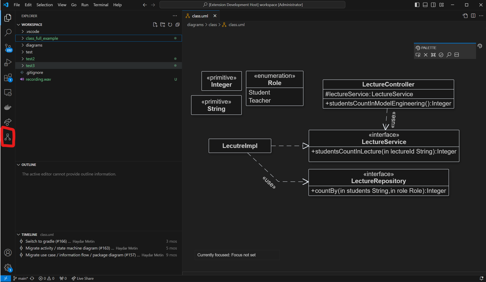
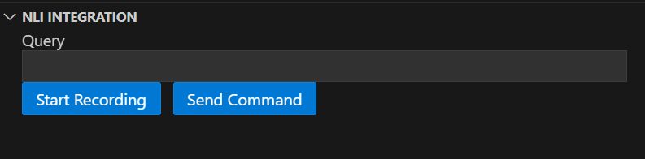
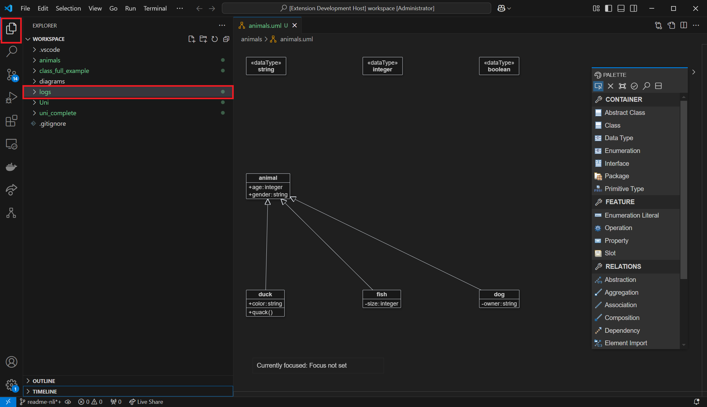

# Setup

Following is a short setup guide on how to get started with the natural language interface for the BigUML editor.

## Requirements

Java 17 JDK: Java 17 is required
You'll need to install [Sox](https://sourceforge.net/projects/sox/) for audio recording.

## NLI Server

1. Pull NLI Server
```cmd 
docker pull sschwantler/nli4uml:latest
```

2. Start docker container
```cmd
docker run -p 8000:8000 sschwantler/nli4uml
```
On the first startup, this may take some time as the speech-to-text model must be downloaded.

## VS Code Extention

The extention can be installed from the `.vsix` file, see [tutorial](https://code.visualstudio.com/docs/editor/extension-marketplace#_install-from-a-vsix). 

# Usage

Once the setup is done, open VS Code.
1. Select File -> Open Folder... -> select or create an empty folder which will be your working directory
1. Select File -> New File -> New Empty UML Diagram.
2. Provide a name and select CLASS as the diagram type.
3. The NLI component is located in the left side bar.



The NLI Integration provides two interaction methods:
1. Record Voice
2. Directly input the query



When "Start Recording" is clicked, your voice is recorded for a fixed time of 5 seconds. 
Once the recording is done, it is processed and directly executed. The text field will also be updated accordingly.

If you don't want to use voice recording, but input the query directly in the text field, you have to manually send the command by clicking "Send Command".

# Logs

All recorded audio snippets and the transcription history will be stored in the folder logs of your workspace folder.



# Usage Example


# Useful Commands

Commands can be provided in natural language. Following are some suggestions.

Note that some commands require a selected element (e.g. change name, change visibility, change datatype, move).
There are no predefined datatypes, they must also be created before referenced.

+ Create a class named computer
+ Define a interface called university
+ Create a new abstract class named animal
+ Add a data type named string to the diagram 

- Focus on class computer
- Select the interface university


+ Add a public attribute named size of type string
+ Introduce a private attribute color with datatype string

- Define a public method get size returning string
- Add get color as a protected method with return type string

+ Update the name to school
+ Change the visibility to public
+ Modify the datatype to integer

- Remove the class called computer
- Delete interface named university

+ Add an aggregation between computer and smartphone
+ Between classes school and university, create a composition

- Move it to the left of the class school
- Place it north of the interface school
