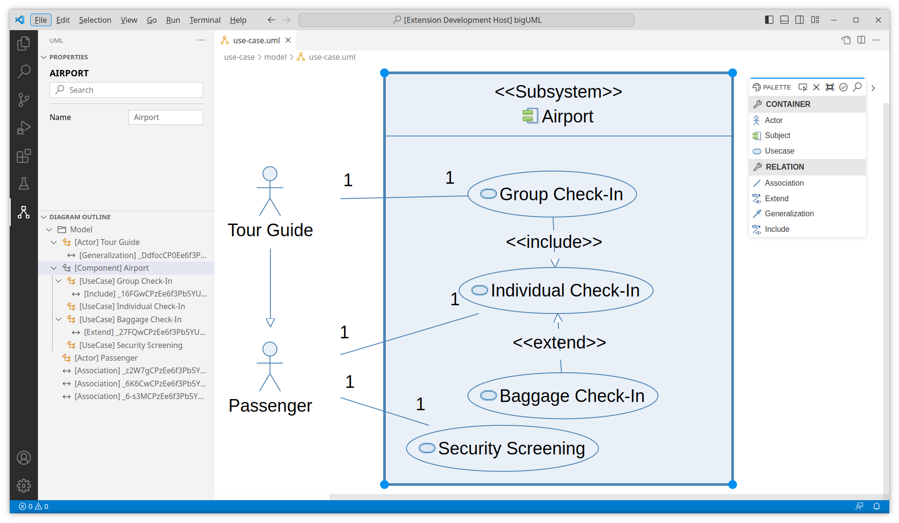

<!-- DEMO -->

  

<!-- BADGES -->

  
  
  

 

<!-- LOGO -->

 
<!-- TITLE -->
<h1 align="center">&emsp;bigUML Modeling Tool</h1>

  &emsp;<strong>Editing UML diagrams in VS Code and developing custom integrations for your IDE of choice is now possible.</strong>

 

- For VS Code users, the project is already distributed in the [VS Code marketplace](https://marketplace.visualstudio.com/items?itemName=BIGModelingTools.umldiagram) and can be installed directly from VS Code.

- This project enables developers to create their own editors by utilizing [GLSP](https://www.eclipse.org/glsp/), where the UML specification is/will be implemented.

---

 
 

**[UML](#uml) •
[DOCUMENTATION](#documentation) •
[DEVELOPMENT SETUP](#development-setup) •
[CONTRIBUTING](#contributing) •
[LICENSE](#license) •
[MODELING TOOLS](#modeling-tools)**

 

## UML

The UML 2 specification currently consists of **7 Structure Diagrams** and **7 Behavior Diagrams**.

<strong>Class Diagram</strong>

<strong>Use Case Diagram</strong>

<em>Initial implementation provided by: @julia05, @JakobD97</em>

<strong>Progress</strong>

### Structure Diagrams

| Class  | Component | Deployment | Object | Package | Profile              | Composite |
| ------ | --------- | ---------- | ------ | ------- | -------------------- | --------- |
| Merged | -         | -          | -      | -       | Merged, not released | -         |

### Behavior Diagrams

| Use Case | Activity | State Machine | Sequence                 | Communication        | Interaction | Timing |
| -------- | -------- | ------------- | ------------------------ | -------------------- | ----------- | ------ |
| Merged   | -        | -             | Contribution in progress | Merged, not released | -           | -      |

## Documentation

Get started with bigUML, learn fundamentals, explore advanced topics, or go through tutorials with our documentation.

- [Changelog](./CHANGELOG.md)
- [Getting Started](./docs/getting-started.md)
- [Documentation](./docs/README.md)
- [Tutorials](./docs/tutorial/README.md)

## Development Setup

Need help concerning the setup? Then go right to [Requirements](./docs/requirements.md) and continue with [Getting Started](./docs/getting-started.md).

## Contributors ✨

Thanks goes to these wonderful people ([emoji key](https://allcontributors.org/docs/en/emoji-key)):

<!-- ALL-CONTRIBUTORS-LIST:START - Do not remove or modify this section -->
<!-- prettier-ignore-start -->
<!-- markdownlint-disable -->
<table>
  <tbody>
    <tr>
      <td align="center" valign="top" width="14.28%"><a href="https://github.com/aylin-sarioglu"> <b>Aylin Sarioğlu</b></a> <a href="https://github.com/borkdominik/bigUML/commits?author=aylin-sarioglu" title="Code">💻</a> <a href="#diagram-aylin-sarioglu" title="Worked on a diagram">↔</a></td>
      <td align="center" valign="top" width="14.28%"><a href="https://github.com/haydar-metin"> <b>Haydar Metin</b></a> <a href="https://github.com/borkdominik/bigUML/commits?author=haydar-metin" title="Code">💻</a> <a href="#maintenance-haydar-metin" title="Maintenance">🚧</a> <a href="#diagram-haydar-metin" title="Worked on a diagram">↔</a></td>
      <td align="center" valign="top" width="14.28%"><a href="https://github.com/JakobD97"> <b>JakobD97</b></a> <a href="https://github.com/borkdominik/bigUML/commits?author=JakobD97" title="Code">💻</a> <a href="#diagram-JakobD97" title="Worked on a diagram">↔</a></td>
      <td align="center" valign="top" width="14.28%"><a href="https://jan-mueller.at/"> <b>Jan Müller</b></a> <a href="https://github.com/borkdominik/bigUML/commits?author=DerYeger" title="Code">💻</a> <a href="#diagram-DerYeger" title="Worked on a diagram">↔</a></td>
      <td align="center" valign="top" width="14.28%"><a href="https://github.com/deweiiss"> <b>Julian Weiß</b></a> <a href="https://github.com/borkdominik/bigUML/commits?author=deweiiss" title="Code">💻</a></td>
      <td align="center" valign="top" width="14.28%"><a href="https://github.com/mrstexx"> <b>Stefan Miljevic</b></a> <a href="https://github.com/borkdominik/bigUML/commits?author=mrstexx" title="Code">💻</a> <a href="#diagram-mrstexx" title="Worked on a diagram">↔</a></td>
      <td align="center" valign="top" width="14.28%"><a href="http://model-engineering.info/"> <b>borkdominik</b></a> <a href="#projectManagement-borkdominik" title="Project Management">📆</a></td>
    </tr>
    <tr>
      <td align="center" valign="top" width="14.28%"><a href="https://github.com/julia05"> <b>julia05</b></a> <a href="https://github.com/borkdominik/bigUML/commits?author=julia05" title="Code">💻</a> <a href="#diagram-julia05" title="Worked on a diagram">↔</a></td>
    </tr>
  </tbody>
</table>

<!-- markdownlint-restore -->
<!-- prettier-ignore-end -->

<!-- ALL-CONTRIBUTORS-LIST:END -->

Contributions of any kind welcome! Do not hesitate to report a bug or to request a feature. Feel free to [open Issues](./issues) or submit PRs.

If you like our work, please feel free to [buy us a coffee](https://www.buymeacoffee.com/bigERtool) ☕️

## License

The project is distributed under the [MIT](https://github.com/borkdominik/bigUML/blob/main/LICENSE) License. See [License](https://github.com/borkdominik/bigUML/blob/main/LICENSE) for more details.

 
 
 

# Modeling Tools

  Checkout our other cool tools.

 

  

  <b>Open-source ER modeling tool for VS Code supporting hybrid, textual- and graphical editing, multiple notations, and SQL code generation!</b> 
  <a href="https://marketplace.visualstudio.com/items?itemName=BIGModelingTools.erdiagram">➜ Download the VS Code Extension</a>

  

