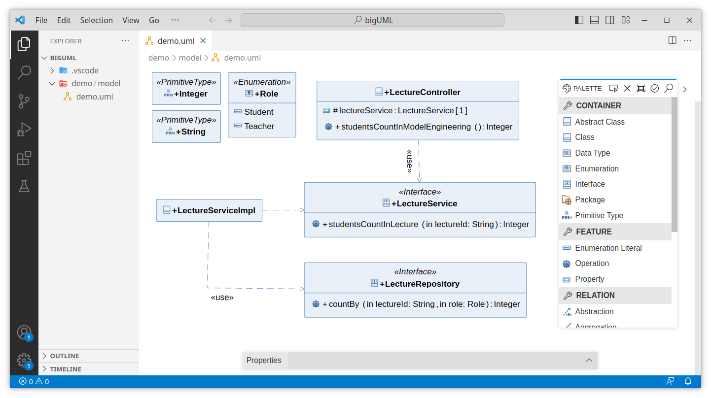

<!-- LOGO -->

  

<!-- TITLE -->
<h1 align="center">bigUML Modeling Tool</h1>

  <strong>Editing UML diagrams in VS Code and developing custom integrations for your IDE of choice is now possible.</strong>

<!-- DEMO -->

  

<!-- BADGES -->

  
  
  

- For VS Code users, the project is already distributed in the [VS Code marketplace](https://marketplace.visualstudio.com/items?itemName=BIGModelingTools.umldiagram) and can be installed directly from VS Code.

- This project enables developers to create their own editors by utilizing [GLSP](https://www.eclipse.org/glsp/), where the UML specification is/will be implemented.

---

 
 

**[UML](#uml) •
[DOCUMENTATION](#documentation) •
[DEVELOPMENT SETUP](#development-setup) •
[CONTRIBUTING](#contributing) •
[LICENSE](#license) •
[MODELING TOOLS](#modeling-tools)**

 

## UML

The UML 2 specification currently consists of **7 Structure Diagrams** and **7 Behavior Diagrams**.

### Structure Diagrams

| Class       | Component | Deployment | Object | Package | Profile | Composite |
| ----------- | --------- | ---------- | ------ | ------- | ------- | --------- |
| In progress | -         | -          | -      | -       | -       | -         |

### Behavior Diagrams

| Use Case | Activity | State Machine | Sequence                 | Communication | Interaction | Timing |
| -------- | -------- | ------------- | ------------------------ | ------------- | ----------- | ------ |
| -        | -        | -             | Contribution in progress | In progress   | -           | -      |

## Documentation

Get started with bigUML, learn fundamentals, explore advanced topics, or go through tutorials with our documentation.

- [Changelog](./CHANGELOG.md)
- [Getting Started](./docs/getting-started.md)
- [Documentation](./docs/README.md)
- [Tutorials](./docs/tutorial/README.md)

## Development Setup

Need help concerning the setup? Then go right to [Requirements](./docs/requirements.md) and continue with [Getting Started](./docs/getting-started.md).

## Contributing

Contributions to the project are always welcome!

Do not hesitate to report a bug or to request a feature. Feel free to [open Issues](./issues) or submit PRs.

### Maintainers

- [Haydar Metin](https://github.com/haydar-metin) (main-developer)
- [Julian Weiß](https://github.com/deweiiss) (former main-developer)
- [Dominik Bork](https://github.com/borkdominik)
- EclipseSource

See [Contributors](./docs/contributors.md) for the list of the previous contributors.

If you like our work, please feel free to [buy us a coffee](https://www.buymeacoffee.com/bigERtool) ☕️

## License

The project is distributed under the [MIT](https://github.com/borkdominik/bigUML/blob/main/LICENSE) License. See [License](https://github.com/borkdominik/bigUML/blob/main/LICENSE) for more details.

 
 
 

# Modeling Tools

  Checkout our other cool tools.

 

  

  <b>Open-source ER modeling tool for VS Code supporting hybrid, textual- and graphical editing, multiple notations, and SQL code generation!</b> 
  <a href="https://marketplace.visualstudio.com/items?itemName=BIGModelingTools.erdiagram">➜ Download the VS Code Extension</a>

  

