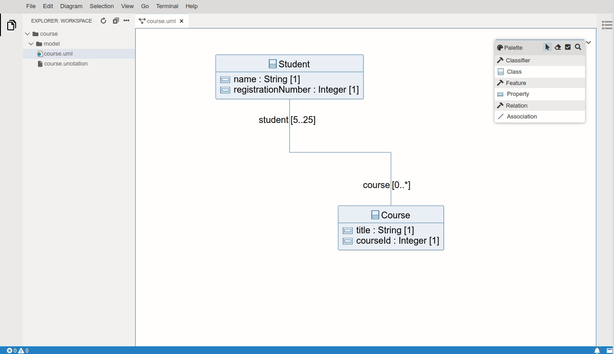

# UML Editor based on GLSP

Uml GLSP provides a web-based editor for UML Models (including Diagrams), integrated with Eclipse Theia. It contains three components: one [Model Server](https://github.com/eclipse-emfcloud/emfcloud-modelserver) (Server-side, written in Java), one [GLSP](https://github.com/eclipse-glsp/glsp) language server (Server-side, written in Java), and one [GLSP client](https://github.com/eclipse-glsp/glsp-client) extension to actually present the diagrams (using [Sprotty](https://github.com/eclipse/sprotty-theia)). 

Uml GLSP can display an existing UML model as a class diagram. The diagram layout will be persisted in an `.unotation` file next to the `.uml` file. The diagram editor also supports creation of new elements (Classes, Properties and Associations), as well as partial support for editing existing elements (Renaming, deleting...).

## Prerequisites

The following libraries/frameworks need to be installed on your system:

| | |
|-|-|
|[Node.js](https://nodejs.org/en/)|`>= 12.14.1 AND < 13`|
|[Yarn](https://classic.yarnpkg.com/en/docs/install#debian-stable)|`>=1.7.0`|
|[Java](https://www.oracle.com/java/technologies/javase-jdk11-downloads.html)|`11`|
|[Maven](https://maven.apache.org/)|`>=3.6.0`|
|[Git](https://git-scm.com/downloads)|`>= 2.11.0`|

 

The editor is heavily interweaved with Eclipse Theia, so please also check the [prerequisites of Theia](https://github.com/eclipse-theia/theia/blob/master/doc/Developing.md#prerequisites).

The web-based/client part of the editor has been developed using [Visual Studio Code](https://code.visualstudio.com/) and the server/java part has been developed with the [Eclipse IDE](https://www.eclipse.org/ide/).
Settings for codestyle are provided for both IDEs, however, it's of course also possible to use any other IDE or text editor.

## Getting started

Clone the uml-glsp editor:

    git clone https://github.com/eclipsesource/uml-glsp.git

### Build
The server components have to be built using Maven, the client component has to be built using yarn. This can be done via CLI:

    cd server && mvn clean install && cd ..
    cd client && yarn && cd ..

#### Resolving build issues under Windows/MacOS

- Missing build tools result in following error:  
  `gyp err! stack error: could not find any visual studio installation to use`
  - Windows:  
    - Install via `npm install --global --vs2015 windows-build-tools`
    - Check that `npm config get msvs_version` returns `2015`
  - Mac OS:  
    - Install [Xcode](https://developer.apple.com/xcode/) developer tools

### Run

    cd client && yarn start

Start your browser on [http://localhost:3000](http://localhost:3000).

 

#### Open diagrams (`*.uml`)
- Add/Delete/Rename support for the following UML Elements: `Class`, `Property`, `Association`

#### Create new diagrams
- via menu entry `File -> New UML Class Diagram`
- via explorer context menu entry `New UML Class Diagram`
- via command palette `File: New UML Class Diagram`

 

For detailed information on running and debugging the [server](./server/README.md) and [client](./client/README.md) components, please see their respective READMEs.

 

## More information

For more information, please visit the [EMF.cloud Website](https://www.eclipse.org/emfcloud/). If you have questions, contact us on our [spectrum chat](https://spectrum.chat/emfcloud/) and have a look at our [communication and support options](https://www.eclipse.org/emfcloud/contact/).

