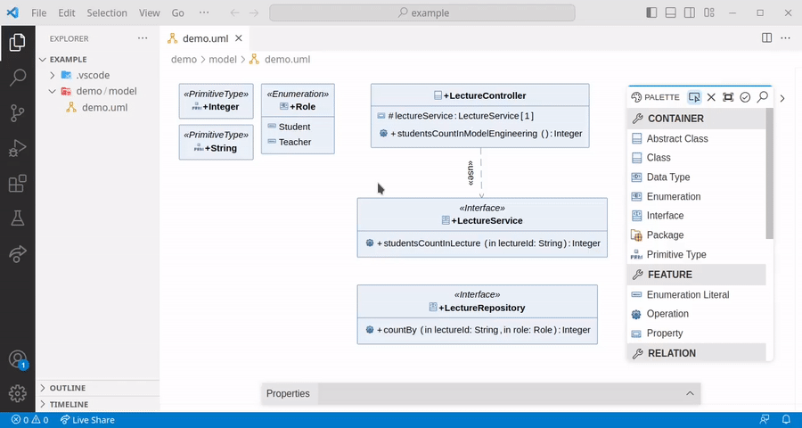
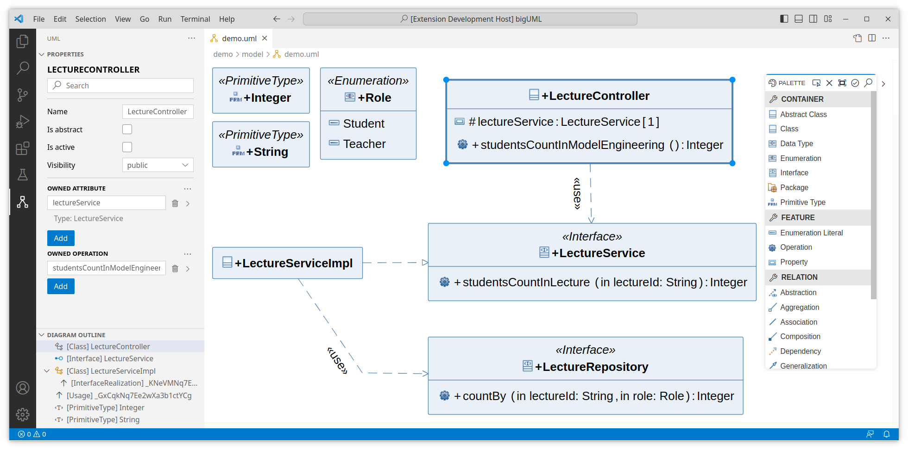
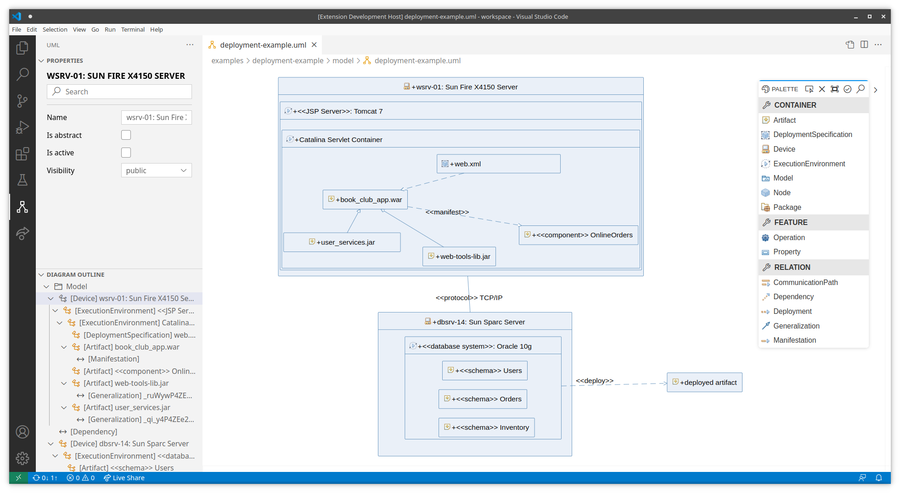
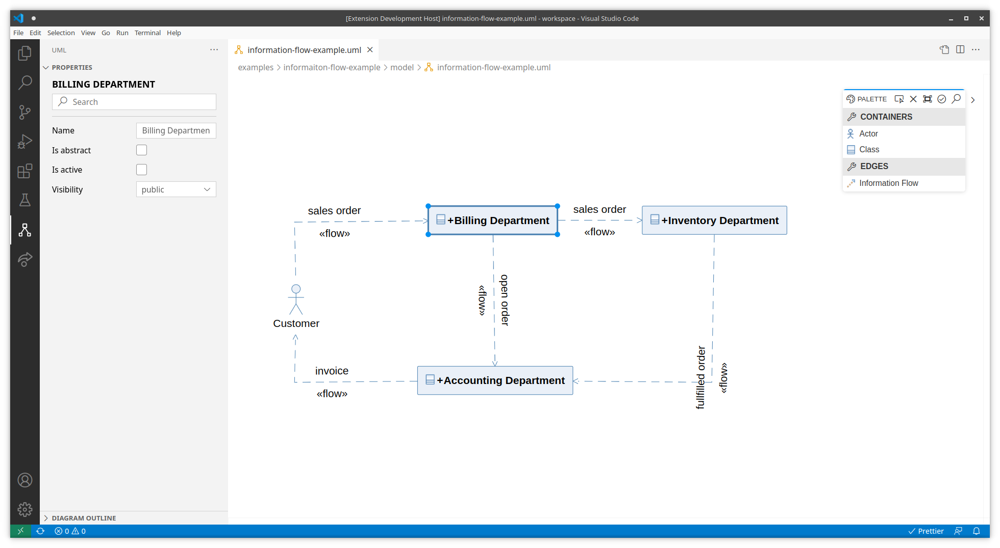
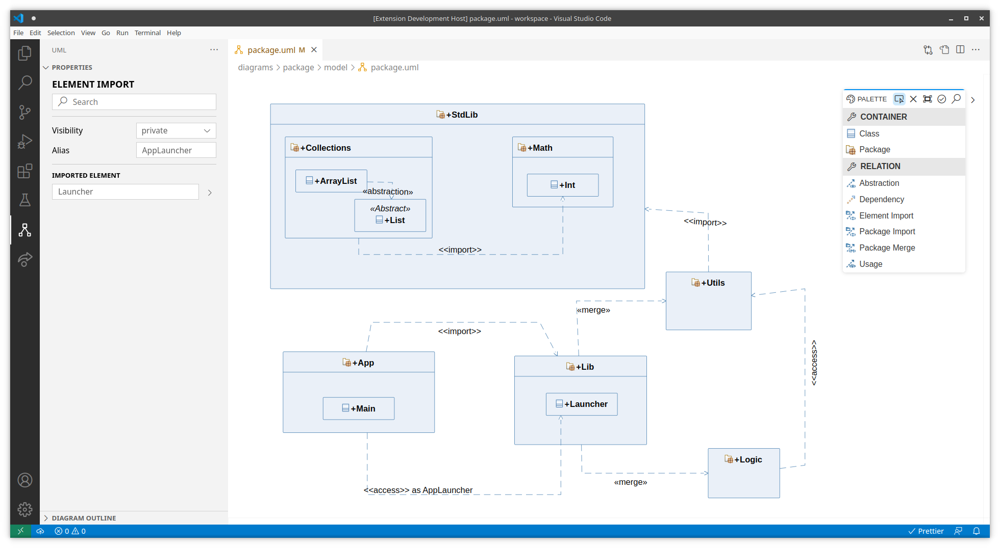
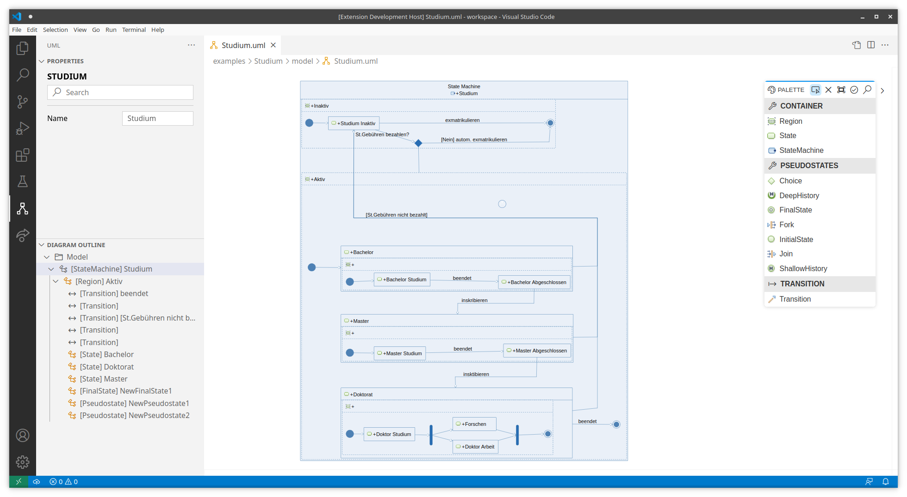

<!-- DEMO -->

  

<!-- BADGES -->

  
  

 

<!-- LOGO -->

<!-- TITLE -->
<h1 align="center">&emsp;bigUML Modeling Tool</h1>

  &emsp;<strong>Editing UML diagrams in VS Code and developing custom integrations for your IDE of choice is now possible.</strong>

 

- For VS Code users, the project is already distributed in the [VS Code marketplace](https://marketplace.visualstudio.com/items?itemName=BIGModelingTools.umldiagram) and can be installed directly from VS Code.

- This project enables developers to create their own editors by utilizing [GLSP](https://www.eclipse.org/glsp/), where the UML specification is/will be implemented.

---

 
 

**[UML](#uml) •
[DOCUMENTATION](#documentation) •
[DEVELOPMENT SETUP](#development-setup) •
[CONTRIBUTING](#contributing) •
[LICENSE](#license) •
[MODELING TOOLS](#modeling-tools)**

 

## UML

The UML 2 specification currently consists of **7 Structure Diagrams** and **7 Behavior Diagrams**.

<!-- =========================== -->

<strong>Activity Diagram</strong>

Coming Soon!

<em>Initial implementation provided by: [@HolzingerAlexander](https://github.com/HolzingerAlexander), [@dellis66](https://github.com/dellis66), [@nbzowski](https://github.com/nbzowski)</em>

<!-- =========================== -->

<strong>Class Diagram</strong>

<em>Initial implementation provided by: [@haydar-metin](https://github.com/haydar-metin), EclipseSource</em>

- Object Diagram integration by: [@vladfreeze](https://github.com/vladfreeze)

<!-- =========================== -->

<strong>Communication Diagram</strong>

Coming Soon!

<em>Initial implementation provided by: [@aylin-sarioglu](https://github.com/aylin-sarioglu), [@haydar-metin](https://github.com/haydar-metin)</em>

<!-- =========================== -->

<strong>Deployment Diagram</strong>

<em>Initial implementation provided by: [@MZeisler](https://github.com/MZeisler), [@H0oKd](https://github.com/H0oKd)</em>

<!-- =========================== -->

<strong>Information Flow Diagram</strong>

<em>Initial implementation provided by: [@lforst](https://github.com/lforst), [@GallusHuber](https://github.com/GallusHuber)</em>

<!-- =========================== -->

<strong>Package Diagram</strong>

<em>Initial implementation provided by: [@DerYeger](https://github.com/DerYeger), [@mrstexx](https://github.com/mrstexx)</em>

<!-- =========================== -->

<strong>Sequence Diagram</strong>

Coming Soon!

<em>Initial implementation provided by: [@simonwaves](https://github.com/simowaves)</em>

<!-- =========================== -->

<strong>State Machine Diagram</strong>

<em>Initial implementation provided by: [@granigd](https://github.com/granigd), [@DavidJaeger10](https://github.com/DavidJaeger10), [@sschwantler](https://github.com/sschwantler)</em>

<!-- =========================== -->

<strong>Use Case Diagram</strong>

<em>Initial implementation provided by: [@julia05](https://github.com/julia05), [@JakobD97](https://github.com/JakobD97)</em>

<!-- =========================== -->

<strong>Progress</strong>

### Structure Diagrams

| Class   | Component | Deployment | Object                | Package | Profile | Composite |
| ------- | --------- | ---------- | --------------------- | ------- | ------- | --------- |
| Initial | -         | Initial    | Integrated into Class | Initial | -       | -         |

### Behavior Diagrams

| Use Case | Activity | State Machine | Sequence | Communication | Interaction | Timing |
| -------- | -------- | ------------- | -------- | ------------- | ----------- | ------ |
| Initial  | -        | Initial       | Initial  | Initial       | -           | -      |

### Extra

| Information Flow |
| ---------------- |
| Initial          |

### Stages

1. **Initial**: Fundemental structure (client and server side) implemented
1. **Beautification**: Improving the UI to respect the specification

### Features

- **Language Complete**: Backend is language complete
- **Property Palette Complete**: Property Palette supports all entries
- **Outline View Complete**: Outline View is diagram specific
- **Validation**: Diagram supports validation

## Documentation

Get started with bigUML, learn fundamentals, explore advanced topics, or go through tutorials with our documentation.

- [Changelog](./CHANGELOG.md)
- [Documentation](./client/docs/README.md)

**Build steps:**

- [Client](./client/README.md)
- [Server](./server/README.md)

## Contributors ✨

Thanks goes to these wonderful people ([emoji key](https://allcontributors.org/docs/en/emoji-key)):

<!-- ALL-CONTRIBUTORS-LIST:START - Do not remove or modify this section -->
<!-- prettier-ignore-start -->
<!-- markdownlint-disable -->
<table>
  <tbody>
    <tr>
      <td align="center" valign="top" width="14.28%"><a href="https://github.com/HolzingerAlexander"> <b>Alexander Holzinger</b></a> <a href="https://github.com/borkdominik/bigUML/commits?author=HolzingerAlexander" title="Code">💻</a> <a href="#diagram-HolzingerAlexander" title="Worked on a diagram">↔</a></td>
      <td align="center" valign="top" width="14.28%"><a href="https://github.com/aylin-sarioglu"> <b>Aylin Sarioğlu</b></a> <a href="https://github.com/borkdominik/bigUML/commits?author=aylin-sarioglu" title="Code">💻</a> <a href="#diagram-aylin-sarioglu" title="Worked on a diagram">↔</a></td>
      <td align="center" valign="top" width="14.28%"><a href="https://github.com/DavidJaeger10"> <b>DavidJaeger10</b></a> <a href="https://github.com/borkdominik/bigUML/commits?author=DavidJaeger10" title="Code">💻</a> <a href="#diagram-DavidJaeger10" title="Worked on a diagram">↔</a></td>
      <td align="center" valign="top" width="14.28%"><a href="https://github.com/granigd"> <b>Dominik Granig</b></a> <a href="https://github.com/borkdominik/bigUML/commits?author=granigd" title="Code">💻</a> <a href="#diagram-granigd" title="Worked on a diagram">↔</a></td>
      <td align="center" valign="top" width="14.28%"><a href="https://github.com/GallusHuber"> <b>GallusHuber</b></a> <a href="https://github.com/borkdominik/bigUML/commits?author=GallusHuber" title="Code">💻</a> <a href="#diagram-GallusHuber" title="Worked on a diagram">↔</a></td>
      <td align="center" valign="top" width="14.28%"><a href="https://github.com/haydar-metin"> <b>Haydar Metin</b></a> <a href="https://github.com/borkdominik/bigUML/commits?author=haydar-metin" title="Code">💻</a> <a href="#maintenance-haydar-metin" title="Maintenance">🚧</a> <a href="#diagram-haydar-metin" title="Worked on a diagram">↔</a></td>
      <td align="center" valign="top" width="14.28%"><a href="https://github.com/JakobD97"> <b>JakobD97</b></a> <a href="https://github.com/borkdominik/bigUML/commits?author=JakobD97" title="Code">💻</a> <a href="#diagram-JakobD97" title="Worked on a diagram">↔</a></td>
    </tr>
    <tr>
      <td align="center" valign="top" width="14.28%"><a href="https://jan-mueller.at/"> <b>Jan Müller</b></a> <a href="https://github.com/borkdominik/bigUML/commits?author=DerYeger" title="Code">💻</a> <a href="#diagram-DerYeger" title="Worked on a diagram">↔</a></td>
      <td align="center" valign="top" width="14.28%"><a href="https://github.com/deweiiss"> <b>Julian Weiß</b></a> <a href="https://github.com/borkdominik/bigUML/commits?author=deweiiss" title="Code">💻</a></td>
      <td align="center" valign="top" width="14.28%"><a href="https://github.com/lorenzk23"> <b>Lorenz Kothmayr</b></a> <a href="https://github.com/borkdominik/bigUML/commits?author=lorenzk23" title="Code">💻</a></td>
      <td align="center" valign="top" width="14.28%"><a href="https://github.com/lforst"> <b>Luca Forstner</b></a> <a href="https://github.com/borkdominik/bigUML/commits?author=lforst" title="Code">💻</a> <a href="#diagram-lforst" title="Worked on a diagram">↔</a></td>
      <td align="center" valign="top" width="14.28%"><a href="https://github.com/MZeisler"> <b>MZeisler</b></a> <a href="https://github.com/borkdominik/bigUML/commits?author=MZeisler" title="Code">💻</a> <a href="#diagram-MZeisler" title="Worked on a diagram">↔</a></td>
      <td align="center" valign="top" width="14.28%"><a href="https://github.com/H0oKd"> <b>Manuel Hude</b></a> <a href="https://github.com/borkdominik/bigUML/commits?author=H0oKd" title="Code">💻</a> <a href="#diagram-H0oKd" title="Worked on a diagram">↔</a></td>
      <td align="center" valign="top" width="14.28%"><a href="https://github.com/sschwantler"> <b>Simon Schwantler</b></a> <a href="https://github.com/borkdominik/bigUML/commits?author=sschwantler" title="Code">💻</a> <a href="#diagram-sschwantler" title="Worked on a diagram">↔</a></td>
    </tr>
    <tr>
      <td align="center" valign="top" width="14.28%"><a href="https://github.com/simowaves"> <b>Simone Andreetto</b></a> <a href="https://github.com/borkdominik/bigUML/commits?author=simowaves" title="Code">💻</a> <a href="#diagram-simowaves" title="Worked on a diagram">↔</a></td>
      <td align="center" valign="top" width="14.28%"><a href="https://github.com/mrstexx"> <b>Stefan Miljevic</b></a> <a href="https://github.com/borkdominik/bigUML/commits?author=mrstexx" title="Code">💻</a> <a href="#diagram-mrstexx" title="Worked on a diagram">↔</a></td>
      <td align="center" valign="top" width="14.28%"><a href="https://github.com/vladfreeze"> <b>Vlad Vifor</b></a> <a href="https://github.com/borkdominik/bigUML/commits?author=vladfreeze" title="Code">💻</a> <a href="#diagram-vladfreeze" title="Worked on a diagram">↔</a></td>
      <td align="center" valign="top" width="14.28%"><a href="http://model-engineering.info/"> <b>borkdominik</b></a> <a href="#projectManagement-borkdominik" title="Project Management">📆</a></td>
      <td align="center" valign="top" width="14.28%"><a href="https://github.com/dellis66"> <b>dellis66</b></a> <a href="https://github.com/borkdominik/bigUML/commits?author=dellis66" title="Code">💻</a> <a href="#diagram-dellis66" title="Worked on a diagram">↔</a></td>
      <td align="center" valign="top" width="14.28%"><a href="https://github.com/julia05"> <b>julia05</b></a> <a href="https://github.com/borkdominik/bigUML/commits?author=julia05" title="Code">💻</a> <a href="#diagram-julia05" title="Worked on a diagram">↔</a></td>
      <td align="center" valign="top" width="14.28%"><a href="https://github.com/nadinPandin"> <b>nadinPandin</b></a> <a href="https://github.com/borkdominik/bigUML/commits?author=nadinPandin" title="Code">💻</a></td>
    </tr>
    <tr>
      <td align="center" valign="top" width="14.28%"><a href="https://github.com/nbzowski"> <b>nbzowski</b></a> <a href="https://github.com/borkdominik/bigUML/commits?author=nbzowski" title="Code">💻</a> <a href="#diagram-nbzowski" title="Worked on a diagram">↔</a></td>
    </tr>
  </tbody>
</table>

<!-- markdownlint-restore -->
<!-- prettier-ignore-end -->

<!-- ALL-CONTRIBUTORS-LIST:END -->

Contributions of any kind are welcome! Do not hesitate to report a bug or to request a feature. Feel free to [open Issues](./issues) or submit PRs.

If you like our work, please feel free to [buy us a coffee](https://www.buymeacoffee.com/bigERtool) ☕️

## License

The project is distributed under the [MIT](https://github.com/borkdominik/bigUML/blob/main/LICENSE) License. See [License](https://github.com/borkdominik/bigUML/blob/main/LICENSE) for more details.

 
 
 

# Modeling Tools

  Checkout our other cool tools.

 

  

  <b>Open-source ER modeling tool for VS Code supporting hybrid, textual- and graphical editing, multiple notations, and SQL code generation!</b> 
  <a href="https://marketplace.visualstudio.com/items?itemName=BIGModelingTools.erdiagram">➜ Download the VS Code Extension</a>

  

