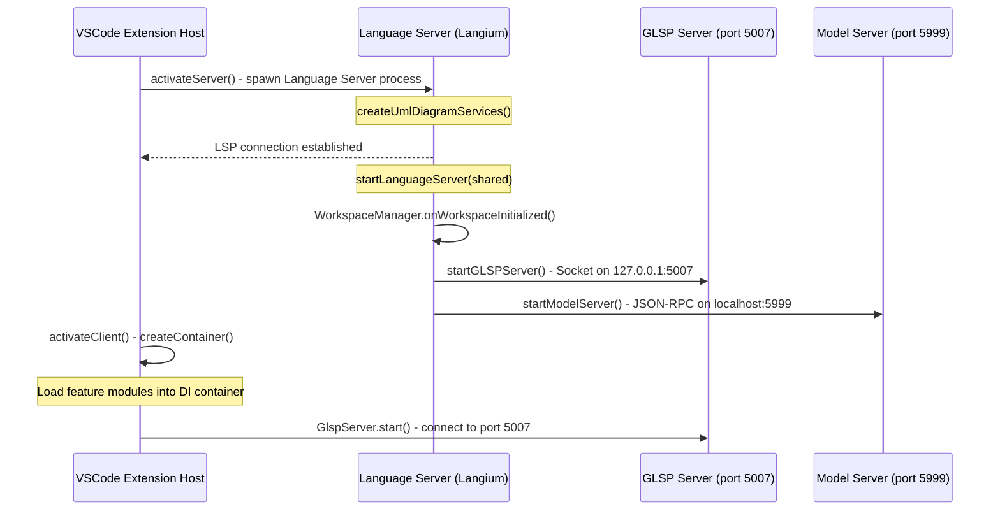
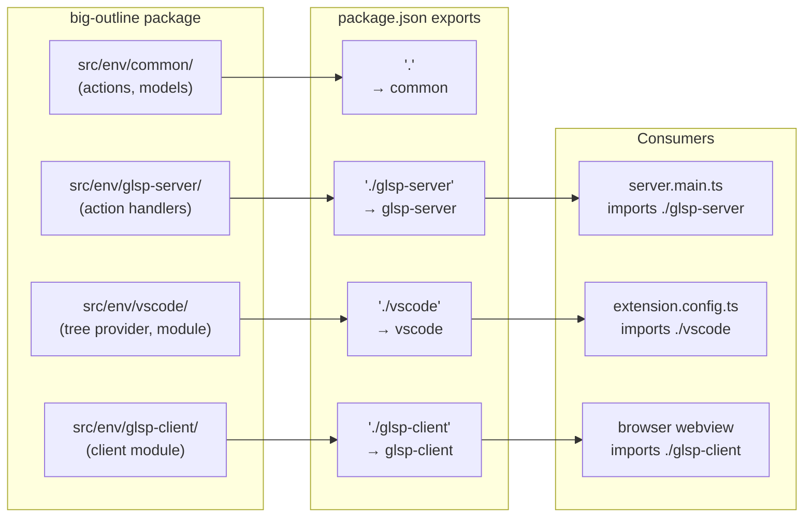
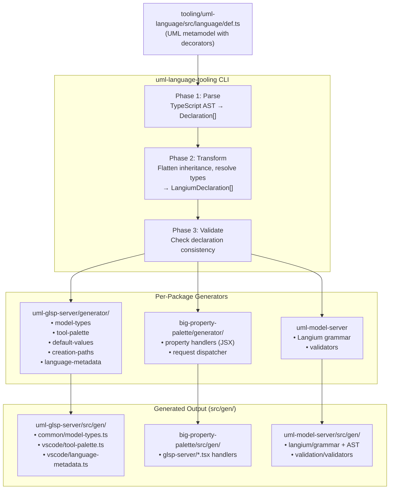
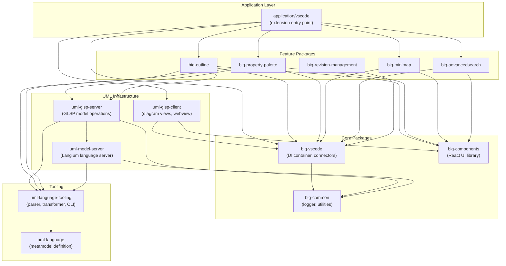

# Architecture Overview

## Overview

bigUML is a graphical UML modeling tool built as a VSCode extension. It uses a monorepo architecture with three distinct runtime processes - the **Extension Host**, the **Language Server** (Langium), and the **GLSP diagram server** - coordinated through an InversifyJS dependency injection container. Each feature is implemented as an independent package that contributes code to one or more of these processes through an environment-based folder convention. A decorator-driven code generation pipeline produces boilerplate from a single language definition file, keeping the UML metamodel as a single source of truth.

## Key Concepts

- **Environment (`env`)** - A target runtime context. Each package splits its source code into `src/env/<environment>/` folders so that the same feature can contribute to multiple processes without coupling them. The environments are: `common`, `vscode`, `glsp-server`, `glsp-client`, `browser`, and `jsx`.
- **Application bootstrap** - The `application/vscode` package is the VSCode extension entry point. It imports modules from every feature package and wires them into the correct process.
- **InversifyJS container** - Each process has its own DI container. Feature packages expose `ContainerModule` factories (one per environment) that the bootstrap layer loads.
- **Package exports map** - Every package uses the `exports` field in `package.json` to expose environment-keyed entry points (e.g., `./vscode`, `./glsp-server`, `./glsp-client`).
- **Language definition (`def.ts`)** - A single TypeScript file in `tooling/uml-language` that declares the complete UML metamodel using classes and decorators.
- **Code generation pipeline** - The `uml-language-tooling` CLI parses `def.ts`, transforms the declarations, and feeds them into per-package generators that emit code into `src/gen/`.
- **GLSP (Graphical Language Server Platform)** - The framework that powers the diagram editor. It follows a client–server architecture where the server manages the model and the client renders it in a webview.
- **Langium** - The parser framework that provides the textual language server (LSP) for `.uml` files, including parsing, validation, and scoping.

## How It Works

### Startup Sequence

When a user opens a `.uml` file in VSCode, the extension activates and boots three server processes in sequence.



**Phase 1 - Server process** (`server.main.ts`): The extension spawns a child process that creates the Langium language services, starts the LSP server, and once the workspace is initialized, launches both the GLSP server and the Model server in the same process.

**Phase 2 - Client process** (`extension.client.ts`): The extension host creates an InversifyJS container, loads all feature modules (outline, property palette, minimap, etc.), triggers `onActivate` lifecycle hooks, and then connects to the GLSP server.

### Environment Model

A single feature - for example the **Outline** - participates in multiple processes. The environment folder convention keeps the code separated while the package exports map makes each slice independently importable.



| Environment   | Runtime                  | Registered in                                 | Typical contents                                       |
| ------------- | ------------------------ | --------------------------------------------- | ------------------------------------------------------ |
| `common`      | Shared / isomorphic      | Imported by any env                           | Actions, protocols, models, type definitions           |
| `vscode`      | Extension host (Node.js) | `extension.config.ts` → `createContainer()`   | Webview providers, VSCode commands, `ContainerModule`  |
| `glsp-server` | Server process (Node.js) | `server.main.ts` → `startGLSPServer()`        | GLSP action/operation handlers, `DiagramFeatureModule` |
| `glsp-client` | Browser (webview)        | GLSP client DI container in webview           | Sprotty views, client-side feature modules             |
| `browser`     | Browser (webview)        | Bundled into webview entry point              | React components, webview root components              |
| `jsx`         | Build-time / server      | JSX runtime for package and element rendering | JSX namespace, runtime factories                       |

### Code Generation Pipeline

The generation pipeline turns a single language definition file into type-safe generated code across multiple packages.



The language definition file (`def.ts`) declares UML elements as TypeScript classes annotated with decorators:

- **`@root`** - Marks the diagram root element
- **`@toolPaletteItem({section, label, icon})`** - Registers the element in the diagram tool palette
- **`@withDefaults`** - All properties receive default values for new element creation
- **`@path`** - Declares a containment relationship (parent → children)
- **`@crossReference`** - Declares a reference to another element
- **`@astType('...')`** - Maps a semantic type to its AST representation (e.g., `Aggregation` → `Association`)
- **`@dynamicProperty('...')`** - Enables runtime choice list population from the model state
- ...

Each package that consumes generated code runs `npm run language:generate`, which invokes the `uml-language-tooling` CLI pointing at the package's own `generator/` directory for templates.

## Package Architecture

### Layers



### Application Layer

**`application/vscode`** is the VSCode extension entry point. It has no feature logic of its own - it bootstraps the system by:

1. **`index.ts`** - Exports `activate()` and `deactivate()` lifecycle functions.
2. **`extension.server.ts`** - Spawns the language server child process (`server.main.ts`) using the VSCode `LanguageClient`.
3. **`extension.client.ts`** - Creates the InversifyJS DI container and starts the GLSP server connection.
4. **`extension.config.ts`** - Assembles the DI container by loading `ContainerModule` instances from every feature package's `./vscode` export.
5. **`server.main.ts`** - Runs in the child process. Creates the Langium services, starts the LSP, GLSP, and Model servers, and loads feature modules from each package's `./glsp-server` export.

### Core Packages

**`big-common`** - Foundation utilities shared by all packages. Provides a logging framework (`loggerFactory`, log levels, configuration) and assertion helpers.

**`big-vscode`** - The VSCode integration hub. It creates the root InversifyJS container (`vscodeModule()`).

**`big-components`** - Reusable React component library for all browser/webview UIs. Provides components like dropdowns, accordions, tables, text fields, and a `VscodeConnector` for message passing between the webview and the extension host.

### Feature Packages

Each feature package follows the same structure and plugs into the system by exporting environment-specific modules. The bootstrap layer (`extension.config.ts` and `server.main.ts`) imports and loads them.

**`big-outline`** - Tree-based outline view showing the element hierarchy. Contributes a GLSP server action handler (`RequestOutlineActionHandler`) and a VSCode tree data provider (`OutlineTreeProvider`).

**`big-property-palette`** - Property editing panel for selected elements. Uses JSX-based property handlers generated from the language definition. Contributes handlers to the GLSP server and a React webview to the browser.

**`big-minimap`** - Minimap visualization for quick navigation. Contributes a GLSP client handler and a React webview component.

**`big-advancedsearch`** - Pattern-based search across UML model elements. Contributes diagram-specific matchers (one per UML diagram type) to the GLSP server and a webview UI.

**`big-revision-management`** - Timeline/snapshot management for model version history. Contributes a VSCode service and a React webview with modal dialogs.

### UML Infrastructure

**`uml-glsp-client`** - The complete GLSP client implementation for UML diagrams. Contains Sprotty views for every UML element type, client-side feature modules (bounds, copy-paste, edit, theme, tools), and the webview entry point (`createUmlDiagramContainer()`). This is what renders the diagram in the browser.

**`uml-glsp-server`** - The GLSP server implementation. Handles model operations (create, update, delete elements), ELK-based layout, and command execution. Exposes `startGLSPServer()` which creates a Socket server on port 5007. Contains generated model types, tool palette definitions, and creation path mappings.

**`uml-model-server`** - The Langium-based language server. Provides parsing, validation, scoping, and serialization for `.uml` files. Exposes `startModelServer()` which creates a JSON-RPC server on port 5999 for AST access with JSON patch support (including undo/redo). Also generates the Langium grammar and AST types from the language definition.

### Tooling

**`uml-language`** - Contains the single source of truth: `def.ts`. This file declares every UML element as a TypeScript class with decorators that control code generation. It also exports the language definition at runtime for packages that need to inspect the metamodel.

**`uml-language-tooling`** - The code generation framework. Provides:

- A **parser** that reads `def.ts` using the TypeScript compiler API and extracts class, interface, type, and property declarations with their decorators.
- A **transformer** that flattens inheritance hierarchies, resolves type references, and builds reverse-lookup maps.
- A **CLI** (`uml-language-tooling extension generate`) that orchestrates the pipeline and dynamically loads each package's generator contribution.
- **Type definitions** for declarations, properties, decorators, multiplicities, and Langium grammar structures.

## Key Files

| File                                                            | Responsibility                                             |
| --------------------------------------------------------------- | ---------------------------------------------------------- |
| `application/vscode/src/index.ts`                               | Extension entry point - `activate()` and `deactivate()`    |
| `application/vscode/src/extension.config.ts`                    | Assembles the DI container with all feature modules        |
| `application/vscode/src/extension.client.ts`                    | Creates container, connects to GLSP server                 |
| `application/vscode/src/extension.server.ts`                    | Spawns the Langium language server child process           |
| `application/vscode/src/server.main.ts`                         | Server process entry - starts LSP, GLSP, and Model servers |
| `packages/big-vscode/src/env/vscode/vscode-common.module.ts`    | Root DI container factory (`vscodeModule()`)               |
| `packages/big-vscode/src/env/vscode/vscode-common.types.ts`     | DI symbol registry (`TYPES`)                               |
| `packages/uml-glsp-server/src/env/vscode/launch.ts`             | `startGLSPServer()` - GLSP socket server setup             |
| `packages/uml-model-server/src/env/langium-connector/launch.ts` | `startModelServer()` - JSON-RPC model server setup         |
| `packages/uml-glsp-client/src/env/browser/uml-glsp.module.ts`   | `createUmlDiagramContainer()` - browser-side GLSP client   |
| `tooling/uml-language/src/language/def.ts`                      | UML metamodel - single source of truth                     |
| `tooling/uml-language-tooling/bin/index.ts`                     | CLI entry point for code generation                        |
| `tooling/uml-language-tooling/src/transformer.ts`               | Declaration transformation and inheritance flattening      |

## Package Folder Convention

Every package follows a consistent directory structure:

```
packages/<name>/
├── package.json          # exports map with environment keys
├── tsconfig.json         # extends root tsconfig
├── esbuild.ts            # custom bundler (webview packages only)
├── config/
│   ├── tsconfig.browser.json   # browser/webview compilation
│   └── tsconfig.node.json      # Node.js/server compilation
├── generator/            # code generation templates (optional)
│   ├── index.ts          # generator entry point
│   └── templates/        # Eta template files
├── src/
│   ├── env/
│   │   ├── common/       # shared actions, models, protocols
│   │   ├── vscode/       # extension host modules
│   │   ├── glsp-server/  # GLSP server handlers
│   │   ├── glsp-client/  # GLSP client modules
│   │   ├── browser/      # React webview components
│   │   └── jsx/          # JSX runtime (property-palette, glsp-server)
│   └── gen/              # generated code (DO NOT EDIT)
│       ├── common/       # generated shared types
│       ├── vscode/       # generated VSCode-specific code
│       └── glsp-server/  # generated server handlers
└── styles/               # CSS stylesheets (webview packages only)
```

- **`src/env/`** - Hand-written source code, split by environment. Each subfolder compiles to a separate entry point in the `exports` map.
- **`src/gen/`** - Machine-generated code produced by `npm run language:generate`. These files should not be edited manually - changes will be overwritten.
- **`generator/`** - Eta templates and contribution functions that the `uml-language-tooling` CLI invokes during code generation.
- **`config/`** - Environment-specific TypeScript configurations. `tsconfig.browser.json` adds DOM and React JSX support; `tsconfig.node.json` targets Node.js only.

## Design Decisions

**Why environment-based code splitting?** bigUML runs code in three distinct processes (extension host, server child process, browser webview) that have different APIs and module systems. Splitting by environment ensures that browser code never imports Node.js modules and vice versa, while still allowing a single package to contribute to all processes. The `exports` map in `package.json` enforces these boundaries at the import level.

**Why a decorator-driven code generation pipeline?** UML has many element types with repetitive structures - each needs model types, property palette handlers, tool palette entries, creation paths, and default values. Writing these by hand for every element is tedious and error-prone. By encoding the metamodel once in `def.ts` with decorators like `@toolPaletteItem` and `@withDefaults`, generators can produce all boilerplate automatically. Adding a new UML element means adding one class to `def.ts` and re-running `npm run language:generate`.

**Why three server processes?** Each server handles a different protocol and concern: the **Language Server** speaks LSP and handles textual editing (validation, completion, formatting); the **GLSP Server** speaks the GLSP protocol and handles graphical editing (layout, diagram operations); the **Model Server** provides a JSON-RPC facade for direct AST access with undo/redo support. Running in the same Node.js process allows them to share the Langium service instances directly (no serialization overhead), while each remains independently addressable on its own port.

**Why InversifyJS?** The GLSP ecosystem already uses InversifyJS for dependency injection. Adopting it across the entire extension creates a uniform module system where feature packages can declare bindings independently and the bootstrap layer simply loads them. This makes features genuinely pluggable - removing a feature is a one-line change in `extension.config.ts`.

## Related Topics

- [GLSP Server Architecture](./glsp-server-architecture.md) - server-side GLSP implementation, operation handlers, and GModel creation
- [Model Server](./model-server.md) - how the RPC model server exposes the Langium AST to non-LSP clients
- [Webview Registration](./guides/webview-registration.md) - how webviews are registered, messaged, and bundled
- [Command Registration](./command-registration.md) - how to register VSCode commands via DI
- [Eclipse GLSP Documentation](https://eclipse.dev/glsp/documentation/) - upstream GLSP framework docs
    - https://github.com/eclipse-glsp/glsp-client/blob/docs/doc/index.md
- [Langium Documentation](https://langium.org/docs/) - parser framework used by the model server

<!--
topic: architecture-overview
scope: architecture
entry-points:
  - application/vscode/src/index.ts
  - application/vscode/src/server.main.ts
  - packages/big-vscode/src/env/vscode/vscode-common.module.ts
  - tooling/uml-language/src/language/def.ts
related:
  - ./model-server.md
  - ./glsp-server-architecture.md
  - ./guides/webview-registration.md
  - ./command-registration.md
last-updated: 2026-03-15
-->
