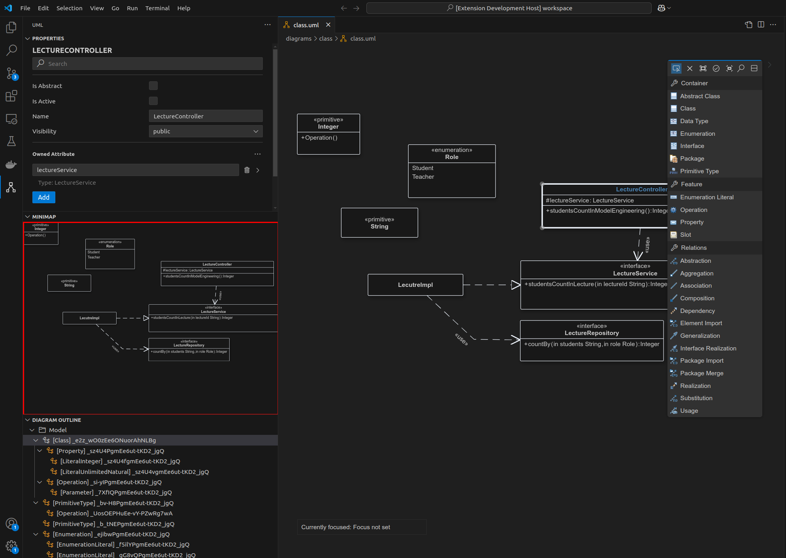

# Communication Workflow

In bigUML, communication between different components follows a structured workflow to ensure consistent data flow and efficient messaging.

## Overview

The communication workflow involves three key elements:

1. **Client**: The front-end component that runs inside **VS Code** and handles user interactions.
2. **Server**: The back-end logic processor that manages diagram data and processes client requests.
3. **Action/Messaging**: A structured protocol that defines message types and data structure.

## Client-Server Communication

Communication between the client and server follows a request-response model where:

- The client dispatches **actions** to request information or perform updates.
- The server processes the request and responds with corresponding **actions**.

For instance, when a user modifies a UML diagram in bigUML:

- The client sends a **`CreateNodeOperation`** to the server.
- The server validates the data and sends back an **`UpdateModelAction`**.

## Messaging Protocol

GLSP uses a message-based protocol for data exchange. Key message types include:

- **Request Actions**: Sent by the client to request information or initiate changes. The sender will wait until a response arrives (blocking).
- **Response Actions**: Sent by the server in reply to client requests.
- **Notification Actions**: Sent when one side needs to inform the other without expecting a response (non-blocking).

### Example Message Flow

1. **User adds a UML class** → Client sends a `CreateNodeOperation` to the server.
2. **Server processes the request** → Server updates its model and sends an `UpdateModelAction` back to the client.
3. **Client receives the update** → The client re-renders the diagram based on the updated data.

## VS Code GLSP Communication

The previously described content applies to GLSP Client and GLSP Server communication. However, we also have different webviews that are connected through the **GLSP VS Code Integration** with the GLSP client/server.

The following image showcases that we have custom webviews such as the **Properties View** and the **Minimap**.

Both run in a webview and can communicate through an API (combination of VS Code, custom logic, and GLSP VS Code Integration) with each other.

**VERY IMPORTANT:**
Webviews and other providers can also dispatch **actions (messages)**. These actions will be propagated by the VS Code integration to the GLSP client or the GLSP server. GLSP's design ensures that actions dispatched to the GLSP client will also be forwarded to the server if necessary.

This means that if you dispatch an action from a different webview, it will first go to the client, and then to the server if required.

The same behavior applies to other VS Code providers such as a **Tree Provider** (e.g., the Outline View).
The previously described content applies to GLSP Client and GLSP Server communication. However, we also have different webviews that are connected through the **GLSP VS Code Integration** with the GLSP client/server.
