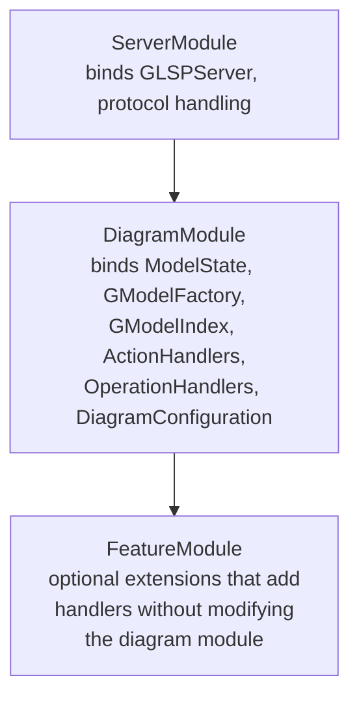
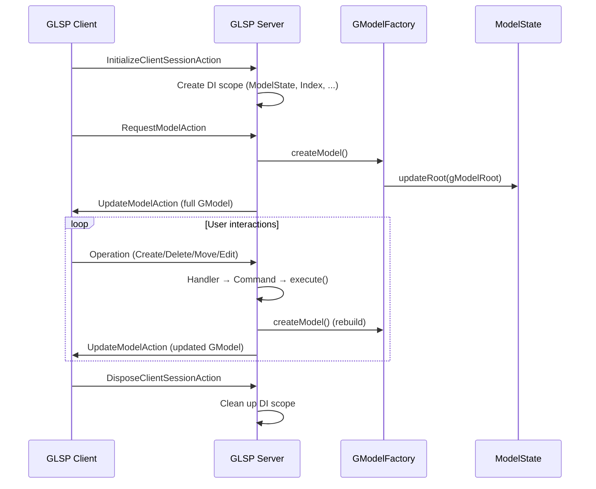
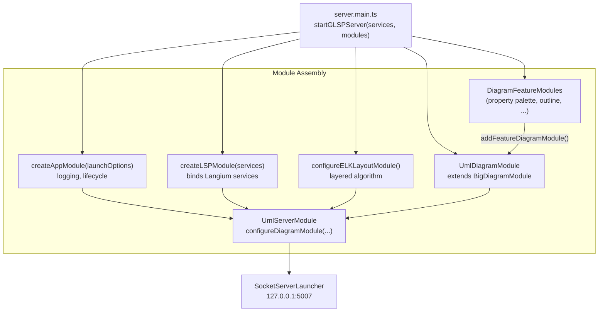
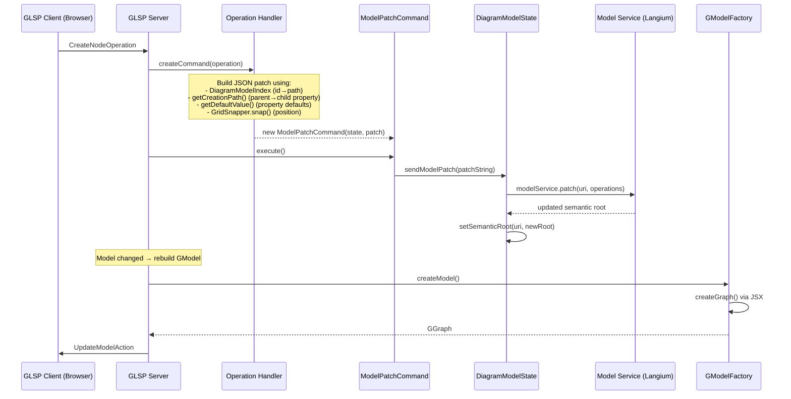
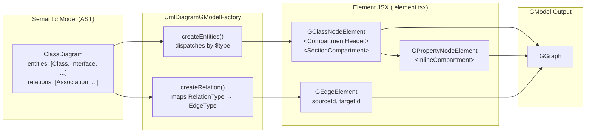
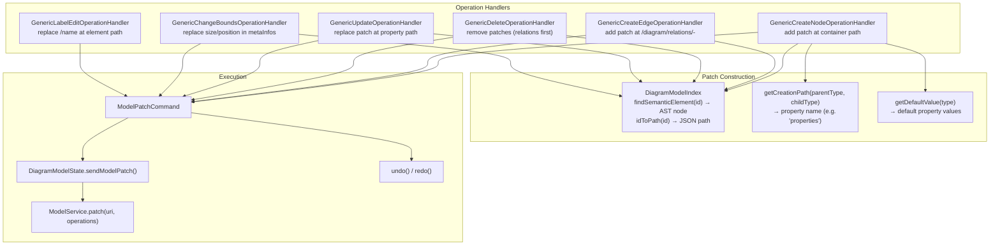
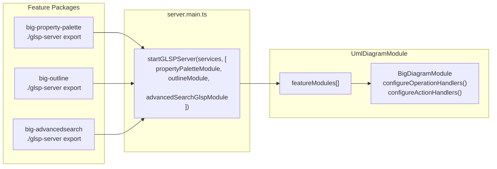

# GLSP Server Architecture

## Overview

The `uml-glsp-server` package is the server-side GLSP implementation for bigUML. It handles model operations (create, update, delete elements), transforms the Langium semantic model into a visual graph (GModel), applies ELK-based layout, and routes mutations through JSON patches with full undo/redo support. The concepts here extend the upstream GLSP framework with UML-specific behavior and a generic, metadata-driven approach to operation handling. See [GLSP Core Concepts](#glsp-core-concepts) below for the foundational knowledge this document builds on.

## Key Concepts

- **`UmlServerModule`** - Extends the GLSP `ServerModule`. Entry point that configures the `UmlGLSPServer` and wires the diagram module.
- **`BigDiagramModule`** - Extends the GLSP `DiagramModule`. Binds all operation handlers, action handlers, model state, model index, GModel factory, and serializer. Accepts `DiagramFeatureModule` extensions from feature packages.
- **`UmlDiagramModule`** - Concrete diagram module for `uml-diagram`. Configures the diagram configuration, tool palette, context menu, and command palette.
- **`DiagramModelState`** - Extends `DefaultModelState`. Holds the semantic root (`Diagram` AST), manages the connection to the Langium model service, and provides `sendModelPatch()`, `undo()`, and `redo()`.
- **`DiagramModelIndex`** - Extends `GModelIndex`. Indexes all semantic AST nodes by ID and builds an ID-to-JSON-path map used by operation handlers to construct patches.
- **`UmlDiagramGModelFactory`** - Implements `GModelFactory`. Converts the semantic `ClassDiagram` AST into a `GGraph` of visual elements using JSX components.
- **`ModelPatchCommand`** - Implements the GLSP `Command` interface. Executes a JSON patch string against the model service and supports `undo()` / `redo()`.
- **Generic operation handlers** - A set of operation handlers (`GenericCreateNodeOperationHandler`, `GenericCreateEdgeOperationHandler`, `GenericDeleteOperationHandler`, `GenericUpdateOperationHandler`, `GenericChangeBoundsOperationHandler`, `GenericLabelEditOperationHandler`) that use generated metadata (creation paths, default values, model types) to handle all UML element types without per-element handler classes.
- **`DiagramFeatureModule`** - Extension point that feature packages (property palette, outline, advanced search) use to register additional action and operation handlers on the GLSP server.
- **JSX component system** - A custom JSX runtime (`jsx-runtime.ts`) that produces `GModelElement` trees. Element files (`.element.tsx`) use JSX to declaratively construct GModel nodes with compartments, labels, and layout options.
- **Generated code (`src/gen/`)** - Model type constants, creation path mappings, default values, tool palette items, and language metadata - all generated from the language definition (`def.ts`) via `npm run language:generate`.

## GLSP Core Concepts

GLSP (Graphical Language Server Platform) is the upstream framework that bigUML extends. Understanding these concepts is essential for working with the GLSP server code. See the [Eclipse GLSP documentation](https://eclipse.dev/glsp/documentation/) and [glsp-server-node source](https://github.com/eclipse-glsp/glsp-server-node) for the full reference.

### Actions and Operations

GLSP communication is built on **actions** - typed JSON messages exchanged between client and server. Every message flowing through the system is an `Action` with a `kind` string discriminator.

**Operations** are a special subset of actions that represent model mutations (create, delete, move, edit). The key distinction:

- **Action** - General-purpose message. Can be a query, notification, or response. Handled by an `ActionHandler`, which returns zero or more response actions. No automatic undo/redo.
- **Operation** - A model-mutating action. Handled by an `OperationHandler`, which returns a `Command` object. The command is executed by the server and tracked for undo/redo.

Standard operation types from the GLSP protocol:

| Operation                 | Purpose                           |
| ------------------------- | --------------------------------- |
| `CreateNodeOperation`     | Create a new node at a position   |
| `CreateEdgeOperation`     | Create an edge between two nodes  |
| `DeleteElementOperation`  | Delete one or more elements       |
| `ChangeBoundsOperation`   | Move or resize elements           |
| `ApplyLabelEditOperation` | Edit a label's text               |
| `ReconnectEdgeOperation`  | Change an edge's source or target |

### The Command Pattern

Operations do not modify state directly. Instead, each `OperationHandler` produces a `Command` that encapsulates the mutation:

```
Client sends Operation
  → ActionDispatcher routes to OperationHandler
  → OperationHandler.createCommand(operation) → Command
  → Server executes Command.execute()
  → Command.undo() / Command.redo() available for history navigation
```

This indirection ensures every mutation is undoable. In bigUML, all commands are `ModelPatchCommand` instances that send JSON patches to the Langium model service.

### GModel

The **GModel** is the visual graph that the server sends to the client for rendering. It is a tree of `GModelElement` nodes rooted at a `GModelRoot`:

| Element        | Role                                                        |
| -------------- | ----------------------------------------------------------- |
| `GModelRoot`   | Top-level container                                         |
| `GGraph`       | The diagram canvas (extends `GModelRoot`)                   |
| `GNode`        | A visual box with position, size, and children              |
| `GEdge`        | A connection between two nodes (source ID → target ID)      |
| `GCompartment` | A sub-container inside a node (e.g., header, property list) |
| `GLabel`       | A text element                                              |
| `GPort`        | A connection anchor point on a node                         |

Every element carries an `id`, a `type` string (used by the client to select the renderer), optional `position`/`size`, `layoutOptions` for ELK, and a `children` array. The `GModelFactory` is responsible for building this tree from the semantic model, and the `GModelSerializer` converts it to the JSON schema sent over the wire.

### DI Module Hierarchy

GLSP uses InversifyJS for dependency injection with a layered module design:



- **`ServerModule`** - Configures the `GLSPServer` instance, message handling, and client session management. One per server process.
- **`DiagramModule`** - Configures everything for a single diagram type: model state, model index, GModel factory, serializer, operation handlers, action handlers, and diagram configuration. The `configureDiagramModule()` method on `ServerModule` registers it.
- **`FeatureModule`** - Lightweight extension point. Can add action/operation handlers to an existing `DiagramModule` without subclassing it. bigUML uses a custom `DiagramFeatureModule` variant of this pattern.

### Model State and Index

The server maintains two stateful services per client session:

- **`ModelState`** (`DefaultModelState`) - Holds the current `GModelRoot` (the visual graph). Provides `updateRoot()` to replace the graph after rebuilding. In bigUML, `DiagramModelState` extends this to also hold the semantic AST root (`Diagram`) from Langium.
- **`GModelIndex`** - Indexes all `GModelElement` nodes by ID for fast lookup. In bigUML, `DiagramModelIndex` extends this to index semantic AST nodes and map each ID to a JSON path in the serialized model.

### Diagram Configuration and Type Hints

The `DiagramConfiguration` service tells the client what is possible for each element type:

- **Shape type hints** - Per node type: `repositionable`, `deletable`, `resizable`, `reparentable`, and `containableElementTypeIds` (what can be created inside).
- **Edge type hints** - Per edge type: `sourceElementTypeIds` and `targetElementTypeIds` (valid connection endpoints), `dynamic` (whether the source/target can be reconnected).
- **Type mapping** - Maps type ID strings to `GModelElement` subclasses so the server instantiates the correct class during GModel construction.

The client requests these hints during initialization and uses them to enable/disable UI affordances (resize handles, connection tools, delete actions).

### Session Lifecycle

A GLSP client session follows this lifecycle:



### Key GLSP Resources

- [Eclipse GLSP Documentation](https://eclipse.dev/glsp/documentation/) - Official guides covering protocol, architecture, and client/server APIs
- [glsp-server-node](https://github.com/eclipse-glsp/glsp-server-node) - Upstream Node.js GLSP server source code
- [GLSP Protocol](https://github.com/eclipse-glsp/glsp/blob/master/PROTOCOL.md) - Full list of actions and operations
- [GLSP Examples](https://github.com/eclipse-glsp/glsp-examples) - Reference implementations showing common patterns

## How It Works

### Server Startup



`startGLSPServer()` assembles four module groups: the GLSP app module (logging, lifecycle), the LSP module (binds Langium services for direct access), the ELK layout module (layered algorithm with `LayeredLayoutConfigurator`), and the `UmlDiagramModule` (all UML-specific handlers). Feature packages contribute `DiagramFeatureModule` instances that are merged into `UmlDiagramModule` before the server launches on port 5007.

### Request Lifecycle

When the GLSP client sends an operation (e.g., create a class), the server processes it through the handler→patch→model service pipeline:



### GModel Creation

The `UmlDiagramGModelFactory` transforms the semantic AST into a visual `GGraph`. Each UML element type has a dedicated `.element.tsx` file that uses the JSX component system to declaratively build the GModel tree.



The resulting GModel tree for a class diagram looks like:

```
GGraph
├─ GClassNode
│  ├─ GCompartment (header)
│  │  ├─ GLabel «abstract»
│  │  └─ GLabel name
│  ├─ GCompartment (properties)
│  │  ├─ GPropertyNode
│  │  └─ GPropertyNode
│  └─ GCompartment (operations)
├─ GInterfaceNode
└─ GEdge
```

The JSX runtime (`jsx-runtime.ts`) converts JSX expressions into `GModelElement` instances. Shared components (`shared-components.tsx`) provide reusable building blocks:

| Component               | Purpose                                                                    |
| ----------------------- | -------------------------------------------------------------------------- |
| `CompartmentHeader`     | Renders the node header with optional `<<stereotype>>` label and name      |
| `SectionCompartment`    | Vertical box for grouping children (properties, operations) with a divider |
| `InlineCompartment`     | Horizontal box for a single row (one property or operation)                |
| `DividerElement`        | Visual separator between sections                                          |
| `getVisibilitySymbol()` | Maps `PUBLIC` → `+`, `PRIVATE` → `-`, `PROTECTED` → `#`, `PACKAGE` → `~`   |

### JSON Patch Mutation

All model modifications flow through JSON patches. Operation handlers construct patch arrays, and `ModelPatchCommand` sends them to the Langium model service.



Each handler follows the same pattern:

1. Look up the target element via `DiagramModelIndex` to get its JSON path
2. Use generated helpers (`getCreationPath`, `getDefaultValue`) to determine where and what to write
3. Build a JSON patch array (`[{op: 'add'|'replace'|'remove', path, value}]`)
4. Return a `ModelPatchCommand` that the server executes

The delete handler is the most complex - it must remove incident relations before nodes and sort removals by descending path depth to avoid index shifts.

### Feature Module Extension

Feature packages contribute server-side behavior through `DiagramFeatureModule`:



`BigDiagramModule.configureOperationHandlers()` and `configureActionHandlers()` iterate over all registered feature modules and call their respective configuration methods, merging feature-specific handlers into the server's DI bindings.

## Key Files

| File                                                                               | Responsibility                                                          |
| ---------------------------------------------------------------------------------- | ----------------------------------------------------------------------- |
| `packages/uml-glsp-server/src/env/vscode/launch.ts`                                | `startGLSPServer()` - assembles modules and launches socket server      |
| `packages/uml-glsp-server/src/env/vscode/module.ts`                                | `UmlServerModule` / `UmlGLSPServer` - top-level server module           |
| `packages/uml-glsp-server/src/env/vscode/diagram/diagram-module.ts`                | `UmlDiagramModule` - diagram-specific wiring                            |
| `packages/uml-glsp-server/src/env/vscode/diagram/diagram-configuration.ts`         | Type mappings, shape/edge type hints                                    |
| `packages/uml-glsp-server/src/env/vscode/diagram/model/diagram-gmodel-factory.tsx` | Semantic AST → GModel conversion via JSX                                |
| `packages/uml-glsp-server/src/env/vscode/features/model/diagram-model-state.ts`    | Semantic root holder, patch execution, undo/redo                        |
| `packages/uml-glsp-server/src/env/vscode/features/model/diagram-model-index.ts`    | ID→path indexing of AST nodes                                           |
| `packages/uml-glsp-server/src/env/vscode/features/model/diagram-model-storage.ts`  | Load/save source model via Langium model service                        |
| `packages/uml-glsp-server/src/env/vscode/features/command/model-patch-command.ts`  | JSON patch command with undo/redo                                       |
| `packages/uml-glsp-server/src/env/vscode/features/mutation/handler/`               | Generic CRUD operation handlers (create, delete, update, bounds, label) |
| `packages/uml-glsp-server/src/env/vscode/features/module/module.ts`                | `BigDiagramModule`, `DiagramFeatureModule` extension point              |
| `packages/uml-glsp-server/src/env/vscode/elements/*.element.tsx`                   | JSX element components (class, interface, property, etc.)               |
| `packages/uml-glsp-server/src/env/jsx/jsx-runtime.ts`                              | Custom JSX runtime producing GModelElements                             |
| `packages/uml-glsp-server/src/env/jsx/components.ts`                               | Shared JSX components (`GCompartmentElement`, `GLabelElement`, etc.)    |
| `packages/uml-glsp-server/src/gen/common/model-types/`                             | Generated model type constants (node/edge type IDs)                     |
| `packages/uml-glsp-server/src/gen/vscode/get-creation-path.ts`                     | Generated parent→child property mappings                                |
| `packages/uml-glsp-server/src/gen/vscode/get-default-value.ts`                     | Generated default property values per element type                      |

## Usage Examples

### Registering a DiagramFeatureModule from a feature package

Feature packages export a `DiagramFeatureModule` from their `./glsp-server` entry point. This module is passed to `startGLSPServer()` in `server.main.ts`:

```typescript
// packages/big-property-palette/src/env/glsp-server/property-palette.module.ts

import { DiagramFeatureModule } from '@borkdominik-biguml/uml-glsp-server/vscode';

export const propertyPaletteModule = new DiagramFeatureModule();

propertyPaletteModule.configureActionHandlers = binding => {
    binding.add(RequestPropertyPaletteActionHandler);
};
```

```typescript
// application/vscode/src/server.main.ts

startGLSPServer({ shared, language: UmlDiagram }, [propertyPaletteModule, outlineModule, advancedSearchGlspModule]);
```

### How an element is structured with JSX

Each UML element type has a `.element.tsx` file that declares both a GNode subclass and a JSX factory function:

```typescript
// packages/uml-glsp-server/src/env/vscode/elements/class.element.tsx

export class GClassNode extends GNode {
    type = ClassDiagramNodeTypes.CLASS;
    layout = 'vbox';
    name: string;
    isAbstract: boolean;
}

export function GClassNodeElement(props: GClassNodeElementProps): GModelElement {
    return (
        <GNodeElement id={props.id} type={ClassDiagramNodeTypes.CLASS}
            position={props.position} size={props.size}
            layoutOptions={{ vGap: 0 }}>
            <CompartmentHeader name={props.name} isAbstract={props.isAbstract} />
            {props.properties.length > 0 && (
                <SectionCompartment id={`${props.id}_properties`}>
                    {props.properties.map(p => <GPropertyNodeElement {...p} />)}
                </SectionCompartment>
            )}
            {props.operations.length > 0 && (
                <SectionCompartment id={`${props.id}_operations`}>
                    {props.operations.map(o => <GOperationNodeElement {...o} />)}
                </SectionCompartment>
            )}
        </GNodeElement>
    );
}
```

The JSX runtime converts this into a `GNode` tree with nested `GCompartment` and `GLabel` children that the GLSP client renders.

## Design Decisions

**Why JSON patches instead of direct AST mutation?** The semantic model lives in the Langium model service, which manages document lifecycle, validation, and cross-references. Direct AST mutation would bypass these mechanisms. JSON patches provide a serializable, atomic operation format that the model service can apply, validate, and track for undo/redo. This also decouples the GLSP server from Langium internals - all it needs is a JSON path and a value.

**Why JSX for GModel construction?** GModel trees are deeply nested (graph → node → compartment → label). Imperative construction with `new GNode()` / `.children.push()` is verbose and hard to read. JSX provides a declarative, HTML-like syntax that mirrors the visual structure. The custom `jsx-runtime.ts` is minimal (~50 lines) and produces standard `GModelElement` instances, so there is no runtime overhead beyond what imperative code would have.

**Why generic operation handlers instead of per-element handlers?** UML has 20+ element types with identical CRUD patterns - create at a path, delete with relations, update a property. Per-element handlers would duplicate this logic. The generic handlers use generated metadata (`getCreationPath`, `getDefaultValue`, model type constants) to handle any element type. Element-specific behavior is encoded in the language definition (`def.ts`) and flows through the generation pipeline, not through handler code.

**Why `DiagramFeatureModule` as an extension point?** Feature packages like property palette and outline need to register action handlers on the GLSP server without modifying the core `UmlDiagramModule`. `DiagramFeatureModule` provides `configureOperationHandlers()` and `configureActionHandlers()` hooks that `BigDiagramModule` calls during DI setup, keeping the extension modular and reversible.

## Related Topics

- [Architecture Overview](./architecture-overview.md) - overall system architecture, startup sequence, and environment model
- [Command Registration](./command-registration.md) - how VSCode commands dispatch GLSP actions
- [Eclipse GLSP Server Documentation](https://github.com/eclipse-glsp/glsp-server-node) - upstream Node.js GLSP server framework

<!--
topic: glsp-server-architecture
scope: architecture
entry-points:
  - packages/uml-glsp-server/src/env/vscode/launch.ts
  - packages/uml-glsp-server/src/env/vscode/diagram/diagram-module.ts
  - packages/uml-glsp-server/src/env/vscode/features/model/diagram-model-state.ts
  - packages/uml-glsp-server/src/env/vscode/diagram/model/diagram-gmodel-factory.tsx
related:
  - ./architecture-overview.md
  - ./command-registration.md
last-updated: 2026-03-15
-->
