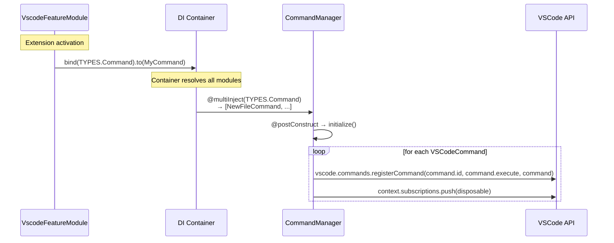
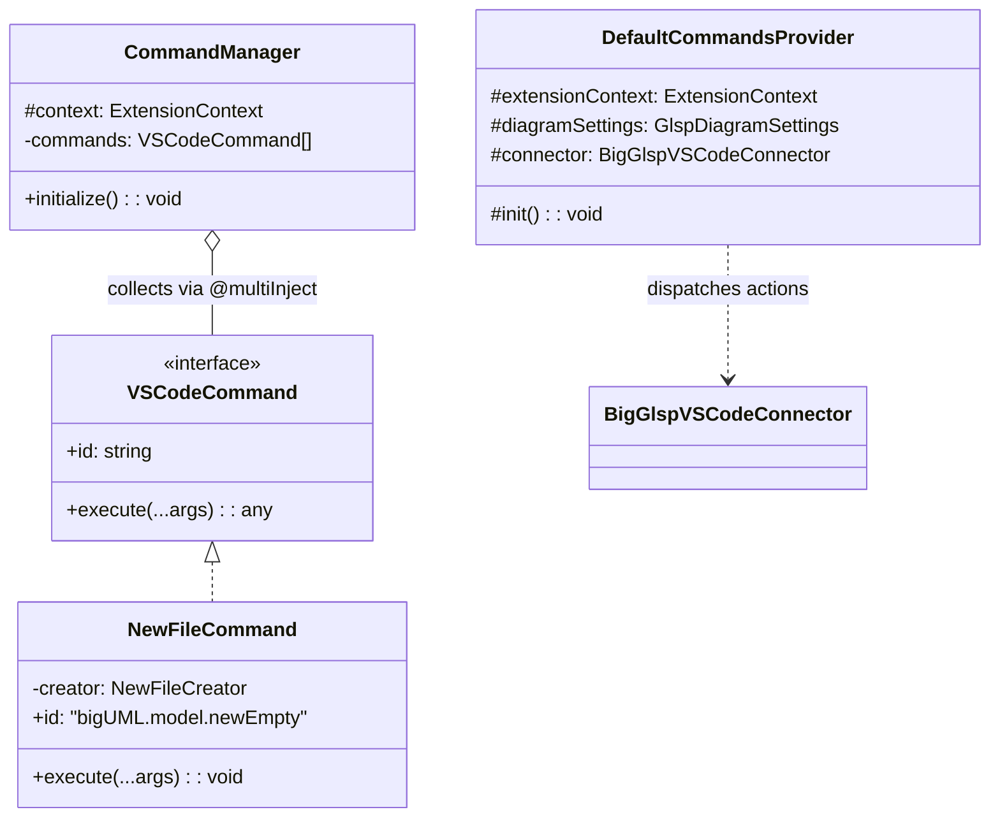
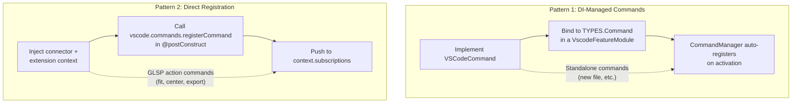

# Command Registration

## Overview

bigUML provides a DI-based command system that lets feature packages register VSCode commands declaratively. Commands implement the `VSCodeCommand` interface and are bound to the `TYPES.Command` symbol in any `VscodeFeatureModule`. The `CommandManager` collects all bound commands on activation and registers them with VSCode automatically. Any command can dispatch GLSP actions by injecting the `BigGlspVSCodeConnector`. For convenience, a `DefaultCommandsProvider` groups simple one-liner action commands that do not warrant their own class.

## Key Concepts

- **`VSCodeCommand`** - Interface with an `id` string and an `execute(...args)` method. Every DI-managed command implements this.
- **`TYPES.Command`** - The InversifyJS multi-injection symbol. Binding a class to this symbol makes it discoverable by the `CommandManager`.
- **`CommandManager`** - Singleton that collects all `TYPES.Command` bindings via `@multiInject` and calls `vscode.commands.registerCommand` for each one during `@postConstruct`.
- **`VscodeFeatureModule`** - A thin wrapper around InversifyJS `ContainerModule` that provides a `BindingContext`. Feature packages use it to declare their bindings.
- **`DefaultCommandsProvider`** - A convenience grouping for simple diagram commands (fit, center, select all, export SVG) that are one-liners dispatching GLSP actions through the `BigGlspVSCodeConnector`. These could equally be implemented as `VSCodeCommand` classes - `DefaultCommandsProvider` just avoids creating a dedicated class for each trivial command.
- **`package.json` `contributes.commands`** - Every command must also be declared in the extension's `package.json` for VSCode to recognize it in the command palette, keybindings, and menus.

## How It Works

### Registration Flow



### Class Hierarchy



### Two Registration Patterns



**Pattern 1** is the standard approach for commands that have their own business logic (file creation, wizards, etc.). The command class can inject any service it needs.

**Pattern 2** is used by `DefaultCommandsProvider` for commands that simply forward a GLSP action to the active diagram client. These are lightweight one-liners that do not need their own class.

## Key Files

| File | Responsibility |
|---|---|
| `packages/big-vscode/src/env/vscode/features/command/command.ts` | `VSCodeCommand` interface definition |
| `packages/big-vscode/src/env/vscode/features/command/command.manager.ts` | `CommandManager` - auto-registers all DI-bound commands |
| `packages/big-vscode/src/env/vscode/features/command/command.module.ts` | `commandModule` - binds the manager and built-in commands |
| `packages/big-vscode/src/env/vscode/features/command/default-commands.ts` | `DefaultCommandsProvider` - GLSP action commands |
| `packages/big-vscode/src/env/vscode/features/command/new-file/new-file.command.ts` | `NewFileCommand` - concrete example |
| `packages/big-vscode/src/env/vscode/features/command/new-file/new-file.creator.ts` | `NewFileCreator` - business logic for diagram creation |
| `packages/big-vscode/src/env/vscode/features/command/new-file/wizard.ts` | Multi-step QuickPick wizard for the new file flow |
| `packages/big-vscode/src/env/vscode/features/container/container.ts` | `VscodeFeatureModule` class |
| `packages/big-vscode/src/env/vscode/vscode-common.types.ts` | `TYPES.Command` symbol definition |
| `application/vscode/package.json` | `contributes.commands` declarations |

## Usage Examples

### Creating a new DI-managed command

**Step 1** - Implement the `VSCodeCommand` interface:

```typescript
// packages/my-feature/src/env/vscode/my-feature.command.ts

import { type VSCodeCommand } from '@borkdominik-biguml/big-vscode/vscode';
import { inject, injectable } from 'inversify';

@injectable()
export class MyFeatureCommand implements VSCodeCommand {
    constructor(@inject(MyService) private service: MyService) {}

    get id(): string {
        return 'bigUML.myFeature.doSomething';
    }

    execute(...args: any[]): void {
        this.service.doSomething(args[0]);
    }
}
```

**Step 2** - Bind the command in a `VscodeFeatureModule`:

```typescript
// packages/my-feature/src/env/vscode/my-feature.module.ts

import { TYPES, VscodeFeatureModule } from '@borkdominik-biguml/big-vscode/vscode';
import { MyService } from './my-service.js';
import { MyFeatureCommand } from './my-feature.command.js';

export const myFeatureModule = new VscodeFeatureModule(context => {
    context.bind(MyService).toSelf().inSingletonScope();
    context.bind(TYPES.Command).to(MyFeatureCommand);
});
```

**Step 3** - Load the module in the application bootstrap:

```typescript
// application/vscode/src/extension.config.ts

import { myFeatureModule } from '@borkdominik-biguml/my-feature/vscode';

container.load(
    myFeatureModule,
    // ...other modules
);
```

**Step 4** - Declare the command in `package.json`:

```json
{
    "contributes": {
        "commands": [
            {
                "command": "bigUML.myFeature.doSomething",
                "title": "Do Something",
                "category": "bigUML"
            }
        ]
    }
}
```

### Real-world example: NewFileCommand

The `NewFileCommand` demonstrates the full pattern with service injection. The command itself is a thin shell that delegates to `NewFileCreator`:

```typescript
@injectable()
export class NewFileCommand implements VSCodeCommand {
    constructor(@inject(NewFileCreator) private creator: NewFileCreator) {}

    get id(): string {
        return 'bigUML.model.newEmpty';
    }

    execute(...args: any[]): void {
        let uri: Uri | undefined = undefined;
        if (args[0] !== undefined && args[0] !== null) {
            uri = args[0];
        }
        this.creator.create(uri);
    }
}
```

`NewFileCreator` handles the business logic - it launches a multi-step wizard (`newDiagramWizard`) for the user to pick a name and diagram type, then sends a `CreateNewFileAction` to the model server and opens the resulting file.

The binding in `commandModule` wires everything together:

```typescript
export const commandModule = new VscodeFeatureModule(context => {
    bindLifecycle(context, TYPES.CommandManager, CommandManager);

    context.bind(NewFileCreator).toSelf().inSingletonScope();
    context.bind(TYPES.Command).to(NewFileCommand);
});
```

## Design Decisions

**Why DI-based command registration?** Commands often need access to services like the GLSP connector, selection service, model state, or session client. Using InversifyJS lets command classes declare their dependencies via `@inject` and have them resolved automatically. The `CommandManager` pattern also centralizes registration - adding a command is just a `bind(TYPES.Command).to(...)` call without touching any registration boilerplate.

**Why does `DefaultCommandsProvider` exist as a convenience?** GLSP action commands are one-liners that call `connector.sendActionToActiveClient(SomeAction.create())`. These could be implemented as individual `VSCodeCommand` classes by injecting the `BigGlspVSCodeConnector`, but creating a separate class for each trivial command would add overhead without benefit. The `DefaultCommandsProvider` groups them in a single `@postConstruct` block for brevity. For commands with more complex logic, the standard DI pattern with `VSCodeCommand` + connector injection is preferred.

**Why must commands also be declared in `package.json`?** VSCode requires static command declarations in `contributes.commands` for the command palette, keybindings, menus, and `when` clause contexts. The DI binding handles runtime registration, but VSCode needs the declaration at extension manifest level to make the command discoverable in the UI.

## Related Topics

- [Architecture Overview](./architecture-overview.md) - overall system architecture and DI container setup
- [Webview Registration](./guides/webview-registration.md) - similar DI-based registration pattern for webview providers

<!--
topic: command-registration
scope: guide
entry-points:
  - packages/big-vscode/src/env/vscode/features/command/command.ts
  - packages/big-vscode/src/env/vscode/features/command/command.manager.ts
  - packages/big-vscode/src/env/vscode/features/command/command.module.ts
related:
  - ./architecture-overview.md
  - ./guides/webview-registration.md
last-updated: 2026-03-15
-->
