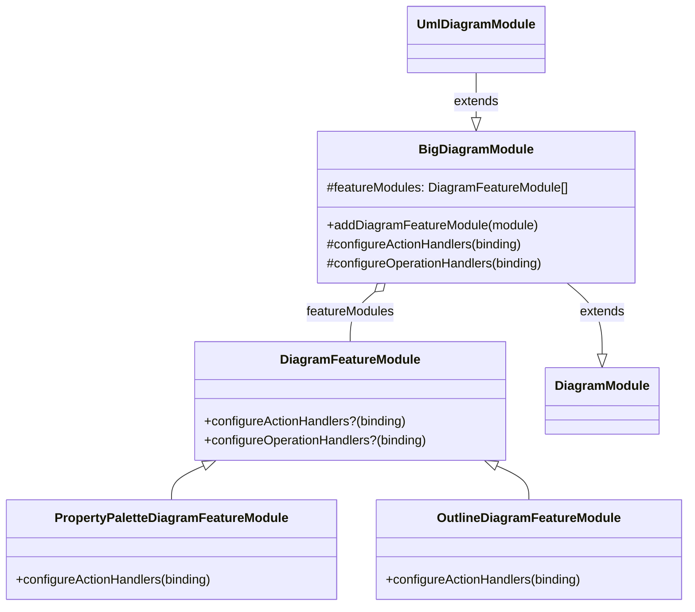
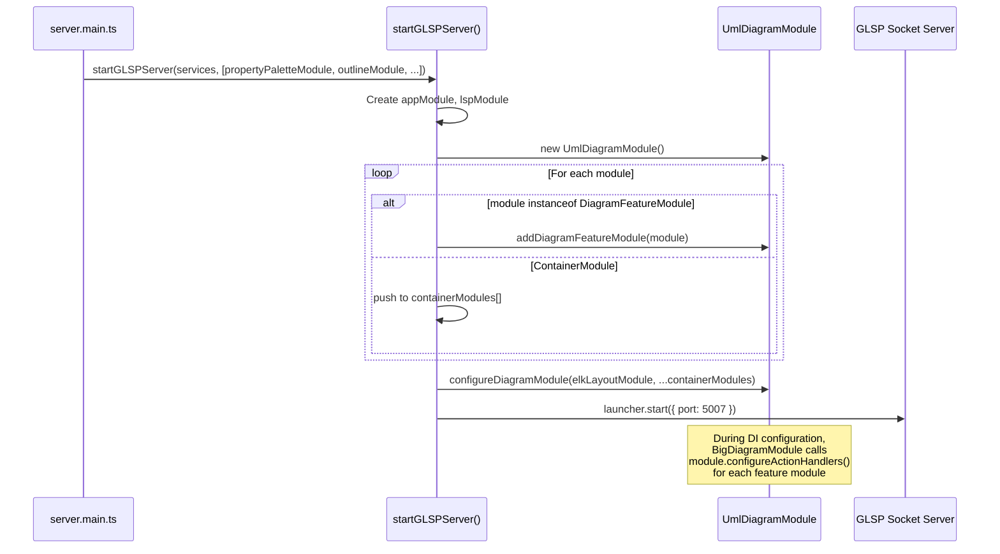
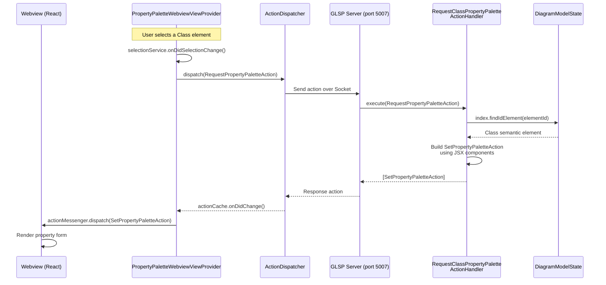
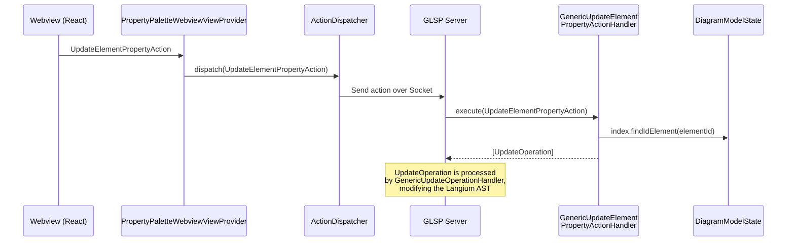

# GLSP Server Feature Modules

## Overview

Feature modules are the extension mechanism for adding server-side behavior to the bigUML GLSP server. Each feature package (property palette, outline, advanced search, etc.) contributes a `DiagramFeatureModule` that registers action and operation handlers into the diagram server. This guide explains how the feature module system works, walks through the full request-response lifecycle, and uses the **property palette** as a concrete example. Read this if you are adding a new server-side feature or want to understand how existing features plug into the GLSP server.

## Key Concepts

- **`DiagramFeatureModule`** - A lightweight class that a feature package instantiates and exports. It has optional hooks to register action handlers and operation handlers into the GLSP server's DI container.
- **`BigDiagramModule`** - The base diagram module that extends GLSP's `DiagramModule`. It manages a list of `DiagramFeatureModule` instances and delegates handler registration to them during container setup.
- **Action handler** - A class implementing `ActionHandler` from `@eclipse-glsp/server`. It receives an incoming action (e.g., `RequestPropertyPaletteAction`) and returns response actions (e.g., `SetPropertyPaletteAction`).
- **Operation handler** - A class implementing `OperationHandler` from `@eclipse-glsp/server`. It receives a mutation operation (e.g., `UpdateOperation`) and modifies the model state.
- **Action protocol** - A set of action types defined in the `common` environment of a package. Actions follow a request/response or fire-and-forget pattern and are the primary communication mechanism between the VSCode client and the GLSP server.
- **Environment folders** - Each package splits code by runtime target: `src/env/common/` for shared types, `src/env/glsp-server/` for server-side handlers, and `src/env/vscode/` for extension host code. The `package.json` exports map exposes each environment as a separate import path.

## How It Works

### Architecture

The GLSP server runs in a separate Node.js process alongside the Langium language server. Feature modules plug into the diagram module at startup, contributing handlers that process actions from the client.



### Startup Flow

When the extension spawns the server process, `server.main.ts` imports every feature module by its `./glsp-server` export and passes them to `startGLSPServer()`. The launcher iterates over the modules, adds each `DiagramFeatureModule` to the `UmlDiagramModule`, and starts the Socket server.



### Request-Response Flow (Property Palette Example)

The property palette demonstrates the full roundtrip between the VSCode extension host, the GLSP server, and the webview.



When the user edits a property value in the webview, the reverse flow triggers:



### Package Structure

A feature package that participates in the GLSP server follows this folder layout:

```
packages/big-property-palette/
├── package.json              # exports map with ./glsp-server, ./vscode, etc.
├── src/
│   ├── env/
│   │   ├── common/           # Shared action types and models
│   │   │   ├── property-palette.action.ts
│   │   │   ├── property-palette.model.ts
│   │   │   └── protocol.ts
│   │   ├── glsp-server/      # GLSP server-side handlers
│   │   │   ├── components.ts
│   │   │   ├── generic-element-property-action-handler.ts
│   │   │   ├── property-palette.module.ts
│   │   │   └── property-palette-util.ts
│   │   └── vscode/           # Extension host webview provider
│   │       ├── property-palette.module.ts
│   │       └── property-palette.webview-view-provider.ts
│   └── gen/
│       └── glsp-server/      # Auto-generated handlers (from def.ts)
│           └── handlers/
│               └── elements/  # Per-element JSX property palette handlers
```

The `package.json` exports map makes each environment independently importable:

```json
{
    "exports": {
        ".": { "default": "./build/env/common/index.js" },
        "./glsp-server": { "default": "./build/env/glsp-server/index.js" },
        "./vscode": { "default": "./build/env/vscode/index.js" }
    }
}
```

### Defining Actions (common/)

Actions are the communication protocol between the client and server. Define them in `src/env/common/` so both sides can import them from the package's root export.

The property palette defines three actions:

| Action                         | Direction       | Purpose                                            |
| ------------------------------ | --------------- | -------------------------------------------------- |
| `RequestPropertyPaletteAction` | Client → Server | Request property data for a selected element       |
| `SetPropertyPaletteAction`     | Server → Client | Response containing the property palette structure |
| `UpdateElementPropertyAction`  | Client → Server | Request to update a specific property value        |

Each action follows the GLSP convention: a `KIND` string constant, an `is()` type guard, and a `create()` factory:

```typescript
// packages/big-property-palette/src/env/common/property-palette.action.ts

export interface RequestPropertyPaletteAction extends RequestAction<SetPropertyPaletteAction> {
    kind: typeof RequestPropertyPaletteAction.KIND;
    elementId?: string;
}

export namespace RequestPropertyPaletteAction {
    export const KIND = 'requestPropertyPalette';

    export function is(object: any): object is RequestPropertyPaletteAction {
        return Action.hasKind(object, KIND) && hasStringProp(object, 'elementId');
    }

    export function create(options: { elementId?: string; requestId?: string }): RequestPropertyPaletteAction {
        return { kind: KIND, requestId: '', ...options };
    }
}
```

### Implementing Action Handlers

Action handlers are `@injectable()` classes that declare which action kinds they handle and implement an `execute` method. They can inject `DiagramModelState` to access the semantic model.

```typescript
// packages/big-property-palette/src/env/glsp-server/generic-element-property-action-handler.ts

@injectable()
export class GenericUpdateElementPropertyActionHandler implements ActionHandler {
    actionKinds = [UpdateElementPropertyAction.KIND];

    @inject(ModelState)
    readonly modelState: DiagramModelState;

    execute(action: UpdateElementPropertyAction): MaybePromise<Operation[]> {
        if (!action.elementId) {
            return [];
        }

        const semanticElement = this.modelState.index.findIdElement(action.elementId);
        if (!semanticElement) {
            return [];
        }

        return [UpdateOperation.create(action.elementId, action.propertyId, action.value)];
    }
}
```

The handler returns an array of response actions or operations. Returning an `Operation` (like `UpdateOperation`) causes the GLSP server to route it to the matching operation handler, which modifies the model.

### Creating the Feature Module

The feature module is the entry point that ties everything together on the server side. Extend `DiagramFeatureModule` and override the configuration hooks to register your handlers:

```typescript
// packages/big-property-palette/src/env/glsp-server/property-palette.module.ts

import { DiagramFeatureModule } from '@borkdominik-biguml/uml-glsp-server/vscode';
import type { ActionHandlerConstructor, InstanceMultiBinding } from '@eclipse-glsp/server';

class PropertyPaletteDiagramFeatureModule extends DiagramFeatureModule {
    override configureActionHandlers(binding: InstanceMultiBinding<ActionHandlerConstructor>): void {
        binding.add(RequestClassPropertyPaletteActionHandler);
        binding.add(GenericUpdateElementPropertyActionHandler);
    }
}

export const propertyPaletteModule = new PropertyPaletteDiagramFeatureModule();
```

Export the instantiated module as a named constant. This is what `server.main.ts` imports.

### Registering in server.main.ts

Import the module from the package's `./glsp-server` export and add it to the array passed to `startGLSPServer()`:

```typescript
// application/vscode/src/server.main.ts

import { propertyPaletteModule } from '@borkdominik-biguml/big-property-palette/glsp-server';
import { outlineModule } from '@borkdominik-biguml/big-outline/glsp-server';
import { advancedSearchGlspModule } from '@borkdominik-biguml/big-advancedsearch/glsp-server';

startGLSPServer({ shared, language: UmlDiagram }, [propertyPaletteModule, outlineModule, advancedSearchGlspModule]);
```

### Connecting the VSCode Side

The GLSP server module handles the server process. The corresponding VSCode-side module handles the extension host - typically a webview provider that dispatches actions and displays results. The property palette registers its VSCode module in `extension.config.ts`:

```typescript
// application/vscode/src/extension.config.ts

import { propertyPaletteModule } from '@borkdominik-biguml/big-property-palette/vscode';

container.load(
    propertyPaletteModule(VSCodeSettings.propertyPalette.viewType)
    // ... other modules
);
```

The VSCode module creates a `VscodeFeatureModule` that binds a `WebviewViewProvider`. The provider injects core services (`ActionDispatcher`, `SelectionService`, `GlspModelState`) and uses them to dispatch request actions to the GLSP server and forward response actions to the webview:

```typescript
// packages/big-property-palette/src/env/vscode/property-palette.module.ts

export function propertyPaletteModule(viewType: string) {
    return new VscodeFeatureModule(context => {
        bindWebviewViewFactory(context, {
            provider: PropertyPaletteWebviewViewProvider,
            options: { viewType }
        });
    });
}
```

### JSX Components for Property Palettes

The property palette uses a custom JSX runtime to declaratively build `SetPropertyPaletteAction` payloads in generated handlers. The JSX components (`PropertyPalette`, `TextProperty`, `BoolProperty`, `ChoiceProperty`, `ReferenceProperty`) are plain functions that return typed property objects - no React involved.

```tsx
// Generated handler (auto-generated from def.ts)

export namespace ClassPropertyPaletteHandler {
    export function getPropertyPalette(semanticElement: Class): SetPropertyPaletteAction[] {
        return [
            SetPropertyPaletteAction.create(
                <PropertyPalette elementId={semanticElement.__id} label={semanticElement.name}>
                    <TextProperty elementId={semanticElement.__id} propertyId='name' text={semanticElement.name!} label='Name' />
                    <BoolProperty
                        elementId={semanticElement.__id}
                        propertyId='isAbstract'
                        value={!!semanticElement.isAbstract}
                        label='isAbstract'
                    />
                    <ChoiceProperty
                        elementId={semanticElement.__id}
                        propertyId='visibility'
                        choices={PropertyPaletteChoices.VISIBILITY}
                        choice={semanticElement.visibility!}
                        label='Visibility'
                    />
                </PropertyPalette>
            )
        ];
    }
}
```

These handlers are auto-generated by the code generation pipeline from `def.ts`. They live in `src/gen/glsp-server/handlers/elements/` and should not be edited manually.

## Key Files

| File                                                                                                          | Responsibility                                                           |
| ------------------------------------------------------------------------------------------------------------- | ------------------------------------------------------------------------ |
| `packages/uml-glsp-server/src/env/vscode/features/module/module.ts`                                           | Defines `DiagramFeatureModule` and `BigDiagramModule`                    |
| `packages/uml-glsp-server/src/env/vscode/launch.ts`                                                           | `startGLSPServer()` - launches GLSP Socket server, wires feature modules |
| `packages/uml-glsp-server/src/env/vscode/diagram/diagram-module.ts`                                           | `UmlDiagramModule` - the concrete diagram module                         |
| `application/vscode/src/server.main.ts`                                                                       | Server process entry point - imports and registers all feature modules   |
| `application/vscode/src/extension.config.ts`                                                                  | Extension host entry point - loads VSCode-side modules                   |
| `packages/big-property-palette/src/env/common/property-palette.action.ts`                                     | Action protocol definitions                                              |
| `packages/big-property-palette/src/env/common/property-palette.model.ts`                                      | Property data model types                                                |
| `packages/big-property-palette/src/env/glsp-server/property-palette.module.ts`                                | Server-side `DiagramFeatureModule`                                       |
| `packages/big-property-palette/src/env/glsp-server/generic-element-property-action-handler.ts`                | Handles `UpdateElementPropertyAction`                                    |
| `packages/big-property-palette/src/gen/glsp-server/handlers/request-class-property-palette-action-handler.ts` | Generated dispatcher routing to element-specific handlers                |
| `packages/big-property-palette/src/env/vscode/property-palette.module.ts`                                     | VSCode-side module factory                                               |
| `packages/big-property-palette/src/env/vscode/property-palette.webview-view-provider.ts`                      | Webview provider dispatching actions and rendering results               |

## Usage Examples

### Minimal Feature Module (Action Handler Only)

A feature that only needs to handle a server-side action:

```typescript
// packages/my-feature/src/env/glsp-server/my-feature.module.ts

import { DiagramFeatureModule } from '@borkdominik-biguml/uml-glsp-server/vscode';
import type { ActionHandlerConstructor, InstanceMultiBinding } from '@eclipse-glsp/server';
import { MyActionHandler } from './my-action-handler.js';

class MyFeatureDiagramFeatureModule extends DiagramFeatureModule {
    override configureActionHandlers(binding: InstanceMultiBinding<ActionHandlerConstructor>): void {
        binding.add(MyActionHandler);
    }
}

export const myFeatureModule = new MyFeatureDiagramFeatureModule();
```

### Action Handler Skeleton

```typescript
// packages/my-feature/src/env/glsp-server/my-action-handler.ts

import { MyRequestAction, MyResponseAction } from '@borkdominik-biguml/my-feature';
import type { DiagramModelState } from '@borkdominik-biguml/uml-glsp-server/vscode';
import { ModelState, type ActionHandler, type MaybePromise } from '@eclipse-glsp/server';
import { inject, injectable } from 'inversify';

@injectable()
export class MyActionHandler implements ActionHandler {
    actionKinds = [MyRequestAction.KIND];

    @inject(ModelState)
    readonly modelState: DiagramModelState;

    execute(action: MyRequestAction): MaybePromise<any[]> {
        // Access the semantic model
        const element = this.modelState.index.findIdElement(action.elementId);
        if (!element) {
            return [MyResponseAction.create()];
        }

        // Build and return a response
        return [MyResponseAction.create({ elementId: action.elementId, data: /* ... */ })];
    }
}
```

### Registering a New Feature Module

```typescript
// application/vscode/src/server.main.ts

import { myFeatureModule } from '@borkdominik-biguml/my-feature/glsp-server';

startGLSPServer({ shared, language: UmlDiagram }, [
    propertyPaletteModule,
    outlineModule,
    advancedSearchGlspModule,
    myFeatureModule // add here
]);
```

## Design Decisions

**Why plugin-based feature modules instead of a monolithic diagram module?**
Each feature package is independently developed and tested. The `DiagramFeatureModule` pattern lets packages contribute server-side handlers without modifying the core `UmlDiagramModule`. This keeps the dependency graph clean - the core server does not depend on feature packages, only the application layer's `server.main.ts` wires them together.

**Why separate `common`, `glsp-server`, and `vscode` environments?**
The GLSP server and VSCode extension host run in different processes with different dependencies. Splitting code into environment folders prevents server-only code (e.g., `@eclipse-glsp/server` imports) from leaking into the extension host bundle, and vice versa. The `common` environment holds action types and models that both sides need. The `package.json` exports map enforces this boundary at the module resolution level.

**Why return Operations from action handlers instead of mutating the model directly?**
GLSP separates reads (action handlers) from writes (operation handlers). Action handlers inspect the model and compute responses. When a mutation is needed, they return `Operation` objects that the server routes to the appropriate `OperationHandler`. This keeps mutation logic centralized, supports undo/redo, and ensures model consistency.

**Why JSX for building property palette responses?**
The generated property palette handlers produce deeply nested data structures. JSX provides a readable, declarative syntax for building these structures from semantic model data. The custom JSX runtime (`packages/big-property-palette/src/env/glsp-server/components.ts`) maps JSX elements to plain property objects - no DOM or React is involved.

## Related Topics

- [Architecture Overview](../architecture-overview.md) - System-wide architecture including the startup sequence and environment model
- [Webview Registration](./webview-registration.md) - How VSCode-side webview providers are registered and how they communicate with webviews

<!--
topic: glsp-server-feature-modules
scope: guide
entry-points:
  - packages/uml-glsp-server/src/env/vscode/features/module/module.ts
  - packages/uml-glsp-server/src/env/vscode/launch.ts
  - application/vscode/src/server.main.ts
related:
  - ../architecture-overview.md
  - ./webview-registration.md
last-updated: 2026-03-15
-->
