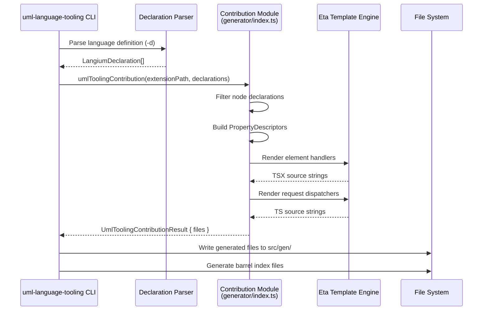
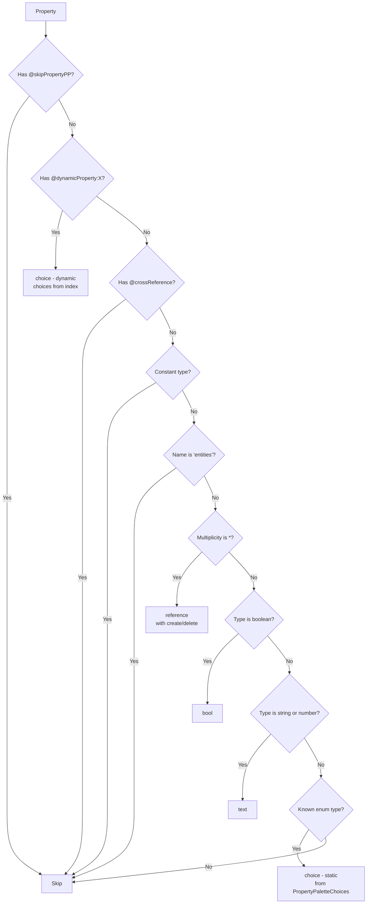
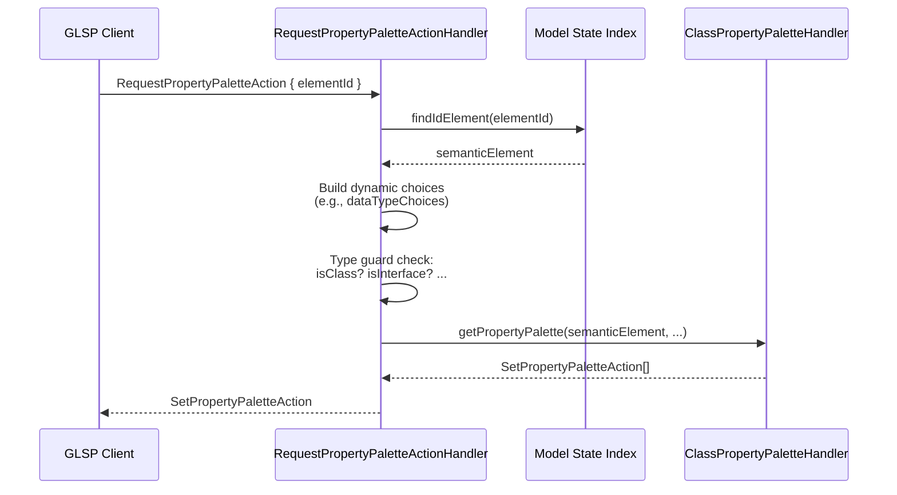

# Code Generation with uml-language-tooling

## Overview

bigUML uses a code generation pipeline to produce boilerplate handlers from a single UML language definition. The `uml-language-tooling` CLI parses TypeScript grammar declarations, transforms them into `LangiumDeclaration` objects, and passes them to package-specific **contribution modules** that emit ready-to-use source files. This guide explains the full pipeline using the **property palette generator** (`big-property-palette/generator`) as a concrete example.

## Key Concepts

- **`LangiumDeclaration`** - Structured representation of a grammar rule (class or type alias) extracted from the UML language definition. Carries the name, properties, inheritance chain, and decorator annotations.
- **`Property`** - A single field on a declaration, including its name, types, multiplicity (`*`, `?`, `1`), and decorators.
- **`UmlToolingContribution`** - A function signature `(extensionPath, declarations) => UmlToolingContributionResult` that every generator must export as `umlToolingContribution`. Returns the list of files to write.
- **`PropertyDescriptor`** - An intermediate object the property palette generator builds for each property, mapping it to one of four UI types: `text`, `bool`, `choice`, or `reference`.
- **Eta** - A lightweight template engine used to render TypeScript/TSX source files from `.eta` template files.
- **Decorators** - Annotations on grammar properties that control generation behavior: `@skipPropertyPP`, `@dynamicProperty:<Type>`, and `@crossReference`.
- **Element handler** - A generated namespace per UML node type containing a `getPropertyPalette` function that returns JSX-based palette data.
- **Request dispatcher** - A generated `ActionHandler` per diagram type that resolves the semantic element and delegates to the correct element handler using type guards.

## How It Works

### Invocation

The generation is triggered through an npm script defined in the package:

```json
{
  "generate": "rimraf src/gen && npm run language:generate",
  "language:generate": "uml-language-tooling extension generate -d @borkdominik-biguml/uml-language/definition -c ./generator/index.ts"
}
```

The CLI receives two key arguments:

| Flag | Purpose |
| ---- | ------- |
| `-d`  | Path to the UML language definition module exporting grammar types |
| `-c`  | Path to the contribution module exporting `umlToolingContribution` |



### Filtering Declarations

Not every grammar declaration produces a handler. `getNodeDecls` filters the input to keep only concrete, non-relation node types:

```typescript
// Kept: concrete classes that are not diagrams, relations, or meta-info
function getNodeDecls(decls: LangiumDeclaration[]): LangiumDeclaration[] {
    return decls.filter(
        d =>
            d.type === 'class' &&
            !d.isAbstract &&
            d.name !== 'Diagram' &&
            !d.name!.endsWith('Diagram') &&
            (d.extends ?? []).every(e => e !== 'Relation') &&
            d.name !== 'Relation' &&
            d.name !== 'Entity' &&
            d.name !== 'ElementWithSizeAndPosition' &&
            !(d.extends ?? []).includes('MetaInfo')
    );
}
```

### Building Property Descriptors

Each property on a filtered declaration is mapped to a `PropertyDescriptor` through `buildPropertyDescriptor`. The mapping follows a decision tree:



The four descriptor types map directly to JSX components:

| Descriptor type | JSX component | Use case |
| --------------- | ------------- | -------- |
| `text` | `<TextProperty>` | String and number fields (`name`, `body`) |
| `bool` | `<BoolProperty>` | Boolean flags (`isAbstract`, `isStatic`) |
| `choice` | `<ChoiceProperty>` | Enumerations and dynamic cross-reference selectors (`visibility`, `type`) |
| `reference` | `<ReferenceProperty>` | Collection properties with create/delete operations (`properties`, `operations`) |

### Decorator Annotations

Decorators are string annotations on grammar properties that customize generation:

| Decorator | Effect |
| --------- | ------ |
| `@skipPropertyPP` | Exclude the property from the palette entirely |
| `@dynamicProperty:<Type>` | Generate a choice dropdown populated at runtime from the model index (e.g., `@dynamicProperty:DataType` queries all `DataType` instances) |
| `@crossReference` | Exclude - cross-references are handled separately |

The `@skipPropertyPP` decorator is also exported from the generator package as a no-op function decorator for use in the grammar definition:

```typescript
export function skipPropertyPP(_target: object, _propertyKey?: string | symbol) {}
```

### Rendering Element Handlers

For each filtered declaration, the generator calls `renderHandler` which:

1. Collects all `@dynamicProperty` types to add extra function parameters
2. Builds a `PropertyDescriptor[]` from the declaration's properties
3. Determines required imports (`@eclipse-glsp/server` for references, `ClassDiagramNodeTypes` for create operations, `PropertyPaletteChoices` for static enums)
4. Passes everything to the `element-property-palette-handler.eta` template

The template produces a namespace with a `getPropertyPalette` function that uses JSX to construct the palette data structure:

```typescript
// Generated output for Class (simplified)
export namespace ClassPropertyPaletteHandler {
    export function getPropertyPalette(semanticElement: Class): SetPropertyPaletteAction[] {
        return [
            SetPropertyPaletteAction.create(
                <PropertyPalette elementId={semanticElement.__id} label={(semanticElement as any).name ?? semanticElement.$type}>
                    <TextProperty elementId={semanticElement.__id} propertyId="name" text={semanticElement.name!} label="Name" />
                    <BoolProperty elementId={semanticElement.__id} propertyId="isAbstract" value={!!semanticElement.isAbstract} label="isAbstract" />
                    <ChoiceProperty elementId={semanticElement.__id} propertyId="visibility"
                        choices={PropertyPaletteChoices.VISIBILITY} choice={semanticElement.visibility!} label="Visibility" />
                    <ReferenceProperty elementId={semanticElement.__id} propertyId="properties" label="Properties"
                        references={/* ... mapped from semanticElement.properties */}
                        creates={[{ label: 'Create Property', action: CreateNodeOperation.create(ClassDiagramNodeTypes.PROPERTY, { containerId: semanticElement.__id }) }]} />
                </PropertyPalette>
            )
        ];
    }
}
```

The JSX components (`PropertyPalette`, `TextProperty`, etc.) are not React components - they are plain functions that return serializable data objects using a custom JSX runtime defined in `big-property-palette/src/env/jsx/`.

### Rendering Request Dispatchers

The generator also produces one dispatcher per diagram type. It finds type aliases ending in `DiagramElements` (e.g., `ClassDiagramElements`), resolves all member types recursively, and generates a handler class that:

1. Looks up the semantic element from the model state index
2. Builds dynamic choice arrays for any `@dynamicProperty` types
3. Dispatches to the correct element handler using Langium type guards (`isClass`, `isInterface`, etc.)



### Generated Output Structure

After running the generator, `src/gen/` contains:

```
src/gen/
└── glsp-server/
    └── handlers/
        ├── elements/
        │   ├── class.property-palette-handler.tsx
        │   ├── interface.property-palette-handler.tsx
        │   ├── enumeration.property-palette-handler.tsx
        │   ├── ... (one per node type)
        │   └── index.ts  (barrel)
        ├── request-class-property-palette-action-handler.ts
        └── index.ts  (barrel)
```

## Key Files

| File | Responsibility |
| ---- | -------------- |
| `packages/big-property-palette/generator/index.ts` | Barrel export for the contribution module |
| `packages/big-property-palette/generator/contribution.ts` | Core generation logic: filtering, descriptor building, rendering |
| `packages/big-property-palette/generator/decorators.ts` | Exports decorator functions (`skipPropertyPP`) |
| `packages/big-property-palette/generator/templates/element-property-palette-handler.eta` | Eta template for per-element JSX handlers |
| `packages/big-property-palette/generator/templates/request-property-palette-action-handler.eta` | Eta template for per-diagram dispatcher handlers |
| `packages/big-property-palette/src/env/glsp-server/components.ts` | JSX component functions (`PropertyPalette`, `TextProperty`, etc.) |
| `packages/big-property-palette/src/env/glsp-server/property-palette-util.ts` | Static choice constants (`PropertyPaletteChoices`) |
| `packages/big-property-palette/src/env/jsx/` | Custom JSX runtime for server-side palette construction |
| `tooling/uml-language-tooling/src/types/declaration.ts` | `LangiumDeclaration` and `Declaration` type definitions |
| `tooling/uml-language-tooling/src/types/property.ts` | `Property` type definition |
| `tooling/uml-language-tooling/bin/index.ts` | CLI entry point that orchestrates the generation pipeline |

## Usage Examples

### Running the Generator

```bash
# From the package directory
cd packages/big-property-palette
npm run generate
```

This deletes `src/gen/`, runs the CLI, and writes fresh generated files.

### Adding a New Property to the Grammar

When a new property is added to a grammar declaration (e.g., adding `isLeaf: boolean` to `Class`), re-running the generator automatically picks it up. The `buildPropertyDescriptor` function maps it to a `BoolProperty` since its type is `boolean`.

### Skipping a Property

Annotate the grammar property with `@skipPropertyPP` to exclude it from the generated palette:

```typescript
@skipPropertyPP
internalId: string;
```

### Dynamic Cross-Reference Properties

Use `@dynamicProperty:<Type>` to generate a choice dropdown populated from the model index at runtime:

```typescript
@dynamicProperty:DataType
type: DataType;
```

This generates a `ChoiceProperty` whose choices are built dynamically by querying `this.modelState.index.getAllDataTypes()` in the request dispatcher.

## Design Decisions

**Why JSX for server-side palette construction?** JSX provides a declarative, composable syntax for building nested data structures. The generated handlers read like UI descriptions while actually producing plain objects via a custom JSX runtime. This makes templates simpler and generated code more readable compared to manual object construction.

**Why Eta templates?** Eta is a minimal, zero-dependency template engine that supports embedded JavaScript logic. Unlike string concatenation, templates keep the generated output shape visible and maintainable. The `.eta` files serve as readable blueprints of the final output.

**Why one dispatcher per diagram type?** Different diagram types contain different sets of elements. A Class Diagram dispatcher only handles Class, Interface, Enumeration, etc., while an Activity Diagram dispatcher handles Activity, Action, etc. Generating per-diagram dispatchers keeps each handler focused and avoids a single monolithic switch statement.

**Why filter out abstract classes and relations?** Abstract classes never appear as concrete elements in the model, so they never need property palettes. Relations have a separate editing workflow and are excluded from the node-based palette generation.

## Related Topics

- [Architecture Overview](../architecture-overview.md) - High-level system architecture
- [Webview Registration](./webview-registration.md) - How webview providers (including the property palette UI) are registered

<!--
topic: property-palette-generator
scope: guide
entry-points:
  - packages/big-property-palette/generator/contribution.ts
  - tooling/uml-language-tooling/bin/index.ts
related:
  - ../architecture-overview.md
  - ./webview-registration.md
last-updated: 2026-03-15
-->
