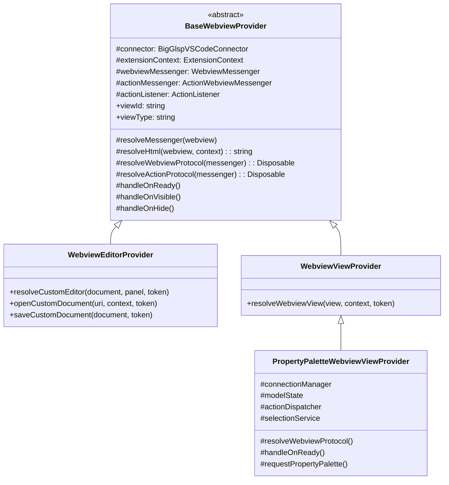
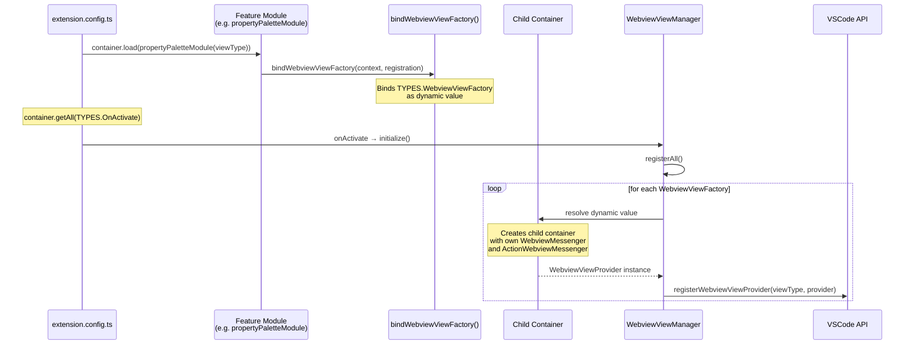
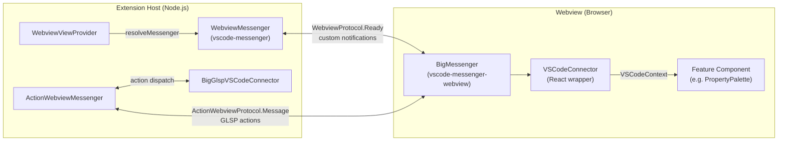
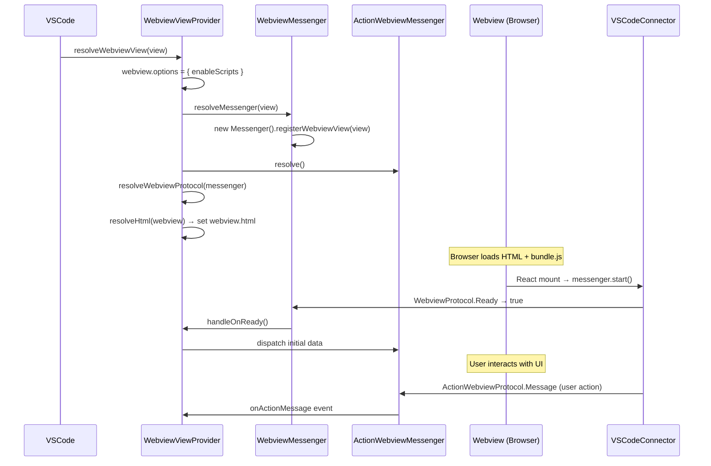
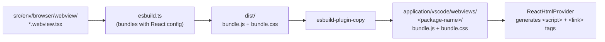

# Webview Registration

## Overview

bigUML uses VSCode webviews to render React-based UIs for features like the property palette, minimap, advanced search, and the diagram editor itself. All webviews share a common infrastructure provided by `big-vscode` that handles HTML generation, message passing, lifecycle events, and DI isolation. There are two webview variants - **editor webviews** (custom editors bound to a file type) and **view webviews** (sidebar/panel views) - both built on the same `BaseWebviewProvider` abstraction.

## Key Concepts

- **`BaseWebviewProvider`** - Abstract base class that every webview provider extends. It wires up the HTML, messenger, action messenger, and lifecycle events when the webview is resolved by VSCode.
- **`WebviewEditorProvider`** - Subclass of `BaseWebviewProvider` implementing VSCode's `CustomEditorProvider` interface. Used for the diagram editor which opens `.uml` files.
- **`WebviewViewProvider`** - Subclass of `BaseWebviewProvider` implementing VSCode's `WebviewViewProvider` interface. Used for sidebar/panel views (property palette, minimap, advanced search, revision management).
- **`WebviewMessenger`** - Extension-side wrapper around `vscode-messenger` that provides typed notification sending/receiving between the extension host and a specific webview instance.
- **`ActionWebviewMessenger`** - Specialized messenger for dispatching GLSP `Action` and `ActionMessage` objects to/from webviews using the `ActionWebviewProtocol`.
- **Child container** - Each webview provider instance lives in its own InversifyJS child container, ensuring that `WebviewMessenger` and `ActionWebviewMessenger` are scoped per-webview rather than shared globally.
- **`VSCodeConnector`** - Browser-side React wrapper component that initializes the `vscode-messenger-webview`, signals readiness, and provides a `VSCodeContext` for child components to send/receive messages.
- **Bundle** - Each webview package uses esbuild to bundle its browser entry point into `bundle.js` + `bundle.css`, which are copied into `application/vscode/webviews/<name>/` for the extension to serve.

## How It Works

### Class Hierarchy



### Registration Flow

When the extension activates, the DI container resolves all webview providers and registers them with VSCode.



### Message Flow

Communication between the extension host and a webview uses two layers: a generic `WebviewMessenger` for custom notifications and an `ActionWebviewMessenger` for GLSP actions.



### Webview Lifecycle



### Bundling and HTML

Each webview package has an esbuild entry point that bundles the browser code:



`ReactHtmlProvider` generates the HTML document that loads these bundles. It constructs `<script>` and `<link>` tags pointing at the bundled files inside `webviews/<name>/`, along with shared assets like `codicon.css` and the root `index.css`.

## Key Files

| File                                                                                    | Responsibility                                                       |
| --------------------------------------------------------------------------------------- | -------------------------------------------------------------------- |
| `packages/big-vscode/src/env/vscode/features/webview/base/base-webview.provider.ts`     | Abstract base for all webview providers                              |
| `packages/big-vscode/src/env/vscode/features/webview/base/webview-messenger.ts`         | Extension-side typed messenger (wraps `vscode-messenger`)            |
| `packages/big-vscode/src/env/vscode/features/webview/base/webview-action-messenger.ts`  | Extension-side GLSP action dispatcher for webviews                   |
| `packages/big-vscode/src/env/vscode/features/webview/base/webview-html-provider.ts`     | `ReactHtmlProvider` - generates the HTML document                    |
| `packages/big-vscode/src/env/vscode/features/webview/editor/webview-editor.provider.ts` | Custom editor webview base class                                     |
| `packages/big-vscode/src/env/vscode/features/webview/editor/webview-editor.bindings.ts` | `bindWebviewEditorFactory()` - DI helper for editor webviews         |
| `packages/big-vscode/src/env/vscode/features/webview/editor/webview-editor.manager.ts`  | Auto-registers all editor providers on activation                    |
| `packages/big-vscode/src/env/vscode/features/webview/view/webview-view.provider.ts`     | Sidebar/panel webview base class                                     |
| `packages/big-vscode/src/env/vscode/features/webview/view/webview-view.bindings.ts`     | `bindWebviewViewFactory()` - DI helper for view webviews             |
| `packages/big-vscode/src/env/vscode/features/webview/view/webview-view.manager.ts`      | Auto-registers all view providers on activation                      |
| `packages/big-vscode/src/env/common/protocol/webview-protocol.ts`                       | `WebviewProtocol.Ready` notification type                            |
| `packages/big-vscode/src/env/common/protocol/action-protocol.ts`                        | `ActionWebviewProtocol.Message` notification type                    |
| `packages/big-components/src/env/browser/vscode/vscode-connector.tsx`                   | Browser-side React wrapper - initializes messenger, provides context |
| `packages/big-components/src/env/browser/vscode/messenger.ts`                           | `BigMessenger` - browser-side `vscode-messenger-webview` wrapper     |

## Usage Examples

### Registering a sidebar webview (WebviewView)

The property palette is a representative example. Three pieces are needed:

**1. The provider** - extends `WebviewViewProvider`, injects services, overrides lifecycle hooks:

```typescript
// packages/big-property-palette/src/env/vscode/property-palette.webview-view-provider.ts

@injectable()
export class PropertyPaletteWebviewViewProvider extends WebviewViewProvider {
    @inject(TYPES.ConnectionManager)
    protected readonly connectionManager: ConnectionManager;

    @inject(TYPES.SelectionService)
    protected readonly selectionService: SelectionService;

    constructor(@inject(TYPES.WebviewViewOptions) options: WebviewViewProviderOptions) {
        super({
            viewId: options.viewType,
            viewType: options.viewType,
            htmlOptions: {
                files: {
                    js: [['property-palette', 'bundle.js']],
                    css: [['property-palette', 'bundle.css']]
                }
            }
        });
    }

    protected override handleOnReady(): void {
        // Send initial data when the webview signals it is ready
        this.requestPropertyPalette();
    }
}
```

**2. The module** - uses `bindWebviewViewFactory` to register in a child container:

```typescript
// packages/big-property-palette/src/env/vscode/property-palette.module.ts

export function propertyPaletteModule(viewType: string) {
    return new VscodeFeatureModule(context => {
        bindWebviewViewFactory(context, {
            provider: PropertyPaletteWebviewViewProvider,
            options: { viewType }
        });
    });
}
```

**3. The bootstrap** - loaded in `extension.config.ts`:

```typescript
// application/vscode/src/extension.config.ts

container.load(
    propertyPaletteModule(VSCodeSettings.propertyPalette.viewType)
    // ...other modules
);
```

### Browser-side component

Every webview entry point follows the same pattern - wrap the feature component in `VSCodeConnector`:

```typescript
// packages/big-property-palette/src/env/browser/webview/property-palette.webview.tsx

const root = createRoot(document.getElementById('root'));
root.render(
    <VSCodeConnector>
        <PropertyPalette />
    </VSCodeConnector>
);
```

Components use `VSCodeContext` to communicate:

```typescript
const { listenAction, dispatchAction } = useContext(VSCodeContext);

// Listen for actions from the extension
listenAction(message => {
    if (SetPropertyPaletteAction.is(message.action)) {
        setPalette(message.action);
    }
});

// Dispatch actions back to the extension
dispatchAction(UpdateElementPropertyAction.create({ elementId, propertyId, value }));
```

### Bundling configuration

Each webview package defines an `esbuild.ts` that bundles the browser entry point and copies output to the application:

```typescript
// packages/big-property-palette/esbuild.ts

const runner = new ESBuildRunner({
    ...rootConfig,
    ...reactConfig,
    entryPoints: ['./src/env/browser/webview/property-palette.webview.tsx'],
    entryNames: 'bundle',
    outdir: 'dist',
    plugins: [
        copy({
            assets: [
                {
                    from: ['dist/**/*'],
                    to: ['../../application/vscode/webviews/property-palette']
                }
            ]
        })
    ]
});
```

## Design Decisions

**Why child containers per webview?** Each webview instance needs its own `WebviewMessenger` and `ActionWebviewMessenger` because the `vscode-messenger` library creates a `MessageParticipant` bound to a specific `WebviewView` or `WebviewPanel`. If messengers were shared, messages would route to the wrong webview. The `bindWebviewViewFactory` / `bindWebviewEditorFactory` helpers create a child InversifyJS container that inherits all parent bindings (connector, services, extension context) but scopes the messenger instances to a single provider.

**Why `vscode-messenger`?** The `vscode-messenger` / `vscode-messenger-webview` pair provides typed, bidirectional RPC over VSCode's `postMessage` API. It handles serialization, routing, and request/response patterns out of the box, avoiding manual `onDidReceiveMessage` wiring. The `WebviewProtocol` and `ActionWebviewProtocol` namespaces define the notification types shared between both sides.

**Why bundle and copy?** Webview code runs in a browser sandbox with no access to Node.js modules or the workspace file system. Each webview must be a self-contained bundle. The esbuild copy plugin places the output into `application/vscode/webviews/<name>/` so that `ReactHtmlProvider` can construct URIs relative to the extension directory. This keeps the build output colocated with the extension's `package.json` files list.

**Why `VSCodeConnector` as a React wrapper?** Centralizing messenger initialization, readiness signaling, and context provision in a single component avoids repetitive setup in every webview. Feature components simply consume `VSCodeContext` and call `listenAction` / `dispatchAction` without knowing about the underlying messenger plumbing.

## Related Topics

- [Architecture Overview](../architecture-overview.md) - overall system architecture and package structure
- [Command Registration](../command-registration.md) - similar DI-based registration pattern for VSCode commands
- [Eclipse GLSP VSCode Integration](https://github.com/eclipse-glsp/glsp-vscode-integration) - upstream webview integration for GLSP editors

<!--
topic: webview-registration
scope: guide
entry-points:
  - packages/big-vscode/src/env/vscode/features/webview/base/base-webview.provider.ts
  - packages/big-vscode/src/env/vscode/features/webview/view/webview-view.bindings.ts
  - packages/big-vscode/src/env/vscode/features/webview/editor/webview-editor.bindings.ts
related:
  - ../architecture-overview.md
  - ../command-registration.md
last-updated: 2026-03-15
-->
