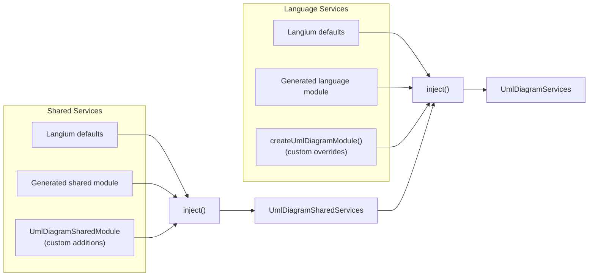
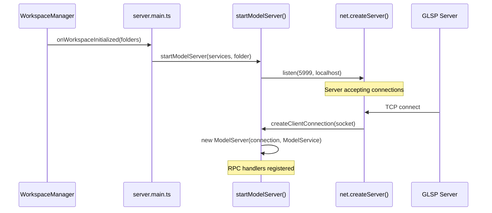
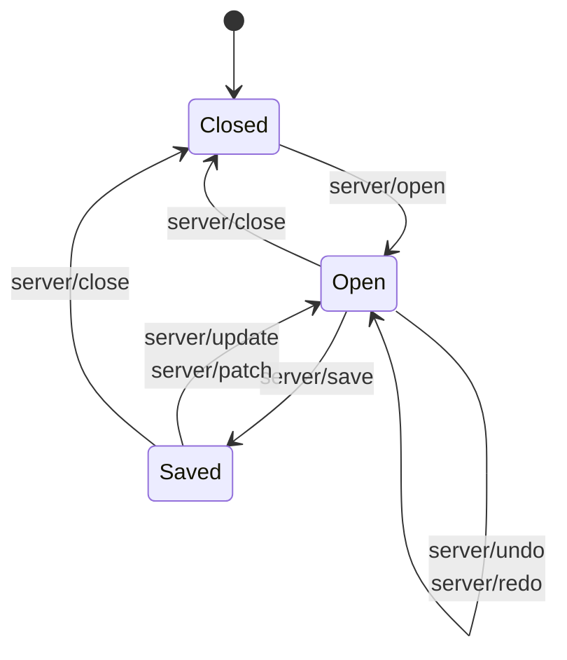
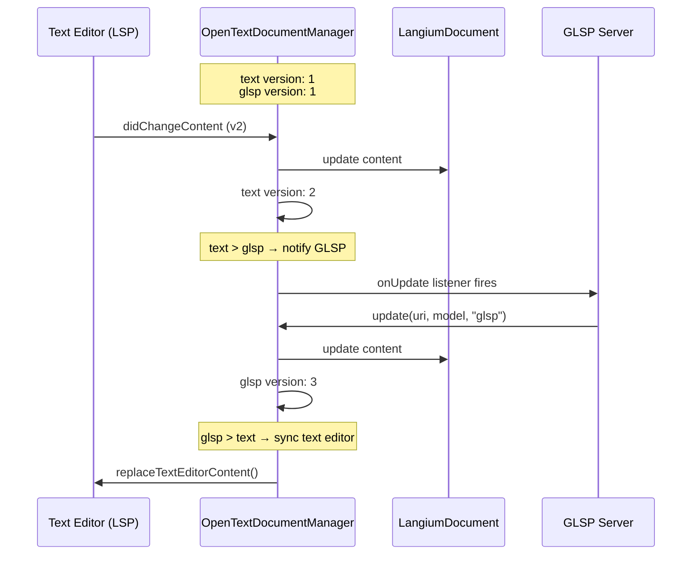
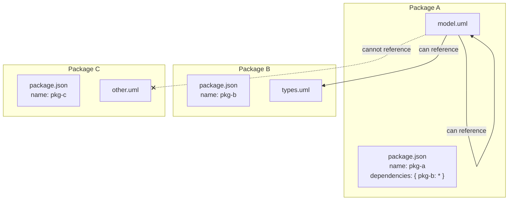
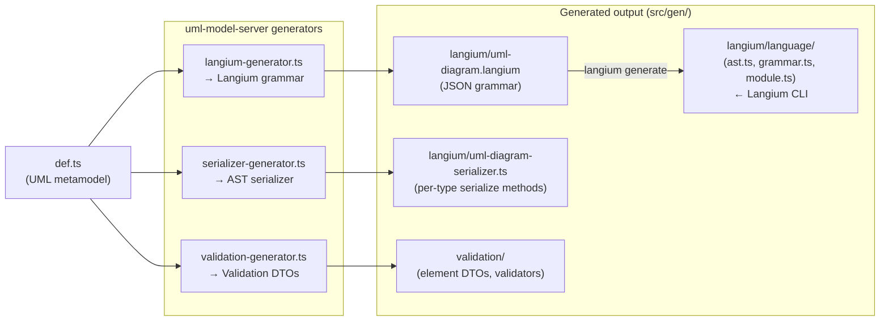

# Model Server

## Overview

The model server is a JSON-RPC facade that exposes the Langium-based semantic model to non-LSP clients - primarily the GLSP diagram server. It listens on `localhost:5999` and provides a REST-like API for opening, requesting, updating, patching, and saving UML documents. This layer enables the graphical editor and the textual editor to modify the same model simultaneously, with version tracking and undo/redo support built on top of JSON patch operations.

Read this document if you need to understand how the model is accessed and mutated from the diagram editor, how multi-client synchronization works, or how Langium is extended to support non-LSP consumers.

## Key Concepts

- **Langium** - A parser framework for building language servers. It parses `.uml` files into an Abstract Syntax Tree (AST), provides scoping, validation, and serialization, and speaks the Language Server Protocol (LSP). See [Langium Core Concepts](#langium-core-concepts) below.
- **Model Server** - A TCP socket server (`localhost:5999`) that wraps `ModelService` behind a JSON-RPC protocol. Each connecting client gets its own `ModelServer` instance.
- **ModelService** - The central facade that manages the document lifecycle (open - request - update - save/close) without requiring callers to be LSP clients.
- **OpenTextDocumentManager** - Manages document versioning across multiple clients (`text` for the LSP text editor, `glsp` for the diagram editor). Keeps both clients in sync when either side makes changes.
- **OpenableTextDocuments** - Extends Langium's `TextDocuments` store to expose internal notification methods, allowing the model server to trigger document lifecycle events programmatically.
- **PatchManager** - Applies JSON patch operations (RFC 6902) to the AST, handles cross-document reference reconstruction, and maintains a linked-list undo/redo history.
- **Package system** - A `package.json`-based visibility mechanism. Documents inside a package can reference each other freely; cross-package references require explicit dependency declarations.
- **`__id` property** - Every AST node carries a unique `__id` property used for stable identification across serialization boundaries and cross-document references.

## Langium Core Concepts

Langium is the foundation on which the model server is built. Understanding these concepts is essential for working with the model server.

### Documents and AST

Langium parses source files into a typed Abstract Syntax Tree (AST). Each source file is represented as a `LangiumDocument`, which wraps the parse result (the AST root node), diagnostics, and the underlying text content. Documents are managed by the `LangiumDocuments` service and indexed by URI.

In bigUML, `.uml` files use a JSON-based grammar - the Langium grammar is auto-generated from the UML metamodel definition (`def.ts`). The parser reads JSON-formatted files and produces typed AST nodes like `Diagram`, `Class`, `Association`, etc.

### Services Architecture

Langium uses a service-based architecture where every capability (parsing, scoping, validation, serialization) is provided by a dedicated service class. Services are split into two categories:

- **Shared services** (`LangiumSharedServices`) - Singleton services shared across all languages: workspace management, document building, the LSP connection.
- **Language-specific services** (`LangiumServices`) - Per-language services: parser, scope provider, validator, name provider, serializer.

Services are assembled through module injection (`inject()`), which merges default, generated, and custom service modules into a single service container. bigUML extends both levels:



### Document Lifecycle

Langium processes documents through a series of build phases, each represented by a `DocumentState`:

1. **Parsed** - The file content has been parsed into an AST.
2. **IndexedContent** - Exported symbols have been computed and added to the global index.
3. **ComputedScopes** - Local scopes have been computed for name resolution.
4. **Linked** - Cross-references between AST nodes have been resolved.
5. **IndexedReferences** - Reference information has been indexed.
6. **Validated** - Validation checks have been executed and diagnostics produced.

The `DocumentBuilder` orchestrates this pipeline. Feature code can listen to specific phases through `onBuildPhase()` - for example, the `OpenTextDocumentManager` listens to the `Validated` phase to notify GLSP clients of text editor changes.

### References

Langium represents cross-references as lazy `Reference` objects. A reference stores both the textual representation (`$refText`) and a resolved pointer to the target AST node (`ref`). References are resolved during the Linked phase based on scoping rules.

In bigUML, references use the `__id` property as the reference key rather than element names. The JSON serializer preserves references as `{ $ref: { __id: "..." } }` objects, and the custom `UmlDiagramJsonSerializer` handles resolving and reviving these during serialization/deserialization.

### Key Langium Resources

- [Langium Documentation](https://langium.org/docs/) - Official guide covering grammar definition, scoping, validation, and the service architecture
- [Langium GitHub Repository](https://github.com/eclipse-langium/langium) - Source code and examples
- [LangiumDocument API](https://langium.org/docs/reference/document-lifecycle/) - Document lifecycle and build phases

## How It Works

### Startup Sequence

The model server is started as part of the language server child process. After the workspace is initialized, `startModelServer()` creates a TCP socket server:



The `createUmlDiagramServices()` function in `uml-diagram-module.ts` assembles the complete service container by merging three layers at each level:

- **Shared services**: Langium defaults + generated shared module + `UmlDiagramSharedModule` (adds `ModelService`, `OpenTextDocumentManager`, `OpenableTextDocuments`, `PackageManager`, `ClientLogger`)
- **Language services**: Langium defaults + generated language module + `createUmlDiagramModule()` (adds custom scoping, naming, serialization, validation)

### RPC Protocol

The model server exposes these JSON-RPC methods:

| Method                | Parameters                | Description                                          |
| --------------------- | ------------------------- | ---------------------------------------------------- |
| `server/open`         | `uri`, `client?`          | Opens a document for modification                    |
| `server/close`        | `uri`, `client?`          | Closes a document                                    |
| `server/request`      | `uri`, `client?`          | Returns the serialized AST root                      |
| `server/update`       | `uri`, `model`, `client?` | Replaces the document content with a new AST         |
| `server/patch`        | `uri`, `patch`, `client?` | Applies a JSON patch operation to the AST            |
| `server/save`         | `uri`, `model`, `client?` | Persists the document to disk                        |
| `server/save/current` | `uri`                     | Saves the current document state without new content |
| `server/undo`         | `uri`                     | Undoes the last patch operation                      |
| `server/redo`         | `uri`                     | Redoes a previously undone patch                     |
| `server/references`   | `uri`, `ref`              | Returns cross-references for a given reference ID    |
| `server/test`         | `uri`                     | Returns the raw JSON serialization (debug)           |

The `client` parameter identifies which consumer is making the request (`"text"` for the LSP text editor, `"glsp"` for the diagram editor). This is critical for the multi-client version tracking described below.

All AST nodes returned over RPC are cleaned by `toSerializable()`, which:

1. Strips Langium-internal `$`-prefixed properties (except `$type`)
2. Converts `Reference` objects to their `$refText` string representation
3. Recursively processes nested objects and arrays

### Document Lifecycle

The model server enforces an open - request - update - save/close lifecycle:



**Open**: The `ModelService` delegates to `OpenTextDocumentManager.open()`, which reads the file from disk (if not already open), registers it in the `OpenableTextDocuments` store, and triggers Langium's document parsing pipeline.

**Request**: Returns the parsed AST root from `LangiumDocument.parseResult.value`. If the document was not already open, it is opened automatically.

**Update**: Serializes the new AST model to text using the language-specific `Serializer`, then updates the `LangiumDocument` content and triggers a rebuild. The text editor is synchronized if the update came from a non-text client.

**Patch**: Applies JSON patch operations through the `PatchManager` (see [JSON Patch & Undo/Redo](#json-patch--undoredo)).

**Save**: Writes the serialized text to disk via `fs.writeFileSync()` and fires a save notification.

### Multi-Client Coordination

The model server supports simultaneous access from two clients: the **text editor** (LSP client, identified as `"text"`) and the **GLSP diagram editor** (identified as `"glsp"`). The `OpenTextDocumentManager` tracks separate document versions for each client.



The coordination rules are:

- When the **text editor** changes a document, the `onDidChangeContent` handler updates the text version. If `text version > glsp version`, GLSP listeners are notified (but only if the document has no parse or validator errors, except linking errors).
- When the **GLSP client** changes a document, the `update()` method bumps the glsp version. If `glsp version > text version`, the text editor content is replaced via `connection.workspace.applyEdit()`.
- If a document has parse errors when the GLSP client tries to update, the update returns an empty model to signal that the document cannot be modified until the text editor errors are resolved.

### JSON Patch & Undo/Redo

The `PatchManager` applies [RFC 6902 JSON Patch](https://datatracker.ietf.org/doc/html/rfc6902) operations to the semantic model. This is the primary mutation mechanism used by the GLSP server.

```mermaid
flowchart TD
    subgraph "PatchManager.applyPatch()"
        A["Collect affected documents<br>(via index cross-references)"]
        B["Serialize all affected docs<br>to JSON via JsonSerializer"]
        C["Add temporary UUIDs<br>for patch tracking"]
        D["Update reference paths<br>to use temp UUIDs"]
        E["Apply JSON patch operations<br>(fast-json-patch)"]
        F["Rebuild cross-document<br>references from UUIDs"]
        G["Remove temp UUIDs,<br>clean JSON"]
        H["Rebuild Langium reference<br>structures ($ref, $refText)"]
        I["Update all affected documents<br>via OpenTextDocumentManager"]
        J["Record undo/redo snapshot"]
    end

    A --> B --> C --> D --> E --> F --> G --> H --> I --> J
```



The undo/redo system uses a doubly-linked list where each node stores a map of document URIs to their text content before (`undo` map) and after (`redo` map) a patch. Navigating the list restores the full document state:

- **Undo**: Replaces all affected documents with their content from the `undo` map and moves one step back in the history.
- **Redo**: Replaces all affected documents with their content from the `redo` map and moves one step forward.
- A new patch operation discards any forward history (redo entries beyond the current position).

### Serialization Pipeline

The model server uses two complementary serialization mechanisms:

**`UmlDiagramJsonSerializer`** (implements Langium's `JsonSerializer`) - Converts between AST nodes and JSON strings with full reference preservation. Uses a replacer/reviver pattern:

- **Serialization**: Strips Langium-internal properties (`$container`, `$cstNode`, etc.), converts `Reference` objects to `{ $ref: { __id: "..." } }` format, optionally includes text regions and source text.
- **Deserialization**: Parses JSON back into AST nodes, rebuilds `$container`/`$containerProperty`/`$containerIndex` relationships, and revives references by looking up target nodes by `__id`.

**`UmlDiagramSerializer`** (generated, implements `Serializer<AstNode>`) - Produces the canonical text representation of the model for writing to `.uml` files. This is auto-generated from the language definition and produces well-formed JSON that the Langium parser can re-parse.

**`UmlDiagramModelFormatter`** - Formats documents as JSON with tab indentation using `JSON.stringify(parsed, null, '\t')`. Used by the LSP `textDocument/formatting` request.

### Package-Aware Scoping

The model server implements a package system on top of workspace folders. Each directory containing a `package.json` is a package, and dependencies declared in `package.json` control cross-package visibility.



The scoping hierarchy works in two tiers:

1. **Package-local scope** - Elements within the same package are visible first and accessed by their short name (the `__id`).
2. **Dependency scope** - Elements from declared dependencies are visible second, accessed by their fully-qualified name (`packageName/__id`).

This is implemented by three collaborating services:

- **`UmlDiagramPackageManager`** - Parses `package.json` files during workspace initialization, builds a dependency graph, and answers visibility queries (`isVisible(sourcePackage, targetPackage)`).
- **`UmlDiagramScopeComputation`** - Exports every AST node twice: once as a `PackageLocalAstNodeDescription` (short name) and once as a `PackageExternalAstNodeDescription` (fully-qualified name).
- **`UmlDiagramScopeProvider`** - Filters the global scope based on the requesting document's package, building a hierarchy where package-local names are checked before dependency names.

### Code Generation

The model server generates three categories of files from the language definition:



The `contribution.ts` entry point orchestrates the generation:

1. Transforms the parsed language declarations into a Langium grammar structure.
2. Generates the `.langium` grammar file defining the JSON-based DSL for UML diagrams.
3. Generates a type-aware serializer with methods for each UML element type.
4. Generates validation element DTOs from decorator annotations on the language definition classes.
5. Langium CLI then processes the `.langium` grammar to produce `ast.ts` (typed AST interfaces), `grammar.ts` (parser configuration), and `module.ts` (generated service module).

The generation is triggered by `npm run generate`, which runs both `language:generate` (the custom pipeline) and `langium:generate` (the Langium CLI).

## Key Files

| File                                                                                | Responsibility                                                            |
| ----------------------------------------------------------------------------------- | ------------------------------------------------------------------------- |
| `packages/uml-model-server/src/env/langium-connector/launch.ts`                     | `startModelServer()` - TCP socket server on port 5999                     |
| `packages/uml-model-server/src/env/langium-connector/model-server.ts`               | RPC request handler, AST serialization cleanup                            |
| `packages/uml-model-server/src/env/langium-connector/model-service.ts`              | Document lifecycle facade (open/request/update/save/close)                |
| `packages/uml-model-server/src/env/langium-connector/model-module.ts`               | Extended service interfaces (`SharedServices`, `ExtendedLangiumServices`) |
| `packages/uml-model-server/src/env/langium-connector/open-text-document-manager.ts` | Multi-client document version tracking and synchronization                |
| `packages/uml-model-server/src/env/langium-connector/openable-text-documents.ts`    | Exposes Langium `TextDocuments` internal notification methods             |
| `packages/uml-model-server/src/env/langium-connector/patch/patch-manager.ts`        | JSON patch application with undo/redo history                             |
| `packages/uml-model-server/src/env/langium-connector/patch/patch-manager.util.ts`   | UUID tracking, reference rebuilding, Langium reference revival            |
| `packages/uml-model-server/src/env/langium/uml-diagram-module.ts`                   | `createUmlDiagramServices()` - full DI container assembly                 |
| `packages/uml-model-server/src/env/langium/uml-diagram-workspace-manager.ts`        | Workspace initialization events, package system setup                     |
| `packages/uml-model-server/src/env/langium/uml-diagram-scope-provider.ts`           | Package-aware scope filtering                                             |
| `packages/uml-model-server/src/env/langium/uml-diagram-scope.ts`                    | Dual export (local + fully-qualified) scope computation                   |
| `packages/uml-model-server/src/env/langium/uml-diagram-package-manager.ts`          | Package dependency graph and visibility rules                             |
| `packages/uml-model-server/src/env/langium/uml-diagram-json-serializer.ts`          | JSON serialization with reference preservation and text regions           |
| `packages/uml-model-server/src/env/langium/uml-diagram-naming.ts`                   | Local, qualified, and fully-qualified name resolution                     |
| `packages/uml-model-server/src/env/langium/uml-diagram-validator.ts`                | Duplicate `__id` validation                                               |
| `packages/uml-model-server/src/env/langium/uml-diagram-formatter.ts`                | JSON pretty-printing formatter                                            |
| `packages/uml-model-server/src/env/langium/uml-diagram-langium-document-factory.ts` | Auto-generates `__id` for AST nodes missing one                           |
| `packages/uml-model-server/src/env/langium/uml-diagram-langium-documents.ts`        | URI normalization, package.json exclusion                                 |
| `packages/uml-model-server/src/env/generator-config.ts`                             | `referenceProperty: "__id"` configuration                                 |
| `packages/uml-model-server/generator/contribution.ts`                               | Code generation orchestrator (grammar, serializer, validation)            |
| `application/vscode/src/server.main.ts`                                             | Server process entry point - starts LSP, GLSP, and model server           |

## Usage Examples

### Connecting to the model server from the GLSP server

The GLSP server connects to the model server as a JSON-RPC client over TCP. The connection is established during GLSP server startup:

```typescript
// In the GLSP server, a JSON-RPC connection to localhost:5999 is created
const socket = net.connect({ port: 5999, host: 'localhost' });
const connection = rpc.createMessageConnection(new rpc.SocketMessageReader(socket), new rpc.SocketMessageWriter(socket));
connection.listen();

// Open a document for the GLSP client
await connection.sendRequest(new rpc.RequestType2('server/open'), documentUri, 'glsp');

// Request the current AST
const model = await connection.sendRequest(new rpc.RequestType2('server/request'), documentUri, 'glsp');

// Apply a JSON patch (e.g., add a new class)
await connection.sendRequest(
    new rpc.RequestType3('server/patch'),
    documentUri,
    JSON.stringify([
        {
            op: 'add',
            path: '/nodes/-',
            value: { $type: 'Class', __id: 'new-class-1', name: 'MyClass' }
        }
    ]),
    'glsp'
);
```

### Listening for text editor changes

The GLSP server subscribes to model updates so it can refresh the diagram when the user edits the `.uml` file in the text editor:

```typescript
// In the GLSP server integration layer
modelService.onUpdate(documentUri, 'glsp', updatedModel => {
    // The text editor changed the document and it passed validation
    // Refresh the diagram with the new model
    refreshDiagram(updatedModel);
});
```

## Design Decisions

**Why a separate RPC model server instead of using LSP directly?** The Language Server Protocol is designed for text editor interactions - document synchronization, completions, diagnostics. The GLSP server needs direct AST access with structured mutations (JSON patches), undo/redo, and multi-client version tracking. None of these fit the LSP protocol. A dedicated JSON-RPC server provides a clean API surface for form-based and graphical editors without polluting the LSP channel.

**Why JSON patch for mutations?** JSON patch (RFC 6902) provides a standardized, granular way to describe model changes. It maps naturally to diagram operations (add element, remove element, update property) and produces minimal diffs that can be tracked for undo/redo. The GLSP server can describe complex multi-step operations as a series of patch operations without needing to serialize and deserialize the entire model.

**Why track document versions per client?** The text editor and diagram editor may both be open on the same document. Without per-client version tracking, a change from one client would trigger an infinite update loop (editor A changes → editor B gets notified → editor B updates → editor A gets notified → ...). By comparing client-specific version numbers, the `OpenTextDocumentManager` determines the direction of change and only synchronizes when necessary.

**Why extend `TextDocuments` with internal notification methods?** Langium's `TextDocuments` class only accepts events from LSP client connections. The model server needs to trigger the same document lifecycle events (open, change, close) from server-side code for non-LSP clients. `OpenableTextDocuments` makes these internal methods public so the `OpenTextDocumentManager` can simulate LSP client behavior.

**Why a package-based scoping system?** UML models can span multiple files and projects. Without scoping boundaries, every element in the workspace would be visible to every other element, leading to naming conflicts and unintended references. The package system mirrors the familiar npm dependency model - packages are isolated by default, and explicit dependencies open visibility windows.

**Why use `__id` instead of element names for references?** Element names are user-facing and mutable - renaming a class should not break all references to it. The `__id` property provides a stable, auto-generated identifier that survives renames and is unique across the workspace. The document factory (`UmlDiagramLangiumDocumentFactory`) ensures every AST node receives an `__id` during parsing.

## Related Topics

- [Architecture Overview](./architecture-overview.md) - System-wide architecture and startup sequence
- [GLSP Server Feature Modules](./guides/glsp-server-feature-modules.md) - How GLSP server modules consume the model server
- [Property Palette Generator](./guides/property-palette-generator.md) - Generated property handlers that use model server patches
- [Langium Documentation](https://langium.org/docs/) - Official Langium framework documentation
    - [Document Lifecycle](https://langium.org/docs/reference/document-lifecycle/) - Build phases and document states
    - [Scoping](https://langium.org/docs/reference/scoping/) - How name resolution works
    - [Validation](https://langium.org/docs/reference/validation/) - Custom validator registration
- [Eclipse GLSP Documentation](https://eclipse.dev/glsp/documentation/) - Upstream GLSP framework
- [JSON Patch (RFC 6902)](https://datatracker.ietf.org/doc/html/rfc6902) - The patch format used by the model server

<!--
topic: model-server
scope: architecture
entry-points:
  - packages/uml-model-server/src/env/langium-connector/launch.ts
  - packages/uml-model-server/src/env/langium-connector/model-server.ts
  - packages/uml-model-server/src/env/langium-connector/model-service.ts
  - packages/uml-model-server/src/env/langium/uml-diagram-module.ts
related:
  - ./architecture-overview.md
  - ./guides/glsp-server-feature-modules.md
  - ./guides/property-palette-generator.md
last-updated: 2026-03-15
-->
