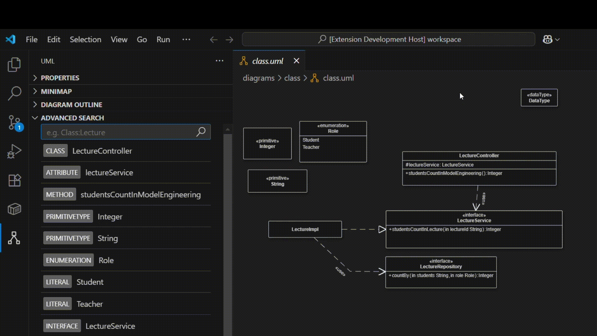

# Advanced Search with Pattern Matching

- Course: Advanced Model Engineering (SS 2025)
- Team Members: Dedic Elma, Miftari Fisnik
- University: TU Wien
- Submission Date: July 6, 2025

## 1. Introduction

This report presents the implementation of the Advanced Search with Pattern Matching feature developed for the bigUML project in Visual Studio Code. The purpose of this document is to explain the motivation behind the feature, outline the design decisions and implementation strategy, highlight key challenges, and discuss ideas for future improvements.

<!-- DEMO -->

  

## 2. Motivation and Purpose

The main objective of this feature is to enable users to efficiently search for UML model elements using flexible, text-based queries. The feature allows users to enter queries like `Class:User` or `Method:get` to find specific elements in UML diagrams. Matching elements are automatically highlighted within the UML diagram and displayed in a structured result list to support quick navigation and easier inspection.

The feature was developed within the bigUML project using a combination of frontend and backend components. The frontend, built with React and the VS Code Webview Toolkit, handles user interaction and result display, while the backend, integrated into the bigUML extension, processes search queries using the GLSP framework.

## 3. Functionality Overview

The search input accepts flexible patterns in the format Type:NamePattern, enabling users to quickly locate model elements based on their type and name. The query format is intentionally kept simple to make the feature accessible to both beginners and experienced users. For example:

- `Class:User` - will match all UML classes with the name "User"
- `Method:get` - will find all methods whose names start with "get"
- `Attribute:id` - will locate attributes named "id"

Once a query is submitted, the system performs the following steps:

1.  Search Execution - the query is parsed and matched against elements in the currently open UML diagram.
2.  Result Presentation - all matching elements are:
    - Visually highlighted directly in the diagram for immediate feedback
    - Listed in a result panel showing their type, name and extra information.
3.  Interactive Navigation - when a user hovers over a result in the list, the corresponding element in the diagram is also highlighted, allowing for fast navigation within large or complex models.

## 4. Architecture and Conceptual Design

### System Architecture

The system architecture follows a modular design consisting of the following main components:

- React Webview (Frontend) – presents the user interface where users input search patterns. Built using React and the VS Code Webview Toolkit.
- VS Code Extension Backend – receives search queries via the vscode-messenger message and delegates them to the appropriate handler.
- Search Action Handler – the AdvancedSearchActionHandler processes the query and traverses the GLSP model to find matching elements.
- Model Matchers – Diagram-specific matchers (e.g. `UseCaseDiagramMatcher`) are responsible for interpreting and matching elements against the pattern.
- GLSP Server Model State – acts as the central in-memory representation of the current UML diagram used for querying.

### Conceptual Flow

At a conceptual level, the feature follows a simple search-and-respond pattern:

1.  The user enters a query pattern such as `Class:User`
2.  The input is sent to the backend, where it is parsed and analyzed
3.  All UML elements matching the pattern are collected
4.  The results are sent back to the frontend

## 5. Supported UML Diagrams

The current implementation includes support for the following UML diagram types:

#### Class Diagram

Handled by the `ClassDiagramMatcher`, this matcher supports all structural components of a class diagram:

- Element Types: Class, Interface, Enumeration, PrimitiveType, DataType
- Members: Attribute, Method, Literal
- Relationships: Association, Aggregation, Composition, Generalization, Dependency, Realization, InterfaceRealization, Abstraction, Usage, Substitution

#### Use Case Diagram

Handled by the `UseCaseDiagramMatcher`, this matcher recognizes actors, use cases, and their relationships:

- Element Types: Actor, UseCase, Subject
- Relationships: Include, Extend, Association, Generalization

#### Activity Diagram

Handled by the `ActivityDiagramMatcher`, this matcher supports common activity modeling constructs:

- Actions and Nodes: Activity, AcceptEventAction, SendSignalAction, Action, ActivityPartition, ActivityFinalNode, DecisionNode, FlowFinalNode, ForkNode, JoinNode, MergeNode, InitialNode, ActivityParameterNode, CentralBufferNode, InputPin, OutputPin
- Edges: ControlFlow

#### State Machine Diagram

Supported by the `StateMachineDiagramMatcher`, this matcher handles:

- States and Pseudostates: StateMachine, Region, State, Pseudostate, Choice, InitialState, FinalState, Fork, Join, DeepHistory, ShallowHistory
- Transitions: Transition

#### Communication Diagram

`CommunicationDiagramMatcher` focuses on modeling interactions between lifelines:

- Element Types: Interaction, Lifeline
- Messages: Message

#### Package Diagram

Implemented via the `PackageDiagramMatcher`, this matcher handles package structure and dependencies:

- Element Types: Package, Class
- Relationships: PackageImport, PackageMerge, ElementImport, Dependency, Usage, Abstraction

#### Information Flow Diagram

The `InformationFlowDiagramMatcher` captures data movement between model elements:

- Element Types: Actor, Class
- Relationships: InformationFlow

Each of these matchers operates independently and adheres to the same interface, ensuring that new diagram types can be added in a modular and maintainable way.

## 6. Implementation details / How We Solved It?

### AdvancedSearch Component

The frontend of the feature is implemented inside the AdvancedSearch component, located within big-advancedsearch package. The component manages two pieces of state: the search query and the list of matching results. As the user types a query, the `fireSearch()` method dispatches a `RequestAdvancedSearchAction` to the backend via the vscode-messenger communication channel. A listener registered via `listenAction()` receives backend responses. When a `AdvancedSearchActionResponse` arrives, the search results are updated and dynamically rendered as a list below the input. Each search result includes a type of tag (e.g., Class, Method), a name and optional details such as attributes or metadata. The component also supports hover-based diagram interaction using `RequestHighlightElementAction`, which triggers element highlighting in the diagram when hovering over results. Thus, the design provides a lightweight yet powerful interface for users to explore large and complex UML models with minimal input.

### AdvancedSearchActionHandler

At the core of the backend logic is the `AdvancedSearchActionHandler` class, which is responsible for handling search and highlight requests originating from the frontend. Upon receiving a `RequestAdvancedSearchAction`, the handler performs the following steps:

- Query Parsing – The input string (e.g., `Class:User`) is split into two parts: a type segment (Class) and a name pattern segment (User). Both parts are normalized to ensure case-insensitive matching.
- Matcher Selection – The handler maintains a list of registered diagram-specific matchers, each implementing the IMatcher interface. If a type is provided, only matchers that support that type (including partial matches) are used.
- Element Matching – The selected matchers receive the current UML model via the `ExperimentalGLSPServerModelState` and return a list of `SearchResult` objects that satisfy the query pattern.
- Filtering and Deduplication – All results are filtered by type and name pattern, then deduplicated using a combination of element ID and type.
- Result Dispatching – The filtered search results are returned to the frontend in the form of an `AdvancedSearchActionResponse`.

The handler also supports diagram interaction through `RequestHighlightElementAction`, which is triggered when the user hovers over a search result. In this case, the handler dispatches a `SelectAction` using the element’s semantic URI to visually highlight it within the UML diagram. This design ensures that all backend search logic is centralized and extensible, allowing future matcher types or query enhancements to be added without affecting the rest of the system.

### Matchers

Diagram-specific search logic is encapsulated within individual matcher classes, each implementing the `IMatcher` interface. Matchers are responsible for traversing the semantic model and extracting matching elements based on the query. Each matcher defines:

- A list of supported types (e.g., Class, Method, Attribute)
- A `match(model)` function that returns all elements of interest
- Optional `supportsPartial(type)` and `supportsList()` methods to support autocomplete and partial queries

All matchers utilize a shared utility called `SharedElementCollector` to recursively traverse deeply nested structures within UML diagrams, as the GLSP model often nests elements in various hierarchies depending on the diagram type. To handle incomplete or missing metadata (e.g., undefined `eClass` or missing type references), matchers implement fallback heuristics such as:

- Inferring types based on element structure
- Resolving parent-child relations via `$ref` pointers
- Generating default names or labels when metadata is sparse

This strategy ensures that the search remains robust and resilient across various modeling styles and incomplete diagrams.

### Communication

The communication between the frontend and backend is built on top of the vscode-messenger framework, enabling lightweight and type-safe message passing. The main components are:

- The React-based AdvancedSearch component dispatches `RequestAdvancedSearchAction` messages when the user enters a query. It also listens for `AdvancedSearchActionResponse` to display results.
- Backend:The `AdvancedSearchActionHandler` receives search requests, invokes the matcher logic, and sends back search results. It also listens for `RequestHighlightElementAction` to handle interactive highlighting.
- Highlighting: When the user hovers over a result, the frontend sends a highlight request to the backend, which dispatches a `SelectAction` to the GLSP framework, causing the corresponding diagram element to be highlighted.

This decoupled communication pattern allows for responsive user interactions, clear separation of concerns, and future extensibility.

## 7. What Problems We Encountered

One of the first challenges we faced was simply understanding how the bigUML platform is structured and how all components interact, because we hadn’t previously worked on similar projects. Another major issue was model traversal. The semantic model used by GLSP is deeply nested and highly dynamic. Each UML diagram type (Class, Use Case, Activity, etc.) structures its elements differently. We also encountered missing or incomplete type information. For example, some elements in Use Case or Activity diagrams did not include a reliable `eClass` or had sparse metadata, making it hard to identify them. To deal with this, we had to implement fallback heuristics and even perform type inference based on parent-child relations and naming conventions.

## 8. Open Issues

The matcher for the Deployment Diagram has been implemented, however, its functionality could not be properly tested since we both encountered issues when trying to open Deployment Diagram in the tool. This problem, which we also mentioned during the presentation, remains unresolved.

## 9. Future Improvements

For potential future improvements, we can suggest several ideas to make the feature even more powerful and user-friendly:

- Multi-Highlighting Support – instead of highlighting just one element, we could visually highlight all matching results in the diagram at once.
- Smarter Query Syntax – we could introduce logical operators like AND, OR or NOT, allowing users to combine multiple filters in a single query.
- Better Feedback – if a pattern is not understood, a friendly validation message could point out what went wrong or how to fix it.

## 10. Feedback about the course

The initial setup of the project environment was quite complex and time-consuming, especially for those unfamiliar with the GLSP system or multi-repo workflows. Despite these challenges, we appreciate the creative freedom and support throughout the project, and we believe the experience helped us improve our practical skills in model-driven engineering.
