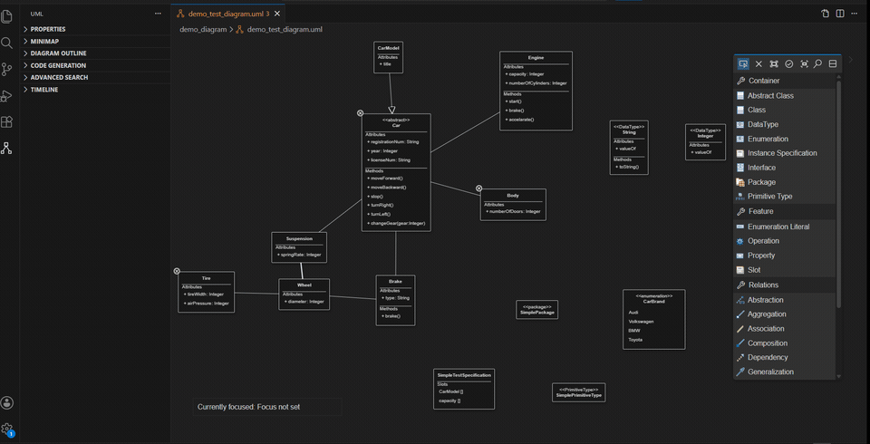

# Advanced Search: Visual Previews, a Structured Query Language & Replace

- **Course:** Advanced Model Engineering (SS 2026)
- **Team Members:** Abdyrakhmanova Aiana, Sultonmurodova Zebiniso, Crnkoci Lukas, Gahleitner Michael, Arslan Smajevic, Marko Vranjes 
- **University:** TU Wien
- **Submission Date:** July 17, 2026
- **Package:** `packages/big-advancedsearch`

> **Second iteration.** The original feature was search-only; this iteration adds SVG
> previews, a structured query language, and **replace** — hence "search and replace". The
> original feature and its first-iteration report are in
> [`SUBMISSION_README.md`](./SUBMISSION_README.md) (demo: `media/advanced-search.gif`); the
> demo for this iteration is `media/advanced-search-and-replace.gif`.

## 1. Introduction

The bigUML VS Code extension already shipped an *Advanced Search* panel that could locate
UML elements by a simple text query and highlight them in the diagram. Our task this term
was to **improve** that feature. Following the topic description, we extended it along three
features:

1. **SVG previews of search results** — each result is shown as a small picture of the
   actual diagram element instead of a plain text line.
2. **A structured query language** — free text is compiled into a validated query language
   that filters by element type, property values, nesting, and relationships, with an
   in-panel syntax help.
3. **Find & replace** — a chosen property is rewritten across all matched elements
   atomically, with a live preview and full undo support.

<p align="center">
  
</p>

## 2. Starting Point

The version we inherited was intentionally basic. Users could type a simple query and the
matching elements were highlighted in the diagram and listed as plain text lines (type and
name only). There was no visual preview, no real query language beyond simple name matching,
and no way to replace anything. Everything described below is our team's contribution on top
of that starting point.

## 3. Theoretical & Conceptual Background

**Why visual previews.** When a search returns many hits, a plain text list forces the user
to click each one just to find out which element it is. Showing a small picture of the actual
node lets them scan instead — recognition is faster than recall. bigUML already renders
diagram snapshots for its minimap and revision management, so this was also a natural fit: we
reuse that same rendering as the source for our thumbnails.

**Why a query language.** Searching a model is not the same as searching text. A UML model is
a network of typed elements with properties and relationships, so a genuinely useful search has
to ask questions like "which classes are abstract?" or "which attributes are of type String?",
not just "which names contain this word?". We looked at how existing approaches handle this. The
OMG's **OCL** is the precise, standard way to query a UML model, but it is verbose and unfriendly
for quick interactive search; Eclipse **EMF Query** is a programmatic option. **CSS-selector** and
**XPath** style syntaxes — familiar to any web developer — are far more compact
(`Class[name~"User"] > Method`). We chose the CSS-selector direction because it is concise, easy
to learn, and fits the "type plus filters" shape of UML elements while still expressing
containment and references.

**Why a real parser.** Rather than pulling the query apart with string tricks, we compile it with
**Chevrotain**, a TypeScript parser toolkit. A parser gives us proper, understandable error
messages and keeps the query *syntax* cleanly separated from the logic that *evaluates* it against
the model.

## 4. Architecture of Our Solution

All feature code lives in the `big-advancedsearch` package, split across the four bigUML runtimes:
a shared protocol layer, the GLSP server (query evaluation), the VS Code extension host (routing
and caching), and the React webview (the panel UI). The end-to-end flow keeps its original shape
but carries much richer content:

```
React webview (browser)  ──RequestAdvancedSearchAction──▶  VS Code host (provider)
        ▲                                                        │  routes + caches
        │  AdvancedSearchActionResponse (results, svg, findPattern)
        │                                                        ▼
   render results ◀── provider merges diagram SVG ──  GLSP server (handler)
   + inline previews                                    parse → AST → matcher → results
```

### 4.1 Feature 1 — Inline SVG Previews

Each result is rendered as a cropped thumbnail of the real diagram node:

- The **extension host** prefetches a full-diagram SVG via the existing minimap export action,
  caches it for the active diagram, and *retries* the export a bounded number of times, because
  early in a diagram's lifecycle the client may not answer yet. The cache is invalidated on diagram
  switch and on any model change, so thumbnails always reflect the current model.
- The **webview** parses that SVG, indexes each element's sub-tree by its id, and crops one
  thumbnail per result by computing a padded view box. Relations get a **composite** preview
  (source → target); members without their own geometry (attributes, methods) fall back to their
  **parent with the child highlighted**. While the export is in flight each row shows a loading
  shimmer, and results with no extractable geometry show a "No preview" placeholder.
- Previews are behind a **title-bar toggle** so the list can stay compact when they aren't needed.

**Performance.** The full-diagram export was originally the panel's slowest step; we made it more than
an order of magnitude faster (see [§5](#5-problems-encountered)).

### 4.2 Feature 2 — Structured Query Language

The query text is compiled into a typed criteria tree and evaluated against the semantic model in
four stages:

- **Lexer** — turns the text into tokens: 13 element keywords (`Class`, `Attribute`, `Method`,
  `Relationship`, `DataType`, `Enumeration`, `EnumerationLiteral`, `Interface`, `PrimitiveType`,
  `Package`, `InstanceSpecification`, `Slot`, `Parameter`), the operators `=` (equals) and `~`
  (contains), brackets, comma, and the child combinator `>`.
- **Parser** — validates structure against the grammar: an element type, an optional `[filter, …]`
  list, and an optional `> element` chain.
- **Visitor** — lowers the parse tree into a typed criteria tree of *type + filters + children* and
  validates every filter.
- **Filter schema** — a single table declares, for each filter, which element types may use it and
  what value type it expects (`string` / `boolean` / `number`). Validation happens *before*
  evaluation, so an unsupported filter produces a clear error instead of silently returning nothing.

**Evaluation** then walks the model: it checks type compatibility (`Class` also matches abstract
classes; `Method` maps to operations, `Attribute` to properties, `Relationship` to every relation
subtype), applies each filter predicate, descends into structural children for the `>` combinator,
and resolves nested `source`/`target` constraints on relationships.

Example: `Class[name~"User"] > Method[isQuery=true]` → all classes whose name contains "User"
**that own** a query method.

**Syntax help.** Because the grammar is richer than plain text search, discoverability matters. A
**title-bar toggle** opens a floating **syntax help** panel that groups runnable examples by category
— elements, property filters, hierarchy (`>`), relationships, and operators — and lists every
queryable parameter, generated from the same filter schema the parser uses, so the help can never
drift from what actually works. Clicking an example runs it immediately.

### 4.3 Feature 3 — Find & Replace

Replace builds directly on the matched result set:

- **Protocol** — a replace request carries the included element ids, the find pattern, the
  replacement, an optional target property (default `name`), and a case-sensitivity flag; the
  response is a per-row result whose "changed" flag drives the ✓ / – / ✗ outcome icons.
- **Shared semantics** — a single replacement function (literal substring, case-insensitive by
  default) is used by **both** the server (the real edit) and the webview (the per-row `old → new`
  preview), so the preview can never disagree with what is written. Enum and boolean properties use
  an exact-match variant.
- **Property selector** — the offered list is built dynamically: it always includes `name`, plus
  every *editable* property the matched elements actually expose (the matcher tags each result with
  its editable values). The editable set is currently all scalar-valued — plain strings (e.g. `name`,
  `value`), enums (e.g. `visibility` → `PUBLIC`/`PRIVATE`/`PROTECTED`/`PACKAGE`), and booleans (e.g.
  `isAbstract`, `isStatic`, `isQuery`) — so cross-references such as an attribute's type are out of
  scope (see Open Issues). Enum and boolean properties are shown as dropdowns, everything else as free
  text. For `name` the find pattern comes from the query; for any other property the user supplies it
  directly.
- **Server handler** — validates the property, rejects an empty pattern and any replace that would
  clear a value, and skips non-matching rows without aborting the batch. All edits are applied as a
  **single** patch through the GLSP command stack and submitted as a normal model operation — which
  is what wires the change into VS Code's undo stack and dirty indicator.
- **Undo & refresh** — the panel's inline **Undo** button reverts the whole batch; on any model
  change the panel re-runs its *current* query (rather than resetting to the full list) and retires a
  now-stale Undo button.

### 4.4 Supporting Fixes

- **Patch-failure propagation** — a failed model patch was being swallowed, which left the command
  stack recording an edit that never happened, so a later undo reverted the wrong change. We surface
  the failure so replace reports it honestly.
- **UI declutter** — color-coded result type badges, a compact inline replace row, and a clear
  distinction between "no results" and an invalid-query error.

## 5. Problems Encountered

- **Diagram export dominated the panel's load time.** Our first working previews were unusably slow.
  The cause was the diagram exporter copying *every* computed CSS property onto every node before
  serializing the SVG. Once we narrowed the copy to the small set of properties that actually affect a
  node's appearance, load time dropped by more than an order of magnitude with no visible difference in
  the thumbnails.
- **The SVG export could arrive before the diagram was ready.** Early in a diagram's lifecycle the
  client did not always answer the export request, so previews came back empty. We made the extension
  host *retry* the export a bounded number of times and invalidate the cached SVG on diagram switch and
  on any model change, so previews eventually appear and always reflect the current model.
- **A silent patch failure corrupted undo.** During replace we found that a failed model patch was
  being swallowed: the command stack recorded an edit that never actually happened, so a later undo
  reverted the wrong change. Surfacing the failure (see [§4.4](#44-supporting-fixes)) was necessary
  before replace could be trusted.
- **Cross-platform differences cost us time.** Subtle behavioural differences between Windows and
  macOS meant a change that worked for one teammate could misbehave for another, so features had to be
  verified on both.

## 6. Open Issues

- **Grammar is hand-maintained.** The filter schema duplicates knowledge that already exists in the
  UML language definition, so a new UML property has to be added in two places and the two can drift.
- **Limited operators.** The syntax exposes only `=` and `~`; comparison operators exist in the
  evaluator but aren't reachable from the query text, and there are no boolean `AND`/`OR`/`NOT`
  combinators.
- **Scalar replace only.** Replace targets scalar string, enum, and boolean properties; changing a
  cross-reference such as an attribute's *type* is not supported.
- **Full-diagram export cost.** Previews still rely on exporting the whole diagram (cached and
  optimized, but not incremental), which remains the heaviest operation on very large models.

## 7. Future Improvements

- **Generate the filter schema from the metamodel.** Derive `FILTER_SPECS` from the generated model
  types (`class-diagram-model-types.ts`) instead of maintaining it by hand, so every UML property
  becomes searchable automatically and can never drift from the language definition.
- **Broaden the query language.** Surface the comparison operators already implemented in the
  evaluator and add boolean `AND`/`OR`/`NOT` for combining filters.
- **Cross-reference replace.** Extend replace beyond scalar properties to reference-valued ones
  (e.g. an attribute's type).

## 8. Feedback

**What we didn't like about the architecture.** The biggest cost is that a single user action crosses
four runtimes (browser webview, GLSP client, GLSP server, model server) communicating over actions and
JSON-RPC. That indirection makes even a small feature hard to follow end to end and hard to debug,
since a failure can surface far from its cause. Within our own package the filter schema is the other
weak spot: it hand-duplicates knowledge that already lives in the generated UML language definition, so
the two can drift and every new queryable property has to be added twice (see [§7](#7-future-improvements)
for how we'd fix this).

**Feedback about the course.** The project was a genuinely valuable, hands-on model-driven engineering
experience, and we appreciated the freedom to shape the feature ourselves. The main friction was the
initial ramp-up on the architecture above: understanding the action flow well enough to make a safe
change took a large share of our time. A short guided "trace one action end to end" walkthrough, plus
an explicit note that features must be tested on both Windows and macOS (subtle platform differences
cost us time), would meaningfully lower that barrier for next year's teams.
