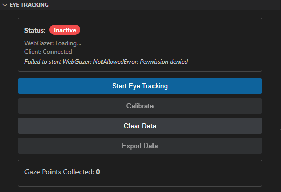

# Eye Tracking Package

This package provides eye tracking functionality for BigUML using WebGazer.js.

## Features

- WebGazer.js integration
- Start/Stop eye tracking toggle
- 9-point calibration system
- Real-time gaze data collection
- Data export (CSV and JSON formats)
- React-based modern UI
- VS Code integration with notifications
- Memory management for large datasets


## DEV-Setup

1. Copy this package to `client/packages/big-eye-tracking/`
2. Add dependency to main `package.json`:
   ```json
   "@borkdominik-biguml/big-eye-tracking": "*"
   ```
3. Register the module in the application
4. Add view to VS Code package.json
5. Build the project: `npm run build`

## Registration in Application

### 1. Add to client/application/vscode/package.json

```json
{
  "views": {
    "bigUML-panel": [
      {
        "id": "bigUML.panel.eye-tracking",
        "name": "Eye Tracking",
        "type": "webview",
        "when": "bigUML.isRunning"
      }
    ]
  },
  "dependencies": {
    "@borkdominik-biguml/big-eye-tracking": "*"
  }
}
```

### 2. Register in dependency injection container

```typescript
// In your main DI configuration
import { eyeTrackingModule } from '@borkdominik-biguml/big-eye-tracking/vscode';

container.load(eyeTrackingModule('bigUML.panel.eye-tracking'));
```

### 3. Add to GLSP client (optional)

```typescript
// In your GLSP client configuration
import { eyeTrackingModule } from '@borkdominik-biguml/big-eye-tracking/glsp-client';

const container = createContainer(...containerModules, eyeTrackingModule);
```

## Usage

1. The eye tracking panel will appear in VS Code sidebar
2. Click "Start Eye Tracking" to begin (requires camera permission)
3. Use "Calibrate" for 9-point calibration
4. Gaze data is automatically collected and exported
5. Use "Export Data" to save collected data
6. Data is saved to `workspace/logs/` directory

## Data Format

### CSV Export
```
timestamp,x,y,relative_timestamp
1704067200000,320,240,0
1704067200050,325,245,50
...
```

### JSON Export
```json
{
  "metadata": {
    "exportTime": "2024-01-01T00:00:00.000Z",
    "totalPoints": 1000,
    "duration": 50000,
    "startTime": 1704067200000
  },
  "gazePoints": [
    {"x": 320, "y": 240, "timestamp": 1704067200000},
    ...
  ]
}
```

## WebGazer Configuration

The implementation uses:
- **Tracker**: TFFacemesh (TensorFlow.js face mesh)
- **Regression**: Ridge regression
- **Video Feed**: Hidden for cleaner UI
- **Predictions**: Visible during tracking
- **Face Overlay**: Disabled

## Memory Management

- Limits gaze points to 10,000 to prevent memory issues
- Automatically removes oldest points when limit is reached
- Periodic data transmission to extension (every 50 points)
- Efficient React state updates

## Privacy & Security

- All processing happens client-side
- No video data is transmitted to servers
- Camera access requires explicit user permission
- Data export is completely local

## Advanced Features

- **Implicit Calibration**: Can be extended with mouse movement tracking
- **Accuracy Measurement**: Framework for measuring tracking precision
- **Heatmap Generation**: Data structure supports heatmap visualization
- **Real-time Analytics**: Live gaze point statistics

## Browser Compatibility

WebGazer.js supports:
- Chrome/Chromium (recommended)
- Firefox
- Safari (limited)
- Edge

VS Code uses Electron (Chromium), so compatibility is excellent.

## Troubleshooting

**Camera Permission Issues:**
- Ensure camera is not used by other applications
- Try restarting VS Code

**Poor Tracking Accuracy:**
- Use the calibration feature
- Ensure good lighting conditions
- Position yourself properly in front of camera
- Minimize head movement during tracking

## Development

To extend this package:

1. **Add new actions** in `src/common/eye-tracking.action.ts`
2. **Extend React component** in `src/browser/eye-tracking.component.tsx`
3. **Update provider** in `src/vscode/eye-tracking.provider.ts`
4. **Add GLSP handlers** in `src/glsp-client/` if needed

The architecture follows the same patterns as other BigUML packages