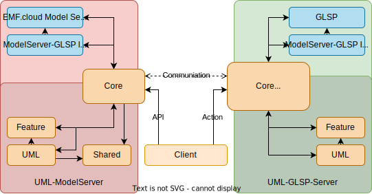

# Achitecture Overview

We provide an overview of the architecture in this and the following pages.

Client

- [Client](./client/client.md)

Server

- [GLSP](./server/glsp.md)
  - [Actions & Action Handlers](./server/actions.md)
- [ModelServer](./server/model-server.md)

Please read first the previously mentioned chapters.

---

The following sections provide you with an overview of the related parts.

## Flow

This section exemplary demonstrates the flow between the clients and the servers.

### Client - UML-ModelServer

The model server provides a REST-API for interaction possibilities. The client can use this functionality to create, delete or listen to changes in source models. The libraries are called or redirected to UML-specific modules depending on the request. The clients (and other servers) are also connected through websockets to the model server to listen to events.

The client uses this REST-API to send a create request to the model server to create the source models (i.e., the files).

### Client - UML-GLSP-Server

Please read the [ActionHandler](https://www.eclipse.org/glsp/documentation/actionhandler/) documentation.

The client sends an action to the UML-GLSP-Server. The UML-GLSP-Server determines if the action should be processed internally (GLSP-Library) or by the UML modules. Further, the UML-GLSP-Server can determine which representation/diagram type is connected to use the correct handler from the right UML module.

### UML-GLSP-Server - UML-ModelServer

The UML-GLSP-Server does not manage the source models. The model server does the model management (CRUD). The GLSP-Server only maps the content provided by the model server to a structure that the client understands.

Consequently, changes requested from the client are propagated from the UML-GLSP-Server to the UML-ModelServer; vice versa, the source models are mapped to a structure the client can render.
