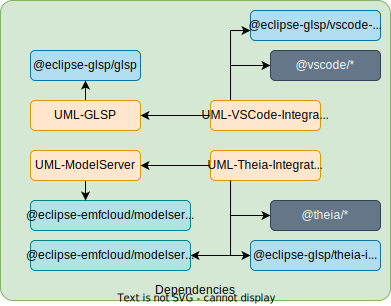

# Client

An overview of the dependencies can be seen as follows.

## Structure of this repository

- `environments/theia-app`: Local Theia instance.
- `packages/*:` Client specific packages.

## Theia-App

Why this package is necessary is described in the [Theia-Application Documentation](https://theia-ide.org/docs/composing_applications/)

## UML-GLSP

The client part of GLSP is implemented in this package.

### Structure

The more exciting parts of this package are explained here.

- `features`: This folder provides the client part of the features provided by the UML-GLSP-Server (e.g., `outline`) or replaces the features provided by the GLSP libraries (e.g., `tool-palette`).
- `graph`: Common rendered graph elements (e.g., `icon`, `glsp-graph`) are placed here.
- `uml`: This folder provides the UML-specific modules and code. The necessary (dependency-) bindings are provided here for every UML module.

## UML-ModelServer

The client part of the custom UML model server is provided in this package.

## UML-Theia-Integration

The UML-Theia-Integration uses [Theia](https://theia-ide.org/docs/), [glsp theia integration](https://github.com/eclipse-glsp/glsp-theia-integration), and the [model server theia integration](https://github.com/eclipse-emfcloud/emfcloud-modelserver-theia) to provide the UML editor for Theia.

### Structure

Theia runs in the browser (frontend) and starts a node process (backend) in the background.

- `browser`: This folder has frontend-specific code.
  - `browser/features`: Custom features like the `outline` require integration access (Theia, VSCode).
  - `browser/glsp`: Everything required to run GLSP in the Theia context.
  - `browser/modelserver`: Everything required to run ModelServer in the Theia context.
  - `browser/theia`: Theia-specific changes.
- `common`: Common used configurations/interfaces.
- `node`: This folder has backend-specific code.

## UML-VSCode-Integration

The UML-VSCode-Integration is a [VSCode Extension](https://code.visualstudio.com/api). It uses [glsp vscode integration](https://github.com/eclipse-glsp/glsp-vscode-integration) to provide the UML editor for VSCode.

The VSCode integration is lightweight, and compared to Theia, it has less functionality already built in. The available integration provides only the basics. However, it is easier to develop and test compared to Theia.

### Structure

The VSCode integration consists of two parts: the `extension` and the `webview`. The `webview` is the GLSP part, available in the VSCode extension context through an _iframe_. It communicates over the iframe with the extension. The `extension` loads the webview and is responsible for the extension lifecycle.

The folder structure is similar to the UML-Theia-Integration.
