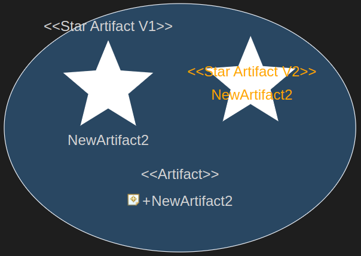

# Rendering

Here we will learn how to render elements with SVG and the GModel. This tutorial follows [Creating Nodes](./1_CreatingNodes.md).

---

We will first extend our UML-ModelServer and UML-GLSP-Server to allow a different variant for the `Artifact`. Afterward, we will render the following SVG:



All the necessary preparations will be passed quickly. Please read the other tutorials for more information about them.

## UML-ModelServer

We will save a **keyword** in the model to allow different renderings for the' Artifact'. Based on that keyword, we will provide a different `GModel` in the UML-GLSP-Server. This keyword is only for easier differentiation.

You probably will NOT need it in your diagram. The **keyword** is only used in the demo for demonstration purposes.

### MS-Step 1: Create Keyword Enum

Create the following `Java Enum` file:

- Name: `ArtifactKeyword`
- Path: `/com.eclipsesource.uml.modelserver/src/main/java/com/eclipsesource/uml/modelserver/uml/diagram/demo/constants/ArtifactKeyword.java` (create packages if necessary)

Put the following content into the file.

```java
package com.eclipsesource.uml.modelserver.uml.diagram.demo.constants;

public enum ArtifactKeyword {
   DEFAULT,
   STAR
}

```

We will use the `ArtifactKeyword` to differentiate between the `default` and the `star` rendering in the `GModelMapper`.

### MS-Step 2: Update Commands

Update the following files:

- `CreateArtifactSemanticCommand.java`
- `CreateArtifactCompoundCommand.java`
- `CreateArtifactContribution.java`

```java
package com.eclipsesource.uml.modelserver.uml.diagram.demo.commands.artifact;

import org.eclipse.uml2.uml.Artifact;
import org.eclipse.uml2.uml.Model;
import org.eclipse.uml2.uml.UMLFactory;

import com.eclipsesource.uml.modelserver.shared. model.ModelContext;
import com.eclipsesource.uml.modelserver.shared.semantic.BaseCreateSemanticChildCommand;
import com.eclipsesource.uml.modelserver.uml.diagram.demo.constants.ArtifactKeyword;
import com.eclipsesource.uml.modelserver.uml.generator.ListNameGenerator;

public class CreateArtifactSemanticCommand extends BaseCreateSemanticChildCommand<Model, Artifact> {

   protected ArtifactKeyword keyword;

   public CreateArtifactSemanticCommand(final ModelContext context, final Model parent, final ArtifactKeyword keyword) {
      super(context, parent);

      this.keyword = keyword;
   }

   @Override
   protected Artifact createSemanticElement(final Model parent) {
      var nameGenerator = new ListNameGenerator(Artifact.class, parent.getPackagedElements());

      var artifact = UMLFactory.eINSTANCE.createArtifact();
      artifact.setName(nameGenerator.newName());
      artifact.addKeyword(this.keyword.name());
      parent.getPackagedElements().add(artifact);

      return artifact;
   }

}
```

```java
package com.eclipsesource.uml.modelserver.uml.diagram.demo.commands.artifact;

import org.eclipse.emf.common.command.CompoundCommand;
import org.eclipse.glsp.graph.GPoint;
import org.eclipse.glsp.graph.util.GraphUtil;
import org.eclipse.uml2.uml.Model;

import com.eclipsesource.uml.modelserver.shared. model.ModelContext;
import com.eclipsesource.uml.modelserver.shared.notation.commands.AddShapeNotationCommand;
import com.eclipsesource.uml.modelserver.uml.diagram.demo.constants.ArtifactKeyword;

public final class CreateArtifactCompoundCommand extends CompoundCommand {

   public CreateArtifactCompoundCommand(final ModelContext context, final Model parent,
      final GPoint position, final ArtifactKeyword keyword) {
      var command = new CreateArtifactSemanticCommand(context, parent, keyword);

      this.append(command);
      this.append(
         new AddShapeNotationCommand(context, command::getSemanticElement, position, GraphUtil.dimension(160, 50)));
   }
}
```

```java
package com.eclipsesource.uml.modelserver.uml.diagram.demo.commands.artifact;

import org.eclipse.emf.common.command.Command;
import org.eclipse.emf.common.util.URI;
import org.eclipse.emf.edit.domain.EditingDomain;
import org.eclipse.emfcloud.modelserver.command.CCommand;
import org.eclipse.emfcloud.modelserver.common.codecs.DecodingException;
import org.eclipse.emfcloud.modelserver.edit.command.BasicCommandContribution;
import org.eclipse.glsp.graph.GPoint;
import org.eclipse.uml2.uml.Model;

import com.eclipsesource.uml.modelserver.core.commands.noop.NoopCommand;
import com.eclipsesource.uml.modelserver.shared.codec.ContributionDecoder;
import com.eclipsesource.uml.modelserver.shared.codec.ContributionEncoder;
import com.eclipsesource.uml.modelserver.uml.diagram.demo.constants.ArtifactKeyword;

public final class CreateArtifactContribution extends BasicCommandContribution<Command> {

   public static final String TYPE = "component:add_artifact";
   protected static final String KEYWORD = "keyword";

   public static CCommand create(final Model parent, final GPoint position, final ArtifactKeyword keyword) {
      return new ContributionEncoder().type(TYPE).parent(parent).position(position).extra(KEYWORD, keyword.name())
         .ccommand();
   }

   @Override
   protected Command toServer(final URI modelUri, final EditingDomain domain, final CCommand command)
      throws DecodingException {
      var decoder = new ContributionDecoder(modelUri, domain, command);

      var context = decoder.context();
      var parent = decoder.parent(Model.class);
      var position = decoder.position().get();
      var keyword = ArtifactKeyword.valueOf(decoder.extra(KEYWORD));

      return parent
         .<Command> map(p -> new CreateArtifactCompoundCommand(context, p, position, keyword))
         .orElse(new NoopCommand());
   }

}
```

Those changes will allow saving the value of the `ArtifactKeyword` in the UML model. Later you can open the `.uml` file and check if the `keyword` has been created.

---

## UML-GLSP-Server

### GS-Step 1: Update the Artifact configuration

Open the file `UmlDemo_Artifact.java`:

Put the following content into the file.

```java
package com.eclipsesource.uml.glsp.uml.diagram.demo.diagram;

import java.util.List;
import java.util.Map;
import java.util.Set;

import org.eclipse.emf.ecore.EClass;
import org.eclipse.glsp.graph.DefaultTypes;
import org.eclipse.glsp.graph.GraphPackage;
import org.eclipse.glsp.server.types.ShapeTypeHint;
import org.eclipse.uml2.uml.Artifact;

import com.eclipsesource.uml.glsp.core.diagram.DiagramElementConfiguration;
import com.eclipsesource.uml.glsp.uml.utils.QualifiedUtil;
import com.eclipsesource.uml.modelserver.uml.diagram.demo.constants.ArtifactKeyword;
import com.eclipsesource.uml.modelserver.unotation.Representation;

public class UmlDemo_Artifact {
   public static String typeId() {
      return QualifiedUtil.representationTypeId(Representation.COMPONENT, DefaultTypes.NODE,
         Artifact.class.getSimpleName());
   }

   public static class Variant {
      public static String starTypeId() {
         return QualifiedUtil.representationTemplateTypeId(Representation.COMPONENT, DefaultTypes.NODE,
            ArtifactKeyword.STAR.name(),
            Artifact.class.getSimpleName());
      }
   }

   public static class GModel {
      public static String starNodeTypeId() {
         return QualifiedUtil.representationTemplateTypeId(Representation.COMPONENT, DefaultTypes.NODE,
            "GModel",
            ArtifactKeyword.STAR.name());
      }

      public static String starCompartmentTypeId() {
         return QualifiedUtil.representationTemplateTypeId(Representation.COMPONENT, DefaultTypes.COMPARTMENT,
            "GModel",
            ArtifactKeyword.STAR.name());
      }
   }

   public enum Property {}

   public static class DiagramConfiguration implements DiagramElementConfiguration.Node {

      @Override
      public Map<String, EClass> getTypeMappings() {
         return Map.of(
            typeId(), GraphPackage.Literals.GNODE,
            Variant.starTypeId(), GraphPackage.Literals.GNODE,
            GModel.starNodeTypeId(), GraphPackage.Literals.GNODE,
            GModel.starCompartmentTypeId(), GraphPackage.Literals.GCOMPARTMENT);
      }

      @Override
      public Set<String> getGraphContainableElements() { return Set.of(typeId(), Variant.starTypeId()); }

      @Override
      public Set<ShapeTypeHint> getShapeTypeHints() {
         return Set.of(
            new ShapeTypeHint(typeId(), true, true, true, false,
               List.of()),
            new ShapeTypeHint(Variant.starTypeId(), true, true, true, false,
               List.of()),
            new ShapeTypeHint(GModel.starNodeTypeId(), false, false, false, false,
               List.of()),
            new ShapeTypeHint(GModel.starCompartmentTypeId(), false, false, false, false,
               List.of()));
      }
   }
}
```

Here we introduce two new concepts: `Variants` and `GModels`. The `Variant.starTypeId` will allow the creation of a variation of the `Artifact`. The `GModels` will be only used in the rendering part and have no interaction possibilities. `GModel.starNodeTypeId` will be rendered as a `GNode` and the `GModel.starCompartmentTypeId` as a `GCompartment`.

#### GS-Step1: Important

- `ids` are used by the client to differentiate between the elements
- `Variants` provide the possibility to create the same element in the UML model, but with slight changes (like adding the `Keyword`)
- `GModels` are only for rendering; they have no functionality

### GS-Step 2: Update the tool palette

Open the file `DemoToolPaletteConfiguration.java`.

Replace the content of the method `containers` with:

```java
   private PaletteItem containers() {
      var containers = List.of(
         PaletteItemUtil.node(UmlDemo_Artifact.typeId(), "Artifact", "uml-artifact-icon"),
         PaletteItemUtil.node(UmlDemo_Artifact.Variant.starTypeId(), "Star Artifact", "uml-artifact-icon"));

      return PaletteItem.createPaletteGroup("uml.classifier", "Container", containers, "symbol-property");
   }
```

Here we add our `Variant` to the tool palette so that we can create it later.

### GS-Step 3: Create the handler

Create the following `Java Class` file:

- Name: `CreateStarArtifactHandler`
- Path: `/com.eclipsesource.uml.glsp/src/main/java/com/eclipsesource/uml/glsp/uml/diagram/demo/handler/operation/artifact/CreateStarArtifactHandler.java` (create packages if necessary)

```java
package com.eclipsesource.uml.glsp.uml.diagram.demo.handler.operation.artifact;

import org.eclipse.emfcloud.modelserver.command.CCommand;
import org.eclipse.glsp.graph.util.GraphUtil;
import org.eclipse.glsp.server.operations.CreateNodeOperation;
import org.eclipse.uml2.uml.Model;

import com.eclipsesource.uml.glsp.uml.diagram.demo.diagram.UmlDemo_Artifact;
import com.eclipsesource.uml.glsp.uml.handler.operations.create.BaseCreateChildNodeHandler;
import com.eclipsesource.uml.glsp.uml.handler.operations.create.CreateLocationAwareNodeHandler;
import com.eclipsesource.uml.modelserver.uml.diagram.demo.commands.artifact.CreateArtifactContribution;
import com.eclipsesource.uml.modelserver.uml.diagram.demo.constants.ArtifactKeyword;

public class CreateStarArtifactHandler extends BaseCreateChildNodeHandler< model>
   implements CreateLocationAwareNodeHandler {

   public CreateStarArtifactHandler() {
      super(UmlDemo_Artifact.Variant.starTypeId());
   }

   @Override
   protected CCommand createCommand(final CreateNodeOperation operation, final Model parent) {
      return CreateArtifactContribution.create(
         parent,
         relativeLocationOf(modelState, operation).orElse(GraphUtil.point(0, 0)), ArtifactKeyword.STAR);
   }
}
```

In the constructor, we pass our `Variant`, and in the `CreateArtifactContribution.create` method, we define that we want to use the keyword `ArtifactKeyword.STAR`.

#### GS-Step3: Important

- We also need to update the `CreateArtifactHandler.java` file to use the keyword `ArtifactKeyword.DEFAULT` in the method `createCommand`

### GS-Step 4: Update the Manifest

Open the file `DemoManifest.java`:

Update the method `contributeDiagramCreateHandlers` to use our new handler:

```java
   contributeDiagramCreateHandlers((contribution) -> {
      contribution.addBinding().to(CreateArtifactHandler.class);
      contribution.addBinding().to(CreateStarArtifactHandler.class);
   });
```

---

## GModel

This part will focus on the `GModel` part of the rendering. First, the final file will be provided, and then all sections will be explained step by step.

### Theory

Please read first

- <https://www.eclipse.org/glsp/documentation/gmodel/>
- <https://www.eclipse.org/glsp/documentation/rendering/>
- <https://www.eclipse.org/glsp/documentation/clientlayouting/>

### File

Open the file `ArtifactNodeMapper.java`:

- Path: `/com.eclipsesource.uml.glsp/src/main/java/com/eclipsesource/uml/glsp/uml/diagram/demo/gmodel/ArtifactNodeMapper.java`

Put the following content into the file.

```java
package com.eclipsesource.uml.glsp.uml.diagram.demo.gmodel;

import org.eclipse.glsp.graph.GCompartment;
import org.eclipse.glsp.graph.GNode;
import org.eclipse.glsp.graph.builder.impl.GCompartmentBuilder;
import org.eclipse.glsp.graph.builder.impl.GLayoutOptions;
import org.eclipse.glsp.graph.builder.impl.GNodeBuilder;
import org.eclipse.glsp.graph.util.GConstants;
import org.eclipse.uml2.uml.Artifact;

import com.eclipsesource.uml.glsp.core.constants.CoreCSS;
import com.eclipsesource.uml.glsp.uml.diagram.demo.diagram.UmlDemo_Artifact;
import com.eclipsesource.uml.glsp.uml.gmodel.BaseGNodeMapper;
import com.eclipsesource.uml.glsp.uml.gmodel.element.NamedElementGBuilder;
import com.eclipsesource.uml.modelserver.uml.diagram.demo.constants.ArtifactKeyword;

public class ArtifactNodeMapper extends BaseGNodeMapper<Artifact, GNode>
   implements NamedElementGBuilder<Artifact> {

   @Override
   public GNode map(final Artifact source) {
      GNodeBuilder builder;

      if (source.hasKeyword(ArtifactKeyword.STAR.name())) {
         // https://www.eclipse.org/glsp/documentation/clientlayouting/
         var innerLayout = new GLayoutOptions().vGap(10)
            .hAlign(GConstants.HAlign.CENTER);

         builder = new GNodeBuilder(UmlDemo_Artifact.Variant.starTypeId())
            .id(idGenerator.getOrCreateId(source))
            .layout(GConstants.Layout.VBOX)
            .addCssClass("uml-star-artifact")
            .add(compartmentBuilder(source)
               .layout(GConstants.Layout.VBOX)
               .layoutOptions(innerLayout)
               .add(buildStars(source))
               .add(buildDefaultHeader(source))
               .build());

      } else {
         builder = new GNodeBuilder(UmlDemo_Artifact.typeId())
            .id(idGenerator.getOrCreateId(source))
            .layout(GConstants.Layout.VBOX)
            .addCssClass(CoreCSS.NODE)
            .add(buildDefaultHeader(source));
      }

      applyShapeNotation(source, builder);

      return builder.build();
   }

   protected GCompartment buildDefaultHeader(final Artifact source) {
      var header = compartmentHeaderBuilder(source)
         .layout(GConstants.Layout.VBOX);

      header.add(textBuilder(source, "<<Artifact>>").build());
      header.add(buildIconVisibilityName(source, "--uml-artifact-icon"));

      return header.build();
   }

   protected GCompartment buildStars(final Artifact source) {
      var compartment = compartmentBuilder(source)
         .layout(GConstants.Layout.HBOX)
         .layoutOptions(new GLayoutOptions().vAlign(GConstants.VAlign.CENTER).hGap(10))
         .add(buildHeaderWithStar(source))
         .add(buildHeaderInStar(source));

      return compartment.build();
   }

   protected GCompartment buildHeaderWithStar(final Artifact source) {
      var compartment = compartmentBuilder(source)
         .layout(GConstants.Layout.VBOX)
         .layoutOptions(new GLayoutOptions().vGap(10));

      var star = new GNodeBuilder(UmlDemo_Artifact.GModel.starNodeTypeId())
         .id(idContextGenerator().getOrCreateId(source))
         .addCssClass("uml-star-node")
         .build();

      compartment
         .add(textBuilder(source, "<<Star Artifact V1>>").build())
         .add(star)
         .add(textBuilder(source, source.getName()).build());

      return compartment.build();
   }

   protected GCompartment buildHeaderInStar(final Artifact source) {
      var star = new GCompartmentBuilder(UmlDemo_Artifact.GModel.starCompartmentTypeId())
         .id(idContextGenerator().getOrCreateId(source))
         .addCssClass("uml-star-compartment")
         .layout(GConstants.Layout.VBOX)
         .layoutOptions(new GLayoutOptions().hAlign(GConstants.HAlign.CENTER));

      star
         .add(textBuilder(source, "<<Star Artifact V2>>").build())
         .add(textBuilder(source, source.getName()).build());

      return star.build();
   }
}
```

### GModel method: map

```java
   @Override
   public GNode map(final Artifact source) {
      GNodeBuilder builder;

      if (source.hasKeyword(ArtifactKeyword.STAR.name())) {
         // https://www.eclipse.org/glsp/documentation/clientlayouting/
         var innerLayout = new GLayoutOptions().vGap(10)
            .hAlign(GConstants.HAlign.CENTER);

         builder = new GNodeBuilder(UmlDemo_Artifact.Variant.starTypeId())
            .id(idGenerator.getOrCreateId(source))
            .layout(GConstants.Layout.VBOX)
            .addCssClass("uml-star-artifact")
            .add(compartmentBuilder(source)
               .layout(GConstants.Layout.VBOX)
               .layoutOptions(innerLayout)
               .add(buildStars(source))
               .add(buildDefaultHeader(source))
               .build());

      } else {
         builder = new GNodeBuilder(UmlDemo_Artifact.typeId())
            .id(idGenerator.getOrCreateId(source))
            .layout(GConstants.Layout.VBOX)
            .addCssClass(CoreCSS.NODE)
            .add(buildDefaultHeader(source));
      }

      applyShapeNotation(source, builder);

      return builder.build();
   }
```

In this method, we first check if the `Artifact` has the keyword `STAR`. In this case, we will build the `GModel` differently. Otherwise, the old `GModel` will be used.

The `GNode` will have the `UmlDemo_Artifact.Variant.starTypeId()` as the type. We use the `VBox` (`vertical`) layout as layout. There are different layouts like `HBox` and `Freeform`. Afterward, the CSS `uml-star-artifact` is appended. Until now, we only defined the root, we also need to add content. That can be done by using `add`. Here we are defining that we want to add a compartment with the `VBox` layout, which should have the elements of `buildStars` and `buildDefaultHeader` methods as children.

### GModel method: buildStars

```java
   protected GCompartment buildStars(final Artifact source) {
      var compartment = compartmentBuilder(source)
         .layout(GConstants.Layout.HBOX)
         .layoutOptions(new GLayoutOptions().vAlign(GConstants.VAlign.CENTER).hGap(10))
         .add(buildHeaderWithStar(source))
         .add(buildHeaderInStar(source));

      return compartment.build();
   }
```

The method `buildStars` creates two different stars side by side with a `gap` between them.

### GModel method: buildHeaderWithStar

```java
   protected GCompartment buildHeaderWithStar(final Artifact source) {
      var compartment = compartmentBuilder(source)
         .layout(GConstants.Layout.VBOX)
         .layoutOptions(new GLayoutOptions().vGap(10));

      var star = new GNodeBuilder(UmlDemo_Artifact.GModel.starNodeTypeId())
         .id(idContextGenerator().getOrCreateId(source))
         .addCssClass("uml-star-node")
         .build();

      compartment
         .add(textBuilder(source, "<<Star Artifact V1>>").build())
         .add(star)
         .add(textBuilder(source, source.getName()).build());

      return compartment.build();
   }
```

This method first creates the compartment (layout), then the star `GNode` with the CSS `uml-star-node` and combines it with the other two texts.

### GModel method: buildHeaderInStar

```java
   protected GCompartment buildHeaderInStar(final Artifact source) {
      var star = new GCompartmentBuilder(UmlDemo_Artifact.GModel.starCompartmentTypeId())
         .id(idContextGenerator().getOrCreateId(source))
         .addCssClass("uml-star-compartment")
         .layout(GConstants.Layout.VBOX)
         .layoutOptions(new GLayoutOptions().hAlign(GConstants.HAlign.CENTER));

      star
         .add(textBuilder(source, "<<Star Artifact V2>>").build())
         .add(textBuilder(source, source.getName()).build());

      return star.build();
   }
```

The previous method put the star between the texts; however, here, we define that the star should be used as a `Compartment`.

### GModel Pseudo Presentation

```ts
- GNode (StarArtifact, VBox)
   - GCompartment (VBox)
      - GCompartment (HBox)
         - Compartment (VBox)
            - Text
            - GNode (StarNodeArtifact)
            - Text
         - StarCompartmentArtifact (VBox)
            - Text
            - Text
      - Header...
```

The result of the mapping would be this pseudo representation.

---

## SVG

Now we will focus on the **client** side.

### CSS

Create the following `css` file:

- Name: `style.css`
- Path: `packages/uml-glsp/css/diagram/demo/style.css` (create folders if necessary)

With the following content:

```css
.uml-star-node {
  fill: #fff;
  stroke-width: 1;
  stroke: #fff;
}

.uml-star-compartment {
  fill: #fff;
  stroke-width: 1;
  stroke: #fff;
}

.uml-star-compartment text {
  fill: orange;
}

.uml-star-artifact {
  fill: var(--uml-node);
  stroke-width: 1;
  stroke: var(--uml-border);
}
```

Those are only necessary to change the style of the SVG. You can change the styling as you wish.

Then import your created file at the bottom of `packages/uml-glsp/css/style.css`

```css
@import "diagram/demo/style.css";
```

### Create the star artifact

Create the following `tsx` file:

- Name: `star-artifact.tsx`
- Path: `packages/uml-glsp/src/uml/diagram/demo/elements/star-artifact.tsx` (create folders if necessary)

```ts
import {
  alignFeature,
  layoutableChildFeature,
  RenderingContext,
  ShapeView,
  SNode,
  svg,
} from "@eclipse-glsp/client";
import { injectable } from "inversify";
import { VNode } from "snabbdom";

// eslint-disable-next-line @typescript-eslint/no-unused-vars
const JSX = { createElement: svg };

export class StarArtifactNode extends SNode {
  static override readonly DEFAULT_FEATURES = [
    ...SNode.DEFAULT_FEATURES,
    alignFeature,
    layoutableChildFeature,
  ];
}

@injectable()
export class StarArtifactView extends ShapeView {
  override render(
    element: StarArtifactNode,
    context: RenderingContext
  ): VNode | undefined {
    if (!this.isVisible(element, context)) {
      return undefined;
    }

    const width = Math.max(10, element.bounds.width);
    const height = Math.max(10, element.bounds.height);

    return (
      <g
        class-selected={element.selected}
        class-mouseover={element.hoverFeedback}
      >
        <ellipse
          cx={width / 2}
          cy={height / 2}
          rx={width / 2}
          ry={height / 2}
        />

        {context.renderChildren(element)}
      </g>
    ) as any;
  }
}
```

Here are two essential concepts. First, we have the element called `StarArtifactNode`. GLSP uses `features` to provide specific functionality to elements. The features `alignFeature`, `layoutableChildFeature` are necessary to align it correctly in the UI; otherwise, aligning would not work.

Then we have the `view` called `StarArtifactView`. This `view` returns the SVG. In the `return` the structure of the SVG is defined. Here we use the `g` element as a container with an `ellipsis` in it. The framework will handle the rest of the children of the element. The `GModel` (see pseudo presentation) will be mapped step by step by the framework to the corresponding view. Right now, the root would only have an `ellipsis` and no star in it.

You can read more about how to handle SVGs here:

- <https://developer.mozilla.org/en-US/docs/Web/SVG/Tutorial/Introduction>
- <https://www.w3schools.com/graphics/svg_intro.asp>

### Create a star node and compartment

Create the following `tsx` file:

- Name: `star.tsx`
- Path: `packages/uml-glsp/src/uml/diagram/demo/elements/star.tsx` (create folders if necessary)

```ts
import {
  alignFeature,
  boundsFeature,
  fadeFeature,
  layoutableChildFeature,
  layoutContainerFeature,
  RenderingContext,
  SCompartment,
  SCompartmentView,
  ShapeView,
  SShapeElement,
  svg,
} from "@eclipse-glsp/client";
import { injectable } from "inversify";
import { VNode } from "snabbdom";

// eslint-disable-next-line @typescript-eslint/no-unused-vars
const JSX = { createElement: svg };

export class StarNode extends SShapeElement {
  static readonly DEFAULT_FEATURES = [
    boundsFeature,
    layoutContainerFeature,
    fadeFeature,
    alignFeature,
    layoutableChildFeature,
  ];
}

@injectable()
export class StarNodeView extends ShapeView {
  override render(
    element: StarNode,
    context: RenderingContext
  ): VNode | undefined {
    if (!this.isVisible(element, context)) {
      return undefined;
    }

    const translate = `translate(${element.bounds.x}, ${element.bounds.y})`;

    // https://uxwing.com/star-full-icon/
    return (
      <g transform={translate}>
        <polygon points="61.44,0 78.351,41.326 122.88,44.638 88.803,73.491 99.412,116.864 61.44,93.371 23.468,116.864 34.078,73.491 0,44.638 44.529,41.326 61.44,0" />
      </g>
    ) as any;
  }
}

export class StarCompartment extends SCompartment {
  static override readonly DEFAULT_FEATURES = [
    ...SCompartment.DEFAULT_FEATURES,
    alignFeature,
  ];
}

@injectable()
export class StarCompartmentView extends SCompartmentView {
  override render(
    element: StarCompartment,
    context: RenderingContext
  ): VNode | undefined {
    const translate = `translate(${element.bounds.x}, ${element.bounds.y})`;
    const translateStar = `translate(${32}, ${-32})`;

    return (
      <g transform={translate} class-sprotty-comp="{true}">
        <polygon
          transform={translateStar}
          points="61.44,0 78.351,41.326 122.88,44.638 88.803,73.491 99.412,116.864 61.44,93.371 23.468,116.864 34.078,73.491 0,44.638 44.529,41.326 61.44,0"
        />

        {context.renderChildren(element)}
      </g>
    ) as any;
  }
}
```

Now here, two interesting things happen. In the `StarNodeView`, we transform the SVG directly by using `translate` and provide a `polygon` in the SVG with different points. The rendered polygon will be shown as a star. Further, we do not call `{context.renderChildren(element)}`. Due to this reason, even if our `GModel` would have children, they would not be rendered as the framework would be not called. Our `StarNodeView` will then be used as the other texts' sibling.

In `StarCompartmentView`, we provide the same star but move it a little diagonally. The essential factor here is that the `StarCompartmentView` has been defined as the container in the `GModel` (see representation) and not as the sibling; rendering-wise, the star is still the sibling. This small discrepancy between the `GModel` and the SVG can cause complications if it is unknown.

### Connecting

Finally, extend the files `demo.types.ts` and `di.config.ts`

```ts
export namespace UmlDemoTypes {
  export const ARTIFACT = QualifiedUtil.representationTypeId(
    UmlDiagramType.COMPONENT,
    DefaultTypes.NODE,
    "Artifact"
  );
  export const STAR_ARTIFACT = QualifiedUtil.representationTemplateTypeId(
    UmlDiagramType.COMPONENT,
    DefaultTypes.NODE,
    "STAR",
    "Artifact"
  );
  export const STAR_NODE = QualifiedUtil.representationTemplateTypeId(
    UmlDiagramType.COMPONENT,
    DefaultTypes.NODE,
    "GModel",
    "STAR"
  );
  export const STAR_COMPARTMENT = QualifiedUtil.representationTemplateTypeId(
    UmlDiagramType.COMPONENT,
    DefaultTypes.COMPARTMENT,
    "GModel",
    "STAR"
  );
}
```

```ts
export const umlDemoDiagramModule = new ContainerModule(
  (bind, unbind, isBound, rebind) => {
    const context = { bind, unbind, isBound, rebind };
    configureModelElement(
      context,
      UmlDemoTypes.ARTIFACT,
      NamedElement,
      NamedElementView
    );
    configureModelElement(
      context,
      UmlDemoTypes.STAR_ARTIFACT,
      StarArtifactNode,
      StarArtifactView
    );
    configureModelElement(
      context,
      UmlDemoTypes.STAR_NODE,
      StarNode,
      StarNodeView
    );
    configureModelElement(
      context,
      UmlDemoTypes.STAR_COMPARTMENT,
      StarCompartment,
      StarCompartmentView
    );
  }
);
```

Now you should be able to create the SVG from the beginning of this tutorial!

## Summary

For the rendering, you need to update two places:

- UML-GLSP-Server: `GModel`
- UML-GLSP-Client: `Model & View`

The `GModel` provides the general structure, whereas the `Model & View` provide how they should be rendered visually. Depending on how you use it, the rendering and the `GModel` could have slight discrepancies. You can use CSS to update the styling.

If you copy from the internet already finished SVG, then please be sure that there will not arise any license issues.
