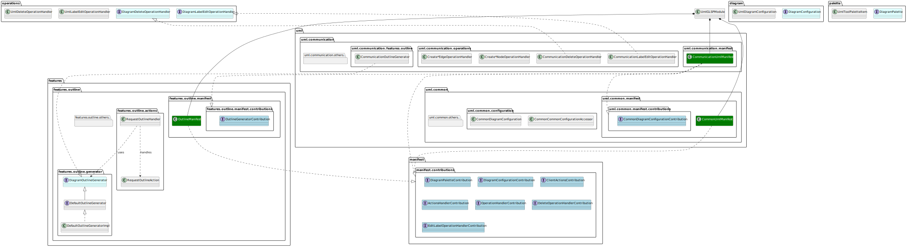

# Architecture

The architecture is based on a plugin/extension pattern. It is similar to how vscode or theia is developed. Every new feature is moved to its own **module**.

Further, there is a separation between **core**, **feature** and **uml** modules.

- The **core** module is the entry point to the application and manages the whole application (e.g. GLSP, DI). The feature and uml modules are injected into the core module. The core module has no information about how the UML diagrams are implemented or how for example the outline generator works.

- The **feature** modules implement distinct features, that are not provided by GLSP (e.g. outline view).

- The **uml** modules implement the respective UML specification (e.g. communication diagram).

To avoid direct usage of module-specific code between the modules the concept of **contribution points** (e.g. similar to vscode) is introduced. A contribution point is an interface, that provides methods that allow modules to provide their implementation based on an interface required by the contribution point. A contribution point provides a mechanism to connect different modules and implementations.

Further, every module has its own **manifest**. The manifest is a class that extends `AbstractModule` (see Guice). In other words, a manifest declares all the necessary dependencies or binds classes for private usage.

With the concept of _contribution point_ and _manifest_ the code is now loosely coupled between modules.

## Example

A pseudo-class diagram is provided here.

Color Legend:

- Green: Manifest
- Light Blue: Contribution point
- Light Cyan: Expected interface by a contribution point.

The **core** module consists of the following important parts:

- **UmlGLSPModule**: Used for dependency injection and wiring GLSP and the other modules.
- **contribution points**: This package provides all contribution points provided by the core module. For example, if another module (e.g. feature or uml) wants to add the possibility to delete an element, it has to implement the interface [DeleteOperationHandlerContribution](../../server/com.eclipsesource.uml.glsp/src/main/java/com/eclipsesource/uml/glsp/manifest/contributions/DeleteOperationHandlerContribution.java) in the manifest. The contribution point [DeleteOperationHandlerContribution](../../server/com.eclipsesource.uml.glsp/src/main/java/com/eclipsesource/uml/glsp/manifest/contributions/DeleteOperationHandlerContribution.java) provides methods, that enable the module to bind a class, that implements the [DiagramDeleteOperationHandler](../../server/com.eclipsesource.uml.glsp/src/main/java/com/eclipsesource/uml/glsp/operations/DiagramDeleteOperationHandler.java) interface. Afterward, in the handler [UmlDeleteOperationHandler](../../server/com.eclipsesource.uml.glsp/src/main/java/com/eclipsesource/uml/glsp/operations/UmlDeleteOperationHandler.java), depending on the context, the correct implementation of [DiagramDeleteOperationHandler](../../server/com.eclipsesource.uml.glsp/src/main/java/com/eclipsesource/uml/glsp/operations/DiagramDeleteOperationHandler.java) is called. The same approach applies to the other contribution points.

The **feature** module has the same approach as the **core** module, with the only difference being that it implements additional or different features that replace functionality in GLSP. For example, the `outline` module provides the feature to outline _something_. This is done via the [RequestOutlineHandler](../../server/com.eclipsesource.uml.glsp/src/main/java/com/eclipsesource/uml/glsp/features/outline/actions/RequestOutlineHandler.java). This handler injects all the implementations of the interface `DiagramOutlineGenerator]() and executes afterward the correct one.

The **uml** module is the respective implementation of a diagram (e.g. Communication diagram). This module has all the necessary diagram-specific functionality, like the handlers or feature implementations. Here we can see that the communication diagram also uses the `outline` feature and also the `common` uml module.

## Reason

The reason for choosing this approach is as follows:

- The core code is already provided by GLSP, it should only be necessary to change the core code only on some cases, otherwise, it should stay as clean as possible to allow faster and easier updates and therefore better maintenance.
- New features should like the name implies introduce new functionality without the necessity to modify all the files outside of the boundary of the feature (-module). If something outside is necessary, then the core code should provide a generic approach to which the feature can bind itself - loose coupling as far as possible.
- UML-specific diagram implementations should be able to live independently from each other. This restricts the possibility of unnoticed errors from other changes done by other UML diagrams.
- Feature modules can provide a generic approach, that applies to all UML diagrams and let the UML diagram implement customizations if necessary.
- Every module has the necessary logic (apart from necessary contribution points) to provide functionality -> The testability is improved and modules can be tested independently.

## Disadvantages

- Dependency injection can get out of hand (i.e. a lot of dependencies, contribution points)
- Extra complexity is introduced (e.g. enabling common elements in the communication diagram)
- Extra overhead/boilerplate to manage everything
